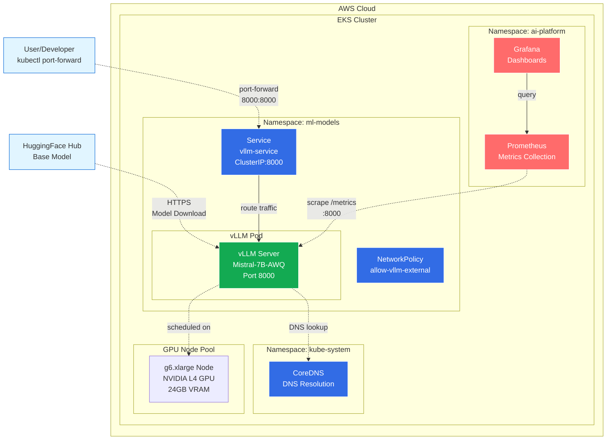
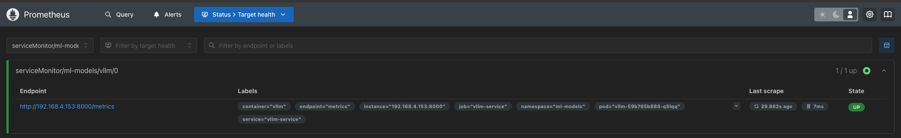

# Blog Post 2: vLLM auf Kubernetes – Dein erstes selbst gehostetes LLM

**Lesezeit:** ~20 Minuten | **Level:** Intermediate  
**Serie:** Self-Hosted LLMs für Datensouveränität | **Code:** [GitHub](https://github.com/hanasobi/self-hosted-llms-tutorial.git)

---

## TL;DR - Für eilige Leser

**Was wir bauen:**
- ✅ vLLM auf Kubernetes mit Mistral-7B (4-bit quantisiert)
- ✅ OpenAI-kompatible API für einfache Integration
- ✅ Monitoring mit Prometheus/Grafana out-of-the-box
- ✅ Kostenoptimiert mit scale-to-zero

**Tech-Stack:** vLLM 0.14.1, Mistral-7B-AWQ, Kubernetes (EKS), g6.xlarge (L4 GPU)

**Code:** [Alle Manifeste auf GitHub](https://github.com/hanasobi/self-hosted-llms-tutorial/tree/main/serving/vllm/kubernetes) | **Willst du mehr?** [Inhaltsverzeichnis](#inhaltsverzeichnis)

---

## Inhaltsverzeichnis

**Schnellstart:**
- [Warum vLLM auf Kubernetes?](#warum-vllm-auf-kubernetes)
- [Was wollen wir erreichen?](#was-wollen-wir-in-diesem-blog-erreichen)

**Teil 1: Design-Entscheidungen**
- [Architekturüberblick](#architekturüberblick)
- [Serving Framework Auswahl](#auswahl-des-serving-framework) (vLLM vs TGI vs Triton)
- [Quantisierung](#quantisierung) (AWQ 4-bit)
- [Hardware-Wahl](#auswahl-der-hardware) (g6.xlarge mit L4)

**Teil 2: Kubernetes Deployment**
- [Netzwerk konfigurieren](#netzwerkkonfiguration) (NetworkPolicies)
- [Server und Modell bereitstellen](#server-und-modell-bereitstellen) (Deployment)
- [Service erstellen](#service-stabiler-zugriff-auf-vllm)
- [Monitoring Setup](#monitoring-observability-für-production-llm-serving)

**Teil 3: Testing & Validation**
- [Smoke Test](#smoke-test-funktioniert-alles)
- [Fazit & Ausblick](#fazit-und-ausblick)

**Ressourcen:**
- [Alle Manifeste auf GitHub](https://github.com/hanasobi/self-hosted-llms-tutorial/tree/main/serving/vllm/kubernetes)

---


## Warum vLLM auf Kubernetes?

In [Blog Post 1](./01-warum-self-hosting.md) haben wir besprochen, warum Datensouveränität für Unternehmen im DACH-Raum kritisch ist. Jetzt setzen wir das in die Praxis um: Wir deployen einen LLM-Server, der komplett unter unserer Kontrolle läuft.

Warum Kubernetes? Weil die meisten Unternehmen bereits Kubernetes-Cluster betreiben. Statt eine komplett neue Infrastruktur aufzubauen, integrieren wir LLM-Serving in bestehende Systeme. Das bedeutet: bekannte Tools, existierende Monitoring-Stacks, etablierte Deployment-Prozesse.

Warum vLLM? Weil es aktuell das performanteste Open-Source-Framework für LLM-Inference ist. PagedAttention, Continuous Batching, OpenAI-kompatible API – alles out-of-the-box. Und später können wir problemlos Fine-tuned Models mit LoRA-Adaptern hinzufügen, ohne die Architektur zu ändern.


## Was wollen wir in diesem Blog erreichen?

Ziel dieses Blogs ist es, einen funktionierenden vLLM-Server auf Kubernetes zu deployen. Nach diesem Post hast du:

1. **Ein laufendes LLM** das du per API ansprechen kannst
2. **Monitoring** das dir zeigt wie dein Model performt
3. **Eine solide Basis** auf der wir in späteren Posts aufbauen

Wir streben kein hochverfügbares Production-Setup an – das wäre für einen ersten Schritt zu viel. Stattdessen fokussieren wir auf die Kernkomponenten und verstehen jeden Schritt.


## Wie werden wir vorgehen?

Um unser Ziel zu erreichen, klären und implementieren wir:

- Auswahl eines Serving Frameworks
- Quantisierung für effiziente GPU-Nutzung
- Auswahl der Hardware
- Bereitstellung der Kubernetes Ressourcen
  - Netzwerk konfigurieren
  - Server und Modell bereitstellen
  - Datenverkehr zum LLM leiten
  - Monitoring bereitstellen/konfigurieren
- Smoke Test: Funktioniert alles?


## Architekturüberblick

**Unser bestehendes Setup:**

Bevor wir vLLM deployen, haben wir bereits eine funktionierende ML-Infrastruktur auf AWS:

**Cluster & Infrastruktur:**
- **EKS Cluster** auf AWS in Region eu-central-1 (Frankfurt)
- **GPU Node Pool**: G-Instances (NVIDIA L4)
- **Autoscaling**: 0-2 Nodes mit scale-to-zero Capability
- **CNI**: Amazon VPC CNI (Standard für EKS)

**Namespaces:**
- `ml-models`: Inference Services (hier deployen wir vLLM)
- `ai-platform`: MLOps-Tools (Prometheus, Grafana, MLflow)
- `kube-system`: Kubernetes Core Services (CoreDNS, etc.)

**Monitoring Stack (bereits deployed):**
- **Prometheus**: Metriken-Collection von allen Services
- **Grafana**: Dashboards und Visualisierung
- Beide in Namespace `ai-platform`

**Warum ist das relevant?**

Wir bauen nicht auf der grünen Wiese. vLLM integriert sich in bestehende Infrastruktur:
- Nutzt die gleichen GPU-Nodes wie andere ML-Workloads
- Teilt sich den Monitoring-Stack mit anderen Services
- Nutzt bestehende Netzwerk- und Security-Konfiguration

Diese Integration ist bewusst – wir wollen zeigen wie LLM-Serving in eine existierende ML-Platform passt, nicht wie man von Null anfängt.

**Übersicht der Komponenten:**

| Komponente | Namespace | Zweck | Relevanz für vLLM |
|------------|-----------|-------|-------------------|
| vLLM | ml-models | LLM Inference | **Neuer Service** |
| Prometheus | ai-platform | Metrics Collection | Scraped vLLM metrics |
| Grafana | ai-platform | Dashboards | Visualisiert vLLM performance |
| CoreDNS | kube-system | DNS Resolution | DNS-Auflösung für vLLM |

Das Diagramm zeigt den Datenfluss: vLLM lädt das Base Model von HuggingFace, Prometheus scraped die Metriken, und wir greifen per Port-Forward auf den Service zu. In späteren Posts erweitern wir diese Architektur um LoRA-Adapter von S3.



---

## Auswahl des Serving Framework

Die erste Entscheidung die wir treffen mussten war welches Framework wir für LLM Serving verwenden. Die Landschaft ist überraschend vielfältig. Es gibt TGI (Text Generation Inference) von HuggingFace, Triton mit TensorRT-LLM Backend, Ray Serve, und vLLM. Jedes Framework hat seine Stärken und Schwächen.

Wir haben bereits Triton für Computer Vision Modelle im Einsatz. Es wäre naheliegend gewesen, auch für LLMs bei Triton zu bleiben. Triton kann mit dem TensorRT-LLM Backend tatsächlich LLMs serven. Allerdings erfordert TensorRT-LLM, dass man Modelle in einen spezialisierten Engine-Format konvertiert. Dieser Konvertierungsprozess ist komplex, fehleranfällig, und erzeugt große Engine-Files die schwer zu verwalten sind. Für ein Tutorial-Projekt das Klarheit und Nachvollziehbarkeit priorisiert, war das zu viel Komplexität.

TGI von HuggingFace ist das naheliegendste Framework, wenn man bereits HuggingFace-Modelle nutzt. Es ist gut integriert mit dem HuggingFace Ecosystem und relativ einfach zu verwenden. Allerdings ist TGI primär für einzelne Modelle optimiert. Multi-LoRA Support, bei dem man mehrere Adapter dynamisch laden kann, ist weniger ausgereift als bei vLLM. Da wir bereits wissen, dass wir in Zukunft mehrere Adapter haben möchten, ist dies ein wichtiger Punkt für die Entscheidung.

vLLM hat uns aus mehreren Gründen überzeugt. Das Framework ist speziell für hohen Throughput bei LLM Inference optimiert. Die PagedAttention-Technik managt den KV-Cache deutlich effizienter als naive Implementierungen. Continuous Batching erlaubt es, Requests mit unterschiedlichen Längen effizient zu batchen, was die GPU-Auslastung verbessert. Der Multi-LoRA Support ist erstklassig implementiert und erlaubt es mehrere Adapter mit minimalem Memory-Overhead zu laden. Und vLLM ist OpenAI-API-kompatibel, was bedeutet, dass Client-Code der für OpenAI geschrieben wurde, direkt funktioniert.

Die Entscheidung für vLLM war aber nicht nur technisch motiviert. Für ein Tutorial, das anderen Teams helfen soll, ist es wichtig, dass das gewählte Framework eine aktive Community hat und gut dokumentiert ist. vLLM erfüllt beide Kriterien. Die GitHub-Aktivität ist hoch, Issues werden schnell beantwortet, und es gibt viele Beispiele und Blog-Posts von anderen Teams, die vLLM nutzen.


## Quantisierung

Um die Hardware-Anforderungen und damit Kosten zu reduzieren, nutzen wir ein 4-bit quantisiertes Base Model (TheBloke/Mistral-7B-v0.1-AWQ). 

**Was bedeutet Quantisierung?**

Das originale Mistral-7B Modell verwendet 16-bit (FP16) oder 32-bit (FP32) Floating-Point-Zahlen für die Model-Gewichte. Bei 4-bit Quantisierung werden diese Gewichte auf 4-bit Integer-Werte komprimiert, was die Modellgröße um etwa Faktor 4 reduziert.

**Warum AWQ?**

AWQ (Activation-aware Weight Quantization) ist eine der präzisesten 4-bit Quantisierungsmethoden. Im Gegensatz zu naiver Quantisierung berücksichtigt AWQ die Wichtigkeit verschiedener Gewichte basierend auf den Activations, was die Qualitätsverluste minimiert.

**Trade-offs:**

Vorteile:
- Modellgröße: ~4 GB statt ~14 GB (FP16) oder ~28 GB (FP32)
- Passt auf kleinere GPUs (L4 mit 24 GB VRAM statt A100 mit 80 GB)
- Schnellere Inference durch weniger Memory-Transfers
- Niedrigere Kosten

Nachteile:
- Minimaler Qualitätsverlust (bei AWQ typischerweise <2% gegenüber FP16)
- Nicht alle Operationen können quantisiert werden (Activations bleiben FP16)
- Erfordert spezialisierte Quantisierungs-Tools

**Praktische Auswirkung für uns:**

Ohne Quantisierung würde Mistral-7B etwa 14 GB GPU-Memory nur für die Gewichte brauchen. Mit 4-bit AWQ sind es ~4 GB. Das lässt Raum für KV-Cache (~15 GB bei max-model-len=4096) und CUDA Graphs (~1.13 GB), sodass alles auf eine L4 mit 24 GB passt.


## Auswahl der Hardware

Um die Kosten für das Tutorial gering zu halten, haben wir zunächst versucht, vLLM auf einer T4 Instanz (AWS g4dn.xlarge / 16GiB VRAM) zu deployen, sind dabei aber auf diverse Probleme gestoßen. Letzten Endes sind 16GiB selbst für ein 4bit quantisiertes Modell zu wenig und die Architektur der T4 ist in die Jahre gekommen. Grundsätzlich sollte es möglich sein, vLLM auf einer T4 zu deployen. Es ist jedoch zu weit entfernt von einem realistischen Szenario.

Unsere Wahl fiel daher auf eine L4 Instanz (g6.xlarge) mit modernerer Architektur und 24GiB VRAM, was ausreichend für ein auf 4bit quantisiertes Mistral-7B ist. Im Vergleich zu noch potenteren Instanzen halten sich die Kosten in Grenzen. 

**Memory-Breakdown für Mistral-7B AWQ auf L4 (aus Deployment-Logs):**
- Model Weights (4-bit AWQ): 3.96 GB
- KV-Cache (max-model-len=4096): 15.07 GB  
- CUDA Graphs Overhead: 1.13 GB
- Activations & Runtime: ~1 GB
- **Total: ~21.2 GB von 24 GB genutzt**

Das lässt 2.8 GB Headroom für Peaks und temporäre Allocations.

**Warum 4-bit Quantisierung so wichtig ist:**

Ohne Quantisierung würde Mistral-7B etwa 14 GB nur für Model Weights brauchen (FP16). Mit AWQ sind es nur 3.96 GB – eine Reduktion um 72%. Diese 10 GB Ersparnis ermöglichen uns:
- Größeren KV-Cache (15 GB statt 5 GB)
- CUDA Graphs (1.13 GB Overhead)  
- 30 simultane Requests statt ~8

Auf einer T4 mit 16 GB VRAM wäre selbst mit Quantisierung der Platz knapp:
- Model: 4 GB
- KV-Cache: max. 10 GB (statt 15 GB)
- CUDA Graphs: nicht möglich (zu wenig Headroom)
- Max Concurrency: ~20 statt 30

Die L4 gibt uns den nötigen Headroom für Production-like Performance.

---

**Fertig mit diesem Abschnitt?**  
→ Weiter zu [Kubernetes Deployment](#bereitstellung-der-kubernetes-ressourcen)  
→ Oder zurück zum [Inhaltsverzeichnis](#inhaltsverzeichnis)

---

## Bereitstellung der Kubernetes Ressourcen

### Netzwerkkonfiguration

**Warum ist das notwendig?**

In Kubernetes-Clustern mit aktivierten NetworkPolicies ist der Netzwerkverkehr standardmäßig eingeschränkt. Pods können nur mit anderen Pods kommunizieren, wenn explizite Regeln dies erlauben. Das ist ein wichtiges Security-Feature – es verhindert dass ein kompromittierter Pod beliebig im Cluster kommunizieren kann.

Unser vLLM-Pod muss mit externen Services kommunizieren:
1. **HuggingFace Hub** (huggingface.co): Um das Mistral-7B Base Model herunterzuladen
2. **CoreDNS** (kube-system): Um Hostnamen aufzulösen

Ohne NetworkPolicy würde der Pod beim Start fehlschlagen mit Timeout-Fehlern, weil er weder DNS-Auflösung noch HTTPS-Verbindungen aufbauen kann.

**Was haben wir gemacht?**

Wir haben eine Egress-NetworkPolicy erstellt, die vLLM-Pods erlaubt nach außen zu kommunizieren. Die Policy ist bewusst restriktiv – sie erlaubt nur die minimal nötigen Verbindungen:

**Regel 1: HTTPS für externe Downloads**
```yaml
egress:
  # Regel 1: HTTPS-Zugriff für HuggingFace
  - to:
    - namespaceSelector: {}  # Alle Namespaces (inkl. externe IPs)
    ports:
    - protocol: TCP
      port: 443
```

Diese Regel erlaubt HTTPS-Verbindungen (Port 443) zu beliebigen Zielen. Das ermöglicht:
- Model-Download von HuggingFace Hub
- Zukünftige externe API-Calls falls nötig

**Regel 2: DNS-Auflösung**
```yaml
  # Regel 2: DNS-Auflösung über CoreDNS
  - to:
    - namespaceSelector:
        matchLabels:
          kubernetes.io/metadata.name: kube-system
      podSelector:
        matchLabels:
          k8s-app: kube-dns
    ports:
    - protocol: UDP
      port: 53
```

Diese Regel ist essentiell aber wird oft vergessen. Ohne DNS kann der Pod "huggingface.co" nicht in IP-Adressen auflösen. Die Regel erlaubt UDP-Traffic auf Port 53 (DNS) zu den CoreDNS-Pods im kube-system Namespace.

---

**Hinweis zu unserem Setup:**

In unserem EKS-Cluster sind NetworkPolicies aktuell nicht aktiv enforced – das CNI-Plugin (Amazon VPC CNI) unterstützt sie nicht nativ. Wir haben sie dennoch erstellt aus mehreren Gründen:

1. **Documentation as Code**: Die Policy dokumentiert welche Netzwerk-Zugriffe vLLM braucht. Das hilft beim Troubleshooting und Security-Reviews.
2. **Production-Ready**: Wenn wir später auf ein CNI mit Policy-Support migrieren (z.B. Calico, Cilium), sind die Policies bereits da.
3. **Defense in Depth**: Auch ohne Enforcement ist es gute Praxis, Security-Boundaries zu definieren.

Viele Teams haben ähnliche Situationen – NetworkPolicies werden geschrieben aber nicht enforced. Das ist pragmatisch und besser als gar keine Policies zu haben.

---

**NetworkPolicy Manifest:** [Production Version](https://github.com/hanasobi/self-hosted-llms-tutorial/tree/main/serving/vllm/kubernetes/networkpolicy.yaml) | [Annotierte Version](https://github.com/hanasobi/self-hosted-llms-tutorial/tree/main/serving/vllm/kubernetes/networkpolicy.annotated.yaml)

Das annotierte Manifest enthält ausführliche Kommentare zu jedem Parameter und erklärt Trade-offs im Detail.

---

### Server und Modell bereitstellen

Das Deployment ist das Herzstück unseres vLLM-Setups. Hier definieren wir wie der Pod aussieht, welche Ressourcen er bekommt, und wie er konfiguriert wird.

#### GPU Node Group: Wo läuft vLLM?

Bevor wir den Pod deployen können, brauchen wir GPU-Nodes im Cluster. Dafür haben wir in unserem EKS-Cluster eine GPU Node Group mit folgenden Eigenschaften angelegt:

**Node Group Konfiguration:**
- **Instance Type**: g6.xlarge (NVIDIA L4, 24 GB VRAM)
- **Autoscaling**: 0-2 Nodes (scale-to-zero aktiviert!)
- **Taint**: `nvidia.com/gpu=true:NoSchedule`
- **Label**: `workload=gpu-vllm`
- **Cost**: ~$0.70/Stunde pro Node

**Warum diese Konfiguration?**

Der **Taint** verhindert dass normale CPU-Workloads auf den teuren GPU-Nodes landen. Nur Pods die explizit mit `tolerations` konfiguriert sind können auf diesen Nodes schedulen. Das ist wichtig für Cost-Control – wir wollen nicht dass ein zufälliger Nginx-Pod einen $500/Monat GPU-Node belegt.

Das **Label** `workload=gpu-vllm` erlaubt uns, gezielt diese Nodes auszuwählen. Wenn wir später verschiedene GPU-Workloads haben (Training auf A100, Inference auf L4), können wir sie durch Labels separieren.

**Scale-to-zero** ist kritisch für Development und Testing. Wenn kein vLLM-Pod läuft, scalen die Nodes nach 10 Minuten auf 0. Das spart etwa $500/Monat verglichen mit always-on Nodes (je nach Region).

**Terraform Snippet (exemplarisch):**

Falls du die Node Group selbst erstellen möchtest, hier ein Terraform-Beispiel:
```hcl
resource "aws_eks_node_group" "gpu_vllm" {
  cluster_name    = aws_eks_cluster.main.name
  node_group_name = "gpu-vllm-nodes"
  node_role_arn   = aws_iam_role.node_group.arn
  subnet_ids      = aws_subnet.private[*].id

  instance_types = ["g6.xlarge"]
  
  scaling_config {
    desired_size = 0  # Scale-to-zero
    max_size     = 2
    min_size     = 0
  }

  labels = {
    workload = "gpu-vllm"
  }

  taint {
    key    = "nvidia.com/gpu"
    value  = "true"
    effect = "NO_SCHEDULE"
  }

  tags = {
    Purpose = "LLM Inference"
  }
}
```

---

#### Das Deployment Manifest: Anatomie eines vLLM Pods

Das Kubernetes Deployment-Manifest definiert wie vLLM laufen soll. Wir gehen Komponente für Komponente durch.

**Replica Count: Warum nur 1?**
```yaml
spec:
  replicas: 1
```

Für Development und Testing reicht ein einzelner Pod. GPU-Nodes sind teuer, und wir optimieren für Kosten nicht für High-Availability. In Production würde man mehrere Replicas mit Load-Balancing verwenden, aber für ein Tutorial ist das overkill.

---

#### vLLM Container: Das Kernstück

**Image und Version:**
```yaml
containers:
- name: vllm
  image: vllm/vllm-openai:v0.14.1-cu130
```

Wir nutzen das offizielle vLLM-Image mit:
- **v0.14.1**: Spezifische Version (nicht `:latest`) für Reproduzierbarkeit
- **cu130**: CUDA 13.0 Support für NVIDIA L4 GPUs
- **openai**: OpenAI-API-kompatibles Interface

Das Image ist groß (~5 GB) aber enthält alle Dependencies vorcompiliert. Wir haben kurz überlegt ein eigenes schlankes Image zu bauen, haben uns aber dagegen entschieden weil:
- Das offizielle Image regelmäßig geupdatet wird
- Security-Patches zeitnah eingespielt werden
- Wir uns nicht um die komplexe CUDA-Toolchain kümmern müssen

**⚠️ Warnung: Die :latest-Falle**

Ursprünglich hatten wir `:latest` verwendet. Das funktionierte - bis es plötzlich nicht mehr funktionierte. Eines Morgens startete der Pod nicht mehr, ohne dass wir etwas geändert hatten. Nach Stunden Debugging stellten wir fest: vLLM hatte ein neues `:latest` Image gepusht mit Breaking Changes.

Das Problem mit `:latest`:
- In Development kostet es Zeit und Nerven (wie wir schmerzlich gelernt haben)
- In Production ist es ein Sicherheitsrisiko
- Niemand kann nachvollziehen welche Version wo läuft
- Rollbacks sind schwierig ("zurück zu welchem latest?")

**Immer eine spezifische Version pinnen.** Wenn ihr upgraden wollt, macht es bewusst und testet die neue Version erst. Mit `v0.14.1` wissen wir genau was läuft und können das System in 6 Monaten noch reproduzieren.


**vLLM Command-Line Arguments:**

Die Args sind **entscheidend** für Performance und Funktionalität:
```yaml
args:
- "serve"
- "TheBloke/Mistral-7B-v0.1-AWQ"       # Base Model von HuggingFace
- "--port=8000"
- "--max-model-len=4096"                # Context Window
- "--gpu-memory-utilization=0.88"       # Kritisch!
```

**Lass uns jeden Arg einzeln durchgehen:**

**1. Base Model:** `TheBloke/Mistral-7B-v0.1-AWQ`

Wir laden das 4-bit quantisierte Modell direkt von HuggingFace. Beim ersten Start lädt vLLM das Modell herunter (~4 GB) und cached es in `/tmp/huggingface`. Nachfolgende Pod-Restarts sind schneller weil das Modell bereits cached ist (solange der Pod nicht auf einen anderen Node verschoben wird).

**2. Context Window:** `--max-model-len=4096`

Das definiert die maximale Sequenzlänge (Prompt + Generation). 4096 Tokens ist eine gute Balance:
- Lang genug für typische Prompts mit Kontext
- Kurz genug dass der KV-Cache nicht den gesamten GPU-Speicher frisst

Aus unseren Startup-Logs wissen wir:
```text
Available KV cache memory: 15.07 GiB
GPU KV cache size: 123,472 tokens
Maximum concurrency for 4,096 tokens per request: 30.03x
```

Bei 4096 Tokens können wir theoretisch 30 simultane Requests im KV-Cache halten.

**3. GPU Memory Utilization:** `--gpu-memory-utilization=0.88`

**Das ist der wichtigste Tuning-Parameter!**

Bei 24 GB VRAM auf der L4 reserviert vLLM mit `0.88` etwa 21.12 GB für sich.
(Details im [Abschnitt Hardware](#auswahl-der-hardware))

**Warum nicht 0.95?**

Mit `0.95` hätten wir theoretisch 3 zusätzliche Concurrency-Slots (33 statt 30). Aber:
- Bei 0.95 sind nur ~1.2 GB Headroom verfügbar
- CUDA Graphs brauchen 1.13 GB
- Das reicht nicht → vLLM deaktiviert CUDA Graphs
- **Ohne Graphs: 2x langsamere Inference** (4.23s statt 1.87s in unseren Tests)

Der Trade-off ist klar: **2x schnellere Inference wichtiger als 3 theoretische Concurrency-Slots.**

CUDA Graphs sind eine NVIDIA-Optimierung die den Execution-Overhead reduziert. Der Startup-Overhead ist 26 Sekunden (Graph-Capture), aber danach ist jede Inference deutlich schneller. Für einen Service der Stunden oder Tage läuft ist 26s Startup vernachlässigbar.

---

**Environment Variables:**
```yaml
env:
- name: HF_HOME
  value: "/tmp/huggingface"
```

Das definiert wo HuggingFace Transformers Models cached. Wir nutzen `/tmp` weil:
- Es ist ein EmptyDir Volume (im RAM oder auf lokalem Disk)
- Wird automatisch aufgeräumt wenn der Pod terminiert
- Kein Persistent Volume nötig (spart Kosten und Komplexität)

Der Nachteil ist dass bei Pod-Restart das Base Model neu geladen werden muss (60 Sekunden). Das ist akzeptabel für Development. In Production würde man ein Persistent Volume verwenden.

---

**Resource Requests und Limits:**
```yaml
resources:
  requests:
    cpu: "3"
    memory: "12Gi"
    nvidia.com/gpu: "1"
  limits:
    cpu: "4"
    memory: "14Gi"
    nvidia.com/gpu: "1"
```

**CPU:** Wir requesten 3 CPUs und limiten auf 4. vLLM braucht CPU für:
- Request-Parsing und Tokenization
- Scheduling-Logik (Continuous Batching)
- Metrics-Export

3-4 CPUs sind ausreichend, da die eigentliche Inference auf der GPU läuft.

**Memory:** 12 GB Request, 14 GB Limit.

**Warum nicht mehr?** Ursprünglich hatten wir 14 GB Request / 16 GB Limit konfiguriert. Das erschien logisch: vLLM braucht Memory für Runtime, Model-Cache, etc. Aber der Pod blieb in "Pending":
```text
Events:
  Warning  FailedScheduling  default-scheduler  
    0/2 nodes are available: 2 Insufficient memory.
```

Das Problem: Die g6.xlarge Node hat insgesamt 16 GB RAM. Davon sind bereits ~2-3 GB für System-Pods reserviert (kubelet, kube-proxy, CNI, etc.). Mit einem 14 GB Request passte unser Pod einfach nicht auf den Node.

Wir haben die Werte auf 12/14 GB reduziert - konservativ aber realistisch. Das deckt:
- vLLM Runtime (~2 GB)
- HuggingFace Model Cache (~4 GB für AWQ)
- System Overhead (~2 GB)
- Headroom für Peaks (~4 GB)

**Lesson Learned:** Resource-Requests müssen zur tatsächlich verfügbaren Node-Capacity passen, nicht zur theoretischen Instance-Size. Der Kubernetes-Scheduler ist konservativ - er reserviert lieber zu viel als zu wenig. Das ist gut für Stabilität, bedeutet aber man muss realistisch requesten.

**GPU:** Wir requesten genau 1 GPU. Das signalisiert dem Kubernetes-Scheduler dass dieser Pod eine vollständige GPU braucht. Der Scheduler wird den Pod nur auf Nodes mit verfügbaren GPUs platzieren.

Der GPU-Request garantiert auch dass der Pod exklusiven Zugriff auf die GPU hat – kein GPU-Sharing mit anderen Pods. Das ist wichtig für Performance und Vorhersagbarkeit.

---

**Node Selector und Tolerations:**
```yaml
nodeSelector:
  workload: gpu-vllm

tolerations:
- key: nvidia.com/gpu
  operator: Equal
  value: "true"
  effect: NoSchedule
```

**NodeSelector** sagt dem Scheduler: "Dieser Pod darf nur auf Nodes mit Label `workload=gpu-vllm` laufen." Das garantiert dass vLLM auf unseren GPU-Nodes landet und nicht versehentlich auf CPU-Nodes.

**Tolerations** erlaubt dem Pod auf Nodes mit dem Taint `nvidia.com/gpu=true:NoSchedule` zu schedulen. Ohne diese Toleration würde der Pod rejected werden.

Zusammen garantieren diese beiden Mechanismen dass:
1. vLLM nur auf GPU-Nodes läuft (NodeSelector)
2. CPU-Workloads nicht auf GPU-Nodes landen (Taint ohne Toleration)
3. Cost-Optimierung durch gezieltes Scheduling

---

#### Deployment durchführen

Nachdem wir das Manifest verstanden haben, können wir deployen:
```bash
# Deployment anwenden
kubectl apply -f deployment.yaml

# Pod-Status checken
kubectl get pods -n ml-models -l app=vllm

# Logs während Startup verfolgen
kubectl logs -n ml-models -l app=vllm --follow

# Details zum Pod (inkl. Events)
kubectl describe pod -n ml-models -l app=vllm
```

**Was passiert beim Start?**

1. **Node Provisioning (0-180s)**: Wenn keine GPU-Node läuft, muss einer hochskaliert werden. Das dauert etwa 2-3 Minuten.

2. **vLLM Container Start (60-90s)**:
   - Image Pull (einmalig): ~2 Minuten für 5 GB Image
   - Model Loading von HuggingFace: ~60 Sekunden
   - CUDA Graphs Capture: ~26 Sekunden

3. **Ready State**: Nach insgesamt 3-5 Minuten ist vLLM bereit für Requests.

**Typische Startup-Logs:**
```text
INFO: Loading weights took 19.18 seconds
INFO: Model loading took 3.96 GiB memory and 60.55 seconds
INFO: Compiling a graph for compile range (1, 2048) takes 12.98 s
INFO: Graph capturing finished in 26 secs, took 1.13 GiB
INFO: Available KV cache memory: 15.07 GiB
INFO: GPU KV cache size: 123,472 tokens
INFO: Maximum concurrency for 4,096 tokens per request: 30.03x
```

Diese Logs sind Gold für Troubleshooting. Wenn etwas schief geht, sagen sie genau wo.

---

**Troubleshooting häufiger Probleme:**

**Problem: Pod bleibt in "Pending"**
```bash
kubectl describe pod -n ml-models -l app=vllm
```
Schaue unter "Events". Häufige Ursachen:
- Kein GPU-Node verfügbar (Autoscaler braucht Zeit)
- NodeSelector matched keine Nodes (Label falsch?)
- Resource-Requests zu hoch

**Problem: vLLM Container crasht**
```bash
kubectl logs -n ml-models <pod-name> -c vllm --previous
```
Häufige Ursachen:
- GPU Memory zu klein (OOM)
- CUDA-Version inkompatibel
- Model nicht gefunden auf HuggingFace

---

**Deployment Manifest:** [Production Version](https://github.com/hanasobi/self-hosted-llms-tutorial/tree/main/serving/vllm/kubernetes/deployment-base.yaml) | [Annotierte Version](https://github.com/hanasobi/self-hosted-llms-tutorial/tree/main/serving/vllm/kubernetes/deployment-base.annotated.yaml)

Das annotierte Manifest enthält ausführliche Kommentare zu jedem Parameter und erklärt Trade-offs im Detail.

---

### Service: Stabiler Zugriff auf vLLM

**Warum brauchen wir einen Service?**

Ein Kubernetes Pod hat eine IP-Adresse, aber diese IP ist nicht stabil. Wenn der Pod neu startet (z.B. nach einem Node-Failover, Upgrade, oder Scale-Event), bekommt er eine neue IP. Clients müssten ihre Verbindung neu konfigurieren, was unpraktisch und fehleranfällig ist.

Ein Kubernetes Service löst dieses Problem durch eine stabile Abstraktion:
- Der Service hat einen **DNS-Namen** (`vllm-service.ml-models.svc.cluster.local`)
- Der Service hat eine **stabile ClusterIP** (wird vom Cluster automatisch zugewiesen)
- Der Service **routet Traffic automatisch** zu den passenden Pods
- Wenn Pods neu starten oder skalieren, **updated der Service automatisch** seine Backend-Liste

Für Clients ist der Service der Endpoint – egal was mit den Pods passiert.

---

**Labels und Selectors: Wie findet der Service die Pods?**
```yaml
metadata:
  labels:
    app: vllm
    component: service
spec:
  selector:
    app: vllm
```

Der **Selector** (`app: vllm`) ist entscheidend. Er sagt dem Service: "Alle Pods mit diesem Label gehören zu mir." Das Deployment setzt das Label auf seinen Pods:
```yaml
# Im Deployment:
spec:
  template:
    metadata:
      labels:
        app: vllm  # ← Muss mit Service-Selector matchen!
```

**ClusterIP vs LoadBalancer:**
```yaml
spec:
  type: ClusterIP
```

Wir nutzen **ClusterIP** (Default), was bedeutet:
- Service ist nur innerhalb des Clusters erreichbar
- Keine externe IP, kein Load-Balancer
- Keine zusätzlichen Kosten ($0/Monat vs ~$18/Monat für AWS NLB)
- Zugriff von außen nur via `kubectl port-forward`

Das ist bewusst – für Development brauchen wir keine externe Erreichbarkeit. In Production würde man entweder einen LoadBalancer oder einen Ingress mit Auth verwenden. Die Änderung ist einfach – `type: LoadBalancer` statt `type: ClusterIP`, und Kubernetes provisioniert automatisch einen AWS NLB.

---

**Port-Konfiguration:**
```yaml
ports:
- name: http
  port: 8000
  targetPort: 8000
- name: metrics
  port: 9090
  targetPort: 8000
```

Hier wird's interessant. vLLM exposed **alles auf Port 8000** – sowohl die API als auch `/metrics`. Das ist praktisch – ein HTTP-Server, ein Port. Die zwei Service-Port-Definitionen erlauben uns aber flexible Zugriffe:

1. **http Port (8000 → 8000)**: Für normale API-Requests
2. **metrics Port (9090 → 8000)**: Für Prometheus Scraping

Prometheus kann den Service auf Port 9090 scrapen (wird später im ServiceMonitor konfiguriert), während Clients den Service auf Port 8000 für API-Calls nutzen. Das ist eine logische Separation auch wenn beide zum gleichen Pod-Port gehen.

---

**Service deployen:**
```bash
# Service erstellen
kubectl apply -f service.yaml

# Verify: Service existiert
kubectl get service -n ml-models vllm-service

# Details anschauen
kubectl describe service -n ml-models vllm-service

# Endpoints checken (welche Pod-IPs sind registered?)
kubectl get endpoints -n ml-models vllm-service
```

**Wichtige Checks nach Deployment:**
```bash
# Sind Pods als Endpoints registriert?
kubectl get endpoints -n ml-models vllm-service

# Output sollte Pod-IPs zeigen:
# NAME            ENDPOINTS         AGE
# vllm-service    10.0.1.42:8000    5m
```

Wenn `ENDPOINTS` leer ist, stimmt etwas mit den Labels nicht – der Service findet die Pods nicht!

**Port-Forward testen:**
```bash
# Terminal 1: Forward starten
kubectl port-forward -n ml-models svc/vllm-service 8000:8000

# Output: Forwarding from 127.0.0.1:8000 -> 8000
# Der Tunnel ist offen, lasse dieses Terminal laufen

# Terminal 2: Health-Check
curl http://localhost:8000/health
```

Wenn das funktioniert, ist der Service korrekt konfiguriert und vLLM ist erreichbar!

---

**Troubleshooting:**

**Problem: Endpoints sind leer**
```bash
kubectl get endpoints -n ml-models vllm-service
# NAME            ENDPOINTS   AGE
# vllm-service    <none>      2m
```

Ursachen:
- Selector matched keine Pods → Check Labels mit `kubectl get pods -n ml-models --show-labels`
- Pods sind nicht Ready → Check mit `kubectl get pods -n ml-models`
- Pod ist in anderem Namespace → Verify namespace

**Problem: Port-Forward failed**
```bash
kubectl port-forward -n ml-models svc/vllm-service 8000:8000
# Error: unable to forward port because pod is not running
```

Ursachen:
- Pod ist nicht Running → Check mit `kubectl get pods -n ml-models`
- Port 8000 auf localhost schon belegt → Nutze anderen lokalen Port: `kubectl port-forward ... 8001:8000`
- Keine Berechtigung → Check kubectl Permissions

---

**Service Manifest:** [Production Version](https://github.com/hanasobi/self-hosted-llms-tutorial/tree/main/serving/vllm/kubernetes/service.yaml) | [Annotierte Version](https://github.com/hanasobi/self-hosted-llms-tutorial/tree/main/serving/vllm/kubernetes/service.annotated.yaml)

---

### Monitoring: Observability für Production-LLM-Serving

**Warum ist Monitoring so wichtig?**

Ein LLM-Service ohne Monitoring ist wie ein Flugzeug ohne Instrumente. Man weiß nicht:
- Wie schnell antwortet das System? (Latenz)
- Wie viele Requests kann es gleichzeitig verarbeiten? (Throughput)
- Wo sind die Bottlenecks? (GPU? Memory? Queue?)
- Wann wird das System überlastet? (Queue Depth, Rejection Rate)

Ohne diese Informationen fliegen wir blind. Wenn Performance-Probleme auftreten, können wir nicht systematisch debuggen. Wenn wir das System tunen wollen, haben wir keine Baseline zum Vergleichen.

---

#### vLLM Metriken: Was wird exposed?

vLLM exposed automatisch Prometheus-Metriken auf dem `/metrics` Endpoint. Wir können sie direkt ansehen:
```bash
# Port-Forward zum vLLM Pod
kubectl port-forward -n ml-models -l app=vllm 8000:8000

# Metriken abrufen
curl http://localhost:8000/metrics
```

Das gibt hunderte Zeilen Output im Prometheus-Format:
```text
# HELP vllm:time_to_first_token_seconds Time to first token
# TYPE vllm:time_to_first_token_seconds histogram
vllm:time_to_first_token_seconds_bucket{le="0.001"} 0.0
vllm:time_to_first_token_seconds_bucket{le="0.005"} 0.0
...
vllm:time_to_first_token_seconds_sum 127.45
vllm:time_to_first_token_seconds_count 89

# HELP vllm:num_requests_running Number of requests currently running
# TYPE vllm:num_requests_running gauge
vllm:num_requests_running 2.0
...
```

**Die wichtigsten Metriken-Kategorien:**

**1. Latenz-Metriken** (wie lange dauern Requests?)
- `vllm:time_to_first_token_seconds`: Zeit bis zum ersten Token (kritisch für Streaming!)
- `vllm:time_per_output_token_seconds`: Zeit pro generiertem Token
- `vllm:e2e_request_latency_seconds`: Gesamte Request-Zeit inkl. Queuing

**2. Throughput-Metriken** (wie viel Arbeit wird gemacht?)
- `vllm:num_requests_running`: Aktuell laufende Requests (Concurrency)
- `vllm:num_requests_waiting`: Requests in der Queue (Saturation Signal!)
- `vllm:prompt_tokens_total`: Verarbeitete Input-Tokens
- `vllm:generation_tokens_total`: Generierte Output-Tokens

**3. Ressourcen-Metriken** (wie ausgelastet ist das System?)
- `vllm:gpu_cache_usage_perc`: GPU-Memory für KV-Cache (sollte hoch sein!)
- `container_gpu_utilization`: GPU Compute-Auslastung
- `container_memory_usage_bytes`: Container Memory Consumption

**Warum sind diese Metriken wichtig?**

- **time_to_first_token**: Bei Streaming-Responses ist das was User zuerst sehen. 2 Sekunden fühlen sich ewig an, 0.5 Sekunden fühlen sich instant an.
- **num_requests_waiting**: Wenn > 0 ist das System unter Last. Wenn konstant > 5 brauchen wir mehr Capacity.
- **gpu_cache_usage_perc**: Bei ~90% ist der KV-Cache gut genutzt. Bei 100% können neue Requests nicht mehr angenommen werden.

---

#### Prometheus: Pull-based Monitoring

**Wie funktioniert Prometheus?**

Prometheus ist ein **Pull-based** Monitoring-System. Anders als Push-based Systeme (wo Services Metriken aktiv zu einem Collector schicken), **scraped** Prometheus die Metriken selbst:

1. Prometheus hat eine Liste von **Targets** (Services die Metriken exposen)
2. Alle X Sekunden (default: 15s) macht Prometheus HTTP GET zu jedem Target
3. Target antwortet mit Metriken im Prometheus-Format
4. Prometheus speichert die Metriken als **Time-Series** in seiner Datenbank
5. Man kann mit **PromQL** (Prometheus Query Language) die Daten abfragen

**Vorteile von Pull:**
- Prometheus kontrolliert wann und wie oft gescraped wird
- Services müssen keinen Prometheus-Client initialisieren
- Wenn Prometheus down ist, verliert man Metriken aber Services laufen normal weiter
- Einfach zu debuggen (man kann `/metrics` mit curl ansehen)

**Prometheus in unserem Cluster:**

Prometheus läuft bereits im `ai-platform` Namespace und sammelt Metriken von vielen Services (Kubernetes Nodes, Pods, andere Inference-Services). Wir müssen nur sicherstellen dass vLLM als Target discovered wird.

---

#### ServiceMonitor: Automatic Service Discovery

**Was ist ein ServiceMonitor?**

ServiceMonitor ist eine Custom Resource (CRD) vom **Prometheus Operator**. Er definiert **welche Services** Prometheus scrapen soll und **wie**:
```yaml
apiVersion: monitoring.coreos.com/v1
kind: ServiceMonitor
metadata:
  name: vllm
  namespace: ml-models
  labels:
    app: vllm
spec:
  selector:
    matchLabels:
      app: vllm          # Welcher Service?
  endpoints:
  - port: metrics        # Welcher Port (Name!)
    path: /metrics       # Welcher Pfad?
    interval: 30s        # Wie oft scrapen?
    scrapeTimeout: 10s   # Timeout für Scrape
  namespaceSelector:
    matchNames:
    - ml-models          # In welchem Namespace?
```

**Wie funktioniert das Zusammenspiel?**

**Schritt 1: ServiceMonitor selektiert Service**

Der ServiceMonitor sagt: "Ich interessiere mich für Services mit Label `app: vllm` in Namespace `ml-models`."

**Schritt 2: ServiceMonitor referenced Port-Namen**

Der ServiceMonitor gibt `port: metrics` an. Das ist der **Name** des Ports im Service, nicht die Nummer! Der Prometheus Operator schaut im Service nach:
```yaml
# Im Service:
ports:
- name: metrics      # ← ServiceMonitor referenced diesen Namen!
  port: 9090         # ← Service-Port (wird nicht direkt genutzt)
  targetPort: 8000   # ← Das ist der tatsächliche Pod-Port!
```

**Schritt 3: Prometheus Operator discovered Pods**

Der Prometheus Operator nutzt die **Kubernetes API** um herauszufinden:
- Welche **Endpoints** (Pod-IPs) hinter dem Service stehen
- Auf welchem **Port** (targetPort: 8000) die Pods erreichbar sind
- Welche **Labels** die Pods haben

**Schritt 4: Prometheus scraped Pods DIREKT**

Prometheus macht seine HTTP-Requests **direkt zu den Pod-IPs**, nicht über die Service-IP!
```text
Prometheus → http://10.0.1.42:8000/metrics  (Pod-IP direkt!)
         ≠→ http://vllm-service:9090/metrics (Service - wird NICHT genutzt)
```

Das ist wichtig zu verstehen: **Der Service ist nur für Discovery**, nicht für den tatsächlichen Scrape-Traffic!

---

**ServiceMonitor deployen:**
```bash
# ServiceMonitor erstellen
kubectl apply -f servicemonitor.yaml

# Verify: Ist der ServiceMonitor da?
kubectl get servicemonitor -n ml-models

# Details anschauen
kubectl describe servicemonitor vllm -n ml-models
```

**Wichtig:** Der ServiceMonitor muss im **gleichen Namespace** wie der Service sein (ml-models). Prometheus selbst läuft in einem anderen Namespace (ai-platform), aber das ist ok – Prometheus Operator kann Cluster-wide ServiceMonitors finden.

---

**Prometheus Targets verifizieren:**

Um zu checken ob Prometheus vLLM tatsächlich scraped, können wir ins Prometheus-UI schauen:
```bash
# Port-Forward zu Prometheus
kubectl port-forward -n ai-platform svc/prometheus 9090:9090

# Browser öffnen: http://localhost:9090
```

In der Prometheus-UI unter "Status → Targets" sollte `ml-models/vllm` auftauchen mit Status "UP".



---

**ServiceMonitor Manifest:** [Production Version](https://github.com/hanasobi/self-hosted-llms-tutorial/tree/main/serving/vllm/kubernetes/servicemonitor.yaml) | [Annotierte Version](https://github.com/hanasobi/self-hosted-llms-tutorial/tree/main/serving/vllm/kubernetes/servicemonitor.annotated.yaml)

---

#### Grafana Dashboards: Kommt in Post 7

Du fragst dich vielleicht: "Prometheus sammelt jetzt Metriken, aber wie visualisiere ich sie?" Grafana Dashboards sind der nächste logische Schritt, aber wir verschieben das bewusst auf [Blog Post 7](./07-lora-serving.md).

Warum? Mit dem Base Model allein gibt es wenig Spannendes zu visualisieren. Die Metriken zeigen "es läuft" – aber ohne Vergleichswert fehlt der Kontext. In Post 7, wenn wir den Fine-tuned LoRA-Adapter deployen, wird Monitoring richtig interessant:

- **Latenz-Vergleich**: Base Model vs LoRA-Adapter (Spoiler: 60% Unterschied)
- **Qualitäts-Korrelation**: Wie hängen Antwortlänge und Latenz zusammen?
- **Load-Testing**: Wie verhält sich das System unter Last?

Dann bauen wir ein Dashboard das diese Vergleiche visualisiert und zeigen, wie man Performance-Probleme systematisch debuggt.

Für jetzt reicht es zu wissen: Die Metriken fließen. Du kannst sie jederzeit in der Prometheus-UI abfragen (`http://localhost:9090` nach Port-Forward). Die schöne Visualisierung kommt, wenn wir etwas Interessantes zu zeigen haben.

---

## Smoke Test: Funktioniert alles?

Nachdem alle Komponenten deployed sind, testen wir ob alles funktioniert.

**1. Pod ist Running:**
```bash
kubectl get pods -n ml-models -l app=vllm
# NAME                    READY   STATUS    RESTARTS   AGE
# vllm-xxxxxxxxx-xxxxx    1/1     Running   0          5m
```

**2. Service hat Endpoints:**
```bash
kubectl get endpoints -n ml-models vllm-service
# NAME            ENDPOINTS         AGE
# vllm-service    10.0.1.42:8000    5m
```

**3. Health-Check:**
```bash
kubectl port-forward -n ml-models svc/vllm-service 8000:8000 
curl -i http://localhost:8000/health
# HTTP/1.1 200 OK
# date: Thu, 05 Feb 2026 16:35:45 GMT
# server: uvicorn
# content-length: 0
```

**4. Erster Inference-Request:**
```bash
curl http://localhost:8000/v1/completions \
  -H "Content-Type: application/json" \
  -d '{
    "model": "TheBloke/Mistral-7B-v0.1-AWQ",
    "prompt": "[INST] Was ist Kubernetes? Antworte in einem Satz. [/INST]",
    "max_tokens": 100,
    "temperature": 0.7
  }'
```

Erwartete Antwort (ungefähr):
```json
{
  "id": "cmpl-xxx",
  "object": "text_completion",
  "created": 1234567890,
  "model": "TheBloke/Mistral-7B-v0.1-AWQ",
  "choices": [
    {
      "index": 0,
      "text": " Kubernetes ist eine Open-Source-Plattform zur Automatisierung der Bereitstellung, Skalierung und Verwaltung von Container-Anwendungen.",
      "finish_reason": "stop"
    }
  ],
  "usage": {
    "prompt_tokens": 25,
    "completion_tokens": 32,
    "total_tokens": 57
  }
}
```

**5. Prometheus scraped Metriken:**
```bash
kubectl port-forward -n ai-platform svc/prometheus 9090:9090 &
# Browser: http://localhost:9090/targets
# → vllm Target sollte "UP" sein
```

Wenn alle 5 Checks bestanden sind: **Glückwunsch! Du hast einen funktionierenden Self-Hosted LLM-Server!** 🎉

---

## Fazit und Ausblick

**Was wir erreicht haben:**

- ✅ vLLM läuft auf Kubernetes mit Mistral-7B
- ✅ OpenAI-kompatible API für einfache Integration
- ✅ Monitoring mit Prometheus/Grafana
- ✅ Kostenoptimiert mit scale-to-zero
- ✅ Solide Basis für weitere Entwicklung

**Die wichtigsten Learnings:**

1. **Quantisierung ist essentiell**: Ohne AWQ würde Mistral-7B nicht auf eine L4 passen
2. **CUDA Graphs sind den Overhead wert**: 2x schnellere Inference für 26s Startup-Delay
3. **Resource Requests müssen realistisch sein**: Theoretische Instance-Size ≠ verfügbare Capacity
4. **Pinned Versions vermeiden Überraschungen**: Nie `:latest` in Production (oder Dev)

**Was kommt als nächstes?**

Dieses Setup ist die Basis für alles was folgt:

- **Blog Post 3**:   Warum Fine-tuning? Wenn RAG und Prompting nicht reichen
- **Blog Post 4**:   Dataset Engineering – Von Rohdaten zu Training-Data
- **Blog Post 5**:   LoRA Training – Mistral-7B auf unsere Domäne anpassen
- **Blog Post 5.5**: Training Infrastructure — HuggingFace Trainer + MLflow
- **Blog Post 6**:   Der pad_token Bug — Eine Debugging-Geschichte
- **Blog Post 7**:   LoRA-Adapter in Production – Fine-tuned Models mit vLLM serven

In Blog Post 7 werden wir das hier gebaute Deployment erweitern: Ein Init-Container lädt den trainierten LoRA-Adapter von S3, vLLM aktiviert Multi-LoRA-Support, und wir vergleichen die Qualität zwischen Base Model und Fine-tuned Model.

Aber zuerst müssen wir verstehen, warum Fine-tuning überhaupt nötig ist und wie wir ein gutes Training-Dataset erstellen.

**Code, Manifeste, und Test-Scripts sind verfügbar im [Repository](https://github.com/hanasobi/llm-finetuning-end-to-end.git).**

---

**Feedback?** Habt ihr Fragen oder Anmerkungen zu diesem Setup? 
→ [GitHub Issues](https://github.com/hanasobi/llm-finetuning-end-to-end/issues)  

---

**Weiterführende Ressourcen:**

- vLLM Documentation: https://docs.vllm.ai/
- Kubernetes Resource Management: https://kubernetes.io/docs/concepts/configuration/manage-resources-containers/
- Prometheus Kubernetes Service Discovery: https://prometheus.io/docs/prometheus/latest/configuration/configuration/#kubernetes_sd_config
- CUDA Graphs Overview: https://developer.nvidia.com/blog/cuda-graphs/

**Nächster Blog-Post:** Warum Fine-tuning? RAG allein reicht nicht

---