# Dataset Engineering: Von Dokumenten zu Trainingsdaten

**Lesezeit:** ~20 Minuten | **Level:** Intermediate-Advanced  
**Serie:** Self-Hosted LLMs für Datensouveränität | **Code:** [GitHub](https://github.com/hanasobi/self-hosted-llms-tutorial.git)

---

*Dies ist Teil 4 unserer Serie "Self-Hosted LLMs für Datensouveränität". In den vorherigen Posts haben wir den [Business Case für Self-Hosting](01-warum-self-hosting.md) besprochen, ein [erstes LLM auf Kubernetes deployed](02-vllm-kubernetes-basics.md) und erklärt, [wann Fine-tuning sinnvoll ist](03-warum-finetuning.md). Jetzt geht es ans Eingemachte: Woher kommen eigentlich die Trainingsdaten?*

---

## Inhaltsverzeichnis

- [Das Problem: Keine Daten, kein Training](#das-problem-keine-daten-kein-training)
- [Die Pipeline im Überblick](#die-pipeline-im-überblick)
- [Was wir bauen: Ein Instruction Dataset für RAG-QA](#was-wir-bauen-ein-instruction-dataset-für-rag-qa)
- [Schritt 1: Document Loading und Chunking](#schritt-1-document-loading-und-chunking)
- [Schritt 2: QA-Pair Generation mit GPT-4o-mini](#schritt-2-qa-pair-generation-mit-gpt-4o-mini)
- [Schritt 3: Quality Control – Der unterschätzte Schritt](#schritt-3-quality-control--der-unterschätzte-schritt)
- [Schritt 4: Dataset Generation - Vom QA-Pair zum Instruction Sample](#schritt-4-dataset-generation---vom-qa-pair-zum-instruction-sample)
- [Schritt 5: Train/Val/Eval Split](#schritt-5-trainvaleval-split)
- [Lessons Learned](#lessons-learned)
- [Was wir beim nächsten Mal besser machen würden](#was-wir-beim-nächsten-mal-besser-machen-würden)
- [Zusammenfassung](#zusammenfassung)
- [Nächster Schritt: LoRA Training](#nächster-schritt-lora-training)
- [Code & Ressourcen](#code--ressourcen)

---

## Das Problem: Keine Daten, kein Training

Die meisten Fine-tuning-Tutorials starten so:

```python
from datasets import load_dataset
dataset = load_dataset("tatsu-lab/alpaca")
# ... und los geht's mit dem Training
```

Drei Zeilen, fertig. Was diese Tutorials verschweigen: **Du hast kein Alpaca-Dataset.** Du hast Confluence-Seiten, PDFs, eine SharePoint-Ablage voller Word-Dokumente, oder — wie in unserem Fall — AWS-Dokumentation im HTML-Format.

Der Weg von "Ich habe Dokumente" zu "Ich habe ein Instruction-Dataset" ist der Teil, den niemand zeigt. Dabei steckt genau in diesem Schritt ein großer Teil der Arbeit.

In diesem Post zeigen wir die komplette Pipeline: Wie wir aus roher AWS-Dokumentation ein hochwertiges Dataset für RAG-basiertes Question Answering erstellt haben. Mit allen Fehlversuchen, Iterationen und Lessons Learned.

---

## Die Pipeline im Überblick

Bevor wir in die Details gehen, hier der Gesamtprozess:


<br>

| Schritt | Input | Output |
|---------|-------|--------|
| Document Loading | HTML-Dateien | Strukturierte Dokumente |
| Chunking | Dokumente | 1,932 Chunks |
| QA-Pair Generation | Chunks | 5,796 QA-Paare (Question + Answer) |
| Quality Control | QA-Paare | Gefilterte QA-Paare (mit Quality Flags) |
| Dataset Generation | Chunks + QA-Paare | 5,796 Instruction Samples |
| Train/Val/Eval Split | Instruction Samples | 3 Dataset-Dateien (3,477 / 1,159 / 1,160) |

Die QA-Pair Generation und manuelle Quality Checks beanspruchen die meiste Laufzeit. Die anderen Schritte laufen schneller durch, haben aber bei uns mehr Implementierungsaufwand erfordert — insbesondere das Chunking, wie wir gleich sehen werden.

---

## Was wir bauen: Ein Instruction Dataset für RAG-QA

Bevor wir in die technischen Details einsteigen, müssen wir verstehen, *was* wir eigentlich bauen und *warum*.

### Das RAG-QA-Szenario

Unser Fine-tuning-Ziel ist ein Modell für **Retrieval-Augmented Generation (RAG)** im Question-Answering-Kontext. In einem typischen RAG-System passiert folgendes:

1. Ein Nutzer stellt eine Frage ("Was ist der Unterschied zwischen S3 und EBS?")
2. Ein Retriever (meist eine Vektordatenbank) findet relevante Text-Chunks aus der Wissensbasis
3. Das LLM bekommt diese Chunks als **Context** zusammen mit der **Frage**
4. Das LLM generiert eine **Antwort** — ausschließlich basierend auf dem gelieferten Context

Der kritische Punkt: Das Modell soll *nicht* aus seinem Trainings-Wissen antworten, sondern nur aus dem Context. Wenn der Context keine Antwort enthält, soll es das sagen.

**So funktioniert RAG in der Praxis:**

```mermaid
sequenceDiagram
    participant User as 👤 Nutzer
    participant Retriever as 🔍 Retriever<br/>(Vector DB)
    participant LLM as 🤖 LLM
    
    User->>Retriever: "Was ist der Unterschied<br/>zwischen S3 und EBS?"
    
    Note over Retriever: Sucht nach relevanten<br/>Text-Chunks
    
    Retriever->>LLM: Context: [Chunk über S3/EBS Storage]<br/>Question: "Was ist der Unterschied..."
    
    Note over LLM: ✅ Antwortet NUR aus Context<br/>❌ NICHT aus Trainings-Wissen
    
    LLM->>User: "S3 ist Object Storage für unstrukturierte Daten,<br/>EBS ist Block Storage für EC2 Instances..."
```


### Was wir simulieren

In einem produktiven RAG-System kommen die Chunks zur Laufzeit aus einer Vektordatenbank. Für das Training müssen wir diese Situation *simulieren*. Das bedeutet:

Wir erzeugen Chunks aus unseren Dokumenten, die so aussehen, als kämen sie aus einer Vektordatenbank. Dann generieren wir passende Fragen und Antworten zu diesen Chunks. Das Ergebnis sind Trainingsbeispiele, die dem Modell zeigen: "Wenn du diesen Context und diese Frage bekommst, dann antworte so."

### Der Dreischritt zum Instruction Dataset

**Schritt A: Chunks erzeugen**

Wir zerlegen unsere AWS-Dokumentation in Chunks mit 400-512 Tokens. Diese Chunks simulieren, was eine Vektordatenbank bei einer Suchanfrage zurückgeben würde. Die Chunk-Größe ist bewusst gewählt: groß genug für sinnvolle Inhalte, klein genug um ins Context Window zu passen.

**Schritt B: QA-Paare generieren**

Für jeden Chunk lassen wir GPT-4o-mini drei Frage-Antwort-Paare generieren. Die Antworten dürfen *nur* auf dem Chunk basieren — keine externen Informationen. So lernt unser Modell später das gleiche Verhalten.

Wichtig: GPT-4o-mini gibt uns nur Question und Answer zurück. Der Context (der Chunk) ist zu diesem Zeitpunkt separat gespeichert.

**Schritt C: Instruction Samples zusammenbauen**

Für das Training brauchen wir vollständige Instruction Samples. Das bedeutet: Context + Question + Answer in einem definierten Format. Hier müssen wir die Chunks und die QA-Paare wieder zusammenführen.

Wir erzeugen zwei Varianten:

Für **Training und Validation** brauchen wir das vollständige Sample, damit das Modell lernen kann:
```
[INST] {Context}

Question: {Question} [/INST] {Answer}
```

Für **Evaluation** brauchen wir nur den Input — das Modell soll die Antwort selbst generieren:
```
[INST] {Context}

Question: {Question} [/INST]
```

### Das Lernziel

Nach dem Fine-tuning soll das Modell verstanden haben: "Wenn ich einen Context und eine Frage in diesem Format bekomme, dann extrahiere ich die Antwort aus dem Context. Ich füge nichts hinzu, ich halluziniere nicht, ich sage ehrlich wenn der Context keine Antwort enthält."

Dieses Verhalten ist nicht selbstverständlich. Base Models und selbst Instruct Models tendieren dazu, aus ihrem Trainings-Wissen zu antworten. Unser Fine-tuning "brennt" das gewünschte Verhalten ein.

> **Hinweis:** Wir haben dieses Ziel nicht in allen Aspekten konsequent umgesetzt. Am Ende dieses Posts diskutieren wir, was wir beim nächsten Mal besser machen würden.

---

Jetzt verstehen wir das Ziel. Schauen wir uns die einzelnen Schritte im Detail an.

---

## Schritt 1: Document Loading und Chunking

Beim Chunking geht es nicht nur darum, lange Dokumente in kürzere Stücke zu schneiden. Es gibt drei zentrale Herausforderungen, die wir lösen mussten.

### Herausforderung 1: Dokument-Hierarchie — Der verlorene Kontext


Stell dir einen Chunk vor, der mit folgendem Text beginnt:

```
Storage options include instance store volumes and EBS volumes. 
Instance store provides temporary block-level storage...
```

Ohne Kontext weiß GPT-4o-mini nicht, wovon hier die Rede ist. Ist das S3? EBS? EC2? Der Chunk allein verrät es nicht. Aber wenn wir in der HTML-Struktur nachschauen, sehen wir: Dieser Text steht unter `EC2 > Instance Types > Storage`.

Die Lösung: Wir extrahieren die **Heading-Hierarchie** aus dem HTML und stellen sie jedem Chunk voran:

```
Section: EC2 FAQs > Instance Types > Storage

Storage options include instance store volumes and EBS volumes. 
Instance store provides temporary block-level storage...
```

Jetzt kann GPT-4o-mini sinnvolle Fragen generieren wie "What storage options are available for EC2 instances?" statt generischer Fragen über "storage".

Der Code dafür ist aufwändiger als man denkt. Wir müssen die DOM-Struktur traversieren, Überschriften-Ebenen (h1, h2, h3, h4) korrekt zuordnen und die Hierarchie für jeden Text-Block rekonstruieren:

```python
def extract_heading_hierarchy(soup, element) -> List[str]:
    """Extract the heading hierarchy for a given element."""
    hierarchy = []
    
    # Walk up the DOM tree, collecting headings
    for parent in element.parents:
        heading = parent.find(['h1', 'h2', 'h3', 'h4'], recursive=False)
        if heading:
            hierarchy.insert(0, heading.get_text(strip=True))
    
    return hierarchy
```

📁 [Vollständiger Code: `html_parser.py`](https://github.com/hanasobi/self-hosted-llms-tutorial/tree/main/data/scripts/html_parser.py) — Der echte Parser ist komplexer und verwendet einen `heading_stack` für die Hierarchie-Verwaltung.

> **Warum HTML und nicht PDF?** Die Heading-Hierarchie ist einer der Gründe, warum wir uns in diesem Tutorial auf HTML-Dokumente konzentrieren. HTML hat eine inhärente Struktur — Überschriften sind semantisch markiert. Bei PDFs müsste man diese Struktur mühsam rekonstruieren, oft mit unzuverlässigen Ergebnissen.
>
> Der zweite Grund: Einige AWS-Services haben PDF-Dokumentationen von mehreren hundert Seiten. Diese hätten mehr als 50% unseres Datasets ausgemacht und die Verteilung völlig aus der Balance gebracht. Mit den HTML-FAQs bekommen wir eine ausgewogenere Abdeckung über alle Services.

### Herausforderung 2: Chunk Content — Müll rausfiltern

HTML-Dokumente enthalten viel, was für QA-Paare nutzlos ist: Inhaltsverzeichnisse, Navigation, Footer, Cookie-Banner, "War diese Seite hilfreich?"-Widgets. Wenn wir dafür QA-Paare generieren, verschwenden wir Geld und verschlechtern die Datenqualität.

Unser Ansatz: Aggressives Filtern beim Parsen.

```python
# Elements to skip entirely
SKIP_ELEMENTS = [
    'nav', 'footer', 'header', 
    'script', 'style', 'noscript',
    '[class*="toc"]',           # Table of contents
    '[class*="breadcrumb"]',    # Navigation breadcrumbs
    '[class*="feedback"]',      # Feedback widgets
    '[class*="cookie"]',        # Cookie banners
]

# Minimum content length to keep a chunk
MIN_CONTENT_LENGTH = 100  # characters
```

Das Ergebnis: Weniger Chunks, aber höhere Qualität. Lieber 1,900 saubere Chunks als 3,000 mit Müll drin.

### Herausforderung 3: Chunk-Grenzen — Token-basiert und semantisch

Hier haben wir am meisten iteriert. Zwei Probleme mussten wir lösen:

**Problem A: LLMs denken in Tokens, nicht Characters**

Unser erster Ansatz war Character-basiert:

```python
# DON'T DO THIS
chunks = [text[i:i+512] for i in range(0, len(text), 512)]
```

Das Problem: 512 Characters sind nur ~100-150 Tokens. Viel zu kurz für sinnvolle QA-Paare.

Also Token-basiert:

```python
tokens = tokenizer.encode(text)
chunks = [tokens[i:i+512] for i in range(0, len(tokens), 512)]
```

Jetzt stimmt die Länge.

**Problem B: Semantische Grenzen respektieren**

Der Token-basierte Ansatz schneidet mitten im Satz ab:

```
Chunk 1: "...encryption key must be rotated every"
Chunk 2: "90 days. The key rotation process..."
```

In einem echten RAG-System mit Overlap und mehreren Chunks wäre das kein Problem. Aber wir arbeiten ohne Overlap — der Aufwand, das zu simulieren, ist für dieses Tutorial zu groß. Also müssen unsere Chunks in sich abgeschlossen sein.

**Die Lösung: TokenRecursiveChunker**

Wir messen in Tokens, splitten aber an semantischen Grenzen:

```python
class TokenRecursiveChunker:
    """Token-based chunker with semantic boundaries."""
    
    DEFAULT_SEPARATORS = [
        "\n\n",    # Paragraphs (try first)
        "\n",      # Lines
        ". ",      # Sentences
        " ",       # Words
        ""         # Characters (last resort)
    ]
    
    def __init__(self, tokenizer, chunk_size=512, chunk_overlap=0, separators: Optional[List[str]] = None):
        self.tokenizer = tokenizer
        self.chunk_size = chunk_size
        self.chunk_overlap = chunk_overlap
        self.separators = separators or self.DEFAULT_SEPARATORS
```

Die Logik: Versuche zuerst, an Paragraph-Grenzen zu splitten. Wenn ein Paragraph zu lang ist, versuche Zeilen. Dann Sätze. Dann Wörter. Der Character-Split ist nur der Fallback für extrem lange Wörter oder Code-Blöcke.

```python
def _split_at_separator_tokens(self, text: str, separator: str) -> List[str]:
    """Split text at separator, keeping chunks near chunk_size TOKENS."""
    if separator == '':
        return self._token_split(text)
    
    splits = text.split(separator)
    
    chunks = []
    current_chunk = ""
    
    for i, split in enumerate(splits):
        # Add separator back (except last split)
        split_with_sep = split + separator if i < len(splits) - 1 else split
        
        # Check token count of combined chunk
        combined = current_chunk + split_with_sep
        combined_tokens = self.tokenizer.encode(combined, add_special_tokens=False)
        
        if current_chunk and len(combined_tokens) > self.chunk_size:
            # Current chunk is done
            chunks.append(current_chunk)
            current_chunk = split_with_sep
        else:
            # Add to current chunk
            current_chunk = combined
    
    # Add final chunk
    if current_chunk:
        chunks.append(current_chunk)
    
    return chunks
```

📁 [Vollständiger Code: `token_recursive_chunker.py`](https://github.com/hanasobi/self-hosted-llms-tutorial/tree/main/data/scripts/token_recursive_chunker.py)

Der entscheidende Unterschied zum `RecursiveCharacterTextSplitter` aus LangChain: **Wir messen in Tokens, nicht Characters.**

### Das Ergebnis

Bevor wir weitermachen, analysieren wir die erzeugten Chunks statistisch. Das ist kein optionaler Schritt — ohne diese Analyse weißt du nicht, ob dein Chunking funktioniert hat.

**Token-Verteilung (n=1,932 Chunks):**

```
     0-128  ██ 62 (3.2%)
   128-256  ████ 120 (6.2%)
   256-384  ███████ 282 (14.6%)
   384-512  ████████████████████████████████████ 1,445 (74.8%)
   512-768  █ 23 (1.2%)
           
           Target: 384-512 tokens ✓
```

| Metrik | Wert |
|--------|------|
| Anzahl Chunks | 1,932 |
| Min / Max Tokens | 9 / 512 |
| Mean / Median | 415 / 451 |
| Chunks im Bereich 384-512 | 74.8% |

**Top Services:**

| Service | Chunks | Anteil |
|---------|--------|--------|
| EC2 | 188 | 9.7% |
| S3 | 127 | 6.6% |
| RDS | 62 | 3.2% |
| CloudFront | 50 | 2.6% |
| CloudWatch | 42 | 2.2% |
| ... | ... | ... |


Worauf wir achten:

- **Token-Verteilung:** Die meisten Chunks sollten nahe an der Zielgröße (512 Tokens) liegen. Zu viele sehr kurze Chunks deuten auf Probleme beim Filtern oder Splitten hin.
- **Service-Abdeckung:** Wir wollen eine breite Abdeckung über verschiedene AWS-Services, nicht 80% EC2 und 20% Rest.
- **Ausreißer:** Extrem lange oder kurze Chunks sollten manuell geprüft werden.

📁 [Code: `dataset_statistics.py`](https://github.com/hanasobi/self-hosted-llms-tutorial/tree/main/data/scripts/dataset_statistics.py)

**Lessons learned:**
- Chunking ist nicht trivial — Character ≠ Token
- Kontext ist König — die Heading-Hierarchie macht den Unterschied
- Weniger ist mehr — lieber filtern als Müll durchschleifen

---

## Schritt 2: QA-Pair Generation mit GPT-4o-mini

Jetzt haben wir 1,932 hochwertige Chunks. Aber für Instruction Fine-tuning brauchen wir Question-Answer-Paare.

### Warum Synthetic Data?

Es gibt kein öffentliches Dataset mit QA-Paaren für AWS-Dokumentation. Und selbst wenn es eines gäbe — für einen produktiven RAG-Use-Case willst du Fragen, die zu *deinen* Dokumenten passen.

Also generieren wir die QA-Paare synthetisch. Das klingt nach Cheating, ist aber State of the Art. Alpaca, Dolly, viele der bekannten Instruction-Datasets wurden so erstellt.

### Der kritische System-Prompt

Der Prompt macht den Unterschied zwischen brauchbaren Daten und Halluzinations-Müll:

```python
SYSTEM_PROMPT = """You are an expert in AWS documentation. Your task is to 
create three high-quality question-answer pairs based on a given text passage.

Rules for questions:
- Create three different question types: one factual question, one conceptual 
  question, and one comparison or relationship question
- Questions should be realistic - how actual AWS users would ask
- All answers must be completely answerable from the given context
- Questions should be in English

Rules for answers:
- Extract and provide ALL relevant information from the context
- NEVER add information not explicitly stated in the context
- NEVER use external knowledge or your training data - only use what's in 
  the given context
- Be as detailed as the context allows - short context = short answer, 
  detailed context = detailed answer
- Write in complete, helpful sentences as if answering a colleague
- If comparing items, ONLY compare aspects explicitly mentioned in the context
- If the context doesn't provide enough information for a comparison, 
  create a different question type instead
- Answers should be in English

Generate the three question-answer pairs in the following JSON format 
(only the JSON array, no additional explanations):
[
  {
    "question": "...",
    "answer": "...",
    "type": "factual|conceptual|comparison"
  }
]"""
```

Die kritischen Zeilen:
- **NEVER add information not explicitly stated in the context**
- **NEVER use external knowledge or your training data**

Warum? Wir trainieren ein RAG-Modell. Das Modell soll lernen, Antworten aus dem Context zu *extrahieren*, nicht aus seinen Gewichten zu *halluzinieren*. Wenn GPT-4o-mini bei der Datengenerierung externes Wissen einbringt, lernt unser Modell das falsche Pattern.

### Drei Question-Types

Für jeden Chunk generieren wir drei verschiedene Fragetypen:

| Type | Beispiel | Ziel |
|------|----------|------|
| **Factual** | "What is the maximum size of an S3 object?" | Fakten extrahieren |
| **Conceptual** | "Why would you use S3 Glacier instead of S3 Standard?" | Zusammenhänge verstehen |
| **Comparison** | "How does S3 encryption differ from EBS encryption?" | Vergleiche ziehen |

Diese Diversität ist wichtig: Ein Modell, das nur faktische Fragen gesehen hat, wird bei konzeptionellen Fragen schwächeln.

### Metadaten anreichern

GPT-4o-mini gibt uns nur Question, Answer und Type zurück. Für die Qualitätskontrolle und das spätere Zusammenführen mit den Chunks brauchen wir aber mehr Kontext. Deshalb reichern wir jedes QA-Paar mit Metadaten an:

```json
{
  "question": "What is Amazon MQ?",
  "answer": "Amazon MQ is a managed message broker service...",
  "question_type": "factual",
  "metadata": {
    "service": "AMAZON",
    "doc_type": "Guide",
    "source_file": "faq.html",
    "chunk_id": "amazon-faq-0",
    "source_tokens": 424,
    "generated_at": "2026-01-19T08:32:04.902277"
  }
}
```

Die wichtigsten Felder:

- **chunk_id:** Verbindet das QA-Paar mit dem Quell-Chunk. Essentiell für den nächsten Schritt, wenn wir Context + Question + Answer zusammenführen.
- **service:** Ermöglicht spätere Analysen ("Wie performt das Modell bei S3 vs. IAM?")
- **source_tokens:** Hilft bei der Qualitätskontrolle — sehr kurze Chunks produzieren oft schlechtere QA-Paare.
- **generated_at:** Für Reproduzierbarkeit und Debugging.

### Statistiken

| Metrik | Wert |
|--------|------|
| Input Chunks | 1,932 |
| Output QA-Paare | 5,796 |
| Failed Chunks | 0 |
| Kosten | ~$0.50 |
| Dauer | ~3.5 Stunden |

Ja, 50 Cent für fast 6,000 Trainingsbeispiele. GPT-4o-mini ist bemerkenswert günstig.

📁 [Code: `generate_qa_pairs.py`](https://github.com/hanasobi/self-hosted-llms-tutorial/tree/main/data/scripts/generate_qa_pairs.py)

> **Hinweis zur Datensouveränität:** Wir nutzen hier bewusst OpenAI für die *Datengenerierung*. Das ist ein pragmatischer Kompromiss — die generierten QA-Paare enthalten keine sensiblen Daten (es ist öffentliche AWS-Dokumentation). In Post 9 zeigen wir, wie du die QA-Generierung komplett self-hosted machen kannst, falls du auch diesen Schritt intern halten musst.

> **Benchmark für Post 9:** Die QA-Generierung über die OpenAI API dauerte ~3.5 Stunden für 1,932 Chunks — das sind ~6.5 Sekunden pro Chunk (je 3 QA-Paare). In Post 9 werden wir vergleichen: Kann ein self-hosted Modell das schneller? Und wenn ja — bei welcher Qualität?

---

## Schritt 3: Quality Control — Der unterschätzte Schritt

GPT-4o-mini ist gut. Aber nicht perfekt. Quality Control ist nicht optional.

### Automatische Flags

Wir prüfen jedes QA-Paar automatisch auf potenzielle Probleme:

```python
def flag_potential_issues(pair: Dict) -> List[str]:
    """Check for potential quality issues. Returns list of flags."""
    flags = []
    
    answer = pair['answer']
    question = pair['question']
    
    # Very short answer
    if len(answer) < MIN_ANSWER_LENGTH:
        flags.append(f"⚠️  SHORT_ANSWER ({len(answer)} chars)")
    
    # Very long answer
    if len(answer) > MAX_ANSWER_LENGTH:
        flags.append(f"⚠️  LONG_ANSWER ({len(answer)} chars)")
    
    # Answer starts with phrases that might indicate hallucination
    hallucination_indicators = [
        "based on my knowledge",
        "as an ai",
        "i don't have access",
        "according to aws documentation",  # Should say "according to the context"
        "generally speaking",
        "in general,",
    ]
    
    answer_lower = answer.lower()
    for indicator in hallucination_indicators:
        if indicator in answer_lower:
            flags.append(f"🚨 HALLUCINATION_INDICATOR: '{indicator}'")
    
    # Very generic questions
    generic_indicators = ["what is", "what are", "how do", "how does"]
    question_lower = question.lower()
    if any(question_lower.startswith(ind) for ind in generic_indicators):
        # This is OK, but flag if it's TOO generic (no specific terms)
        if len(question.split()) < 6:
            flags.append("💭 GENERIC_QUESTION")
    
    # Answer much shorter than question (suspicious)
    if len(answer) < len(question):
        flags.append("⚠️  ANSWER_SHORTER_THAN_QUESTION")
    
    # Missing required fields
    if not question.strip():
        flags.append("🚨 EMPTY_QUESTION")
    if not answer.strip():
        flags.append("🚨 EMPTY_ANSWER")
    
    return flags
```

Die `hallucination_indicators` sind besonders wichtig: Wenn GPT-4o-mini Phrasen wie "based on my knowledge" oder "as an AI" verwendet, hat es vermutlich nicht aus dem Context geantwortet, sondern aus seinem Trainings-Wissen.

📁 [Vollständiger Code: `quality_check_qa.py`](https://github.com/hanasobi/self-hosted-llms-tutorial/tree/main/data/scripts/quality_check_qa.py)

**Ergebnis:** 328 von 5,796 QA-Paaren wurden geflaggt (~5.7%).

| Flag | Anzahl | Anteil | Bewertung |
|------|--------|--------|-----------|
| LONG_ANSWER (>500 chars) | 191 | 58.2% | Meist unproblematisch — ausführliche Antworten |
| ANSWER_SHORTER_THAN_QUESTION | 100 | 30.5% | Oft bei comparison-Fragen mit langer Fragestellung |
| GENERIC_QUESTION | 37 | 11.3% | z.B. "What is Amazon MQ?" — generisch, aber korrekt |
| HALLUCINATION_INDICATOR | 0 | 0% | Kein einziger Treffer für "based on my knowledge" etc. |
| SHORT_ANSWER (<20 chars) | 0 | 0% | Keine zu kurzen Antworten |

Auffällig: **0 Hallucination-Indicators.** Kein einziges Mal hat GPT-4o-mini sich mit Phrasen wie "based on my knowledge" oder "as an AI" verraten. Das spricht für unseren System-Prompt ("NEVER add external knowledge"). Aber Vorsicht: Das bedeutet nicht, dass es keine Halluzinationen gibt — nur dass die *offensichtlichen* Anzeichen fehlen. Wie das nächste Beispiel zeigt.

Die meisten Flags sind harmlos. "What is Amazon MQ?" ist generisch, aber nicht falsch. Kurze Antworten auf präzise Fragen sind oft korrekt. Aber: Die Flags geben uns Kandidaten für die manuelle Prüfung.

### Manuelle Hallucination Checks

Die automatischen Flags fangen offensichtliche Probleme. Aber sie fangen nicht, wenn GPT-4o-mini einfach den falschen Service beschreibt.

Hier ein echtes Beispiel aus unserer Quality-Check-Datei:

**Chunk Content (gekürzt):**
```
All transformed records from Lambda must be returned to Firehose with 
the following three parameters: recordId, result, and data.
[... weiterer Text über Firehose Data Transformation ...]
```

**Generierte QA-Paare:**

| # | Frage | Problem |
|---|-------|---------|
| 1 | "What should you do if you suspect AWS Data Exchange resources are being used for illegal purposes?" | ❌ **Falscher Service!** |
| 2 | "How does AWS Data Exchange simplify the data acquisition process?" | ❌ **Falscher Service!** |
| 3 | "How does billing differ between purchasing a data product with upfront payments versus multiple payments on AWS Data Exchange?" | ❌ **Falscher Service!** |

Der Chunk handelt von **Firehose und Lambda**. Die QA-Paare handeln von **AWS Data Exchange**. GPT-4o-mini hat hier komplett halluziniert — vermutlich weil der Service-Name "Data" im Chunk-Metadaten ähnlich klang.

**Lesson learned:** LLMs halluzinieren. Immer. Auch GPT-4. Manuelle Stichproben sind Pflicht.

Unser Prozess: 10 zufällige Chunks komplett durchprüfen — Chunk lesen, alle drei QA-Paare gegen den Chunk validieren. Bei 5,796 Paaren ist das statistisch nicht perfekt, aber es gibt ein Gefühl für die Datenqualität.

---

## Schritt 4: Dataset Generation - Vom QA-Pair zum Instruction Sample

Jetzt bauen wir aus den gefilterten QA-Paaren vollständige Instruction Samples.

### Die Felder

```json
{
  "system": "You are an expert assistant for AWS certification...",
  "context": "Section: S3 FAQs > Security > Encryption\n\n[Chunk Content]",
  "question": "What encryption options does S3 offer?",
  "reference_answer": "S3 offers SSE-S3, SSE-KMS, and SSE-C...",
  "prompt_training": "[INST] Section: S3 FAQs > ...\n\nQuestion: What encryption options does S3 offer? [/INST] S3 offers SSE-S3, SSE-KMS, and SSE-C...",
  "metadata": {
    "service": "S3",
    "doc_type": "FAQ",
    "question_type": "factual",
    "chunk_id": "s3-faq-42"
  }
}
```

**Warum diese Struktur?**

| Feld | Zweck |
|------|-------|
| `system` | Der RAG-System-Prompt — identisch für alle Samples |
| `context` | Der Chunk mit Heading-Hierarchie als Präfix |
| `question` / `reference_answer` | Die eigentlichen Daten |
| `prompt_training` | Fertig formatiert für Mistral `[INST]...[/INST]` inkl. Antwort |
| `metadata` | Für spätere Analyse und Debugging |

### Warum Begrenzer wie `[INST]...[/INST]`?

Ein Base Model wie Mistral-7B-v0.1 ist im Kern ein Text-Fortsetzungsmodell. Es nimmt Text und sagt vorher, was als nächstes kommt. Ohne klare Markierungen weiß das Modell nicht, wo der Input aufhört und wo es mit der Antwort beginnen soll.

Die Begrenzer lösen dieses Problem:

- `[INST]` signalisiert: "Hier beginnt die Instruktion/Frage"
- `[/INST]` signalisiert: "Die Instruktion ist zu Ende — jetzt komm du"

Beim Training lernt das Modell: "Wenn ich `[/INST]` sehe, ist es Zeit, eine Antwort zu generieren." Ohne diese Markierungen würde das Modell einfach den Input-Text weiterschreiben, statt zu antworten.

### Zwei Prompt-Formate

Wir generieren zwei Varianten:

**Training/Validation:** `prompt_training`
```
[INST] {context}

Question: {question} [/INST] {answer}
```

**Evaluation:** `prompt_inference`
```
[INST] {context}

Question: {question} [/INST]
```

Der Unterschied: Bei der Evaluation fehlt die Antwort — das Modell soll sie generieren. Bei Training/Validation ist die Antwort dabei, damit das Modell lernen kann.

### Der System-Prompt

Ein Detail, das oft übersehen wird: Der System-Prompt ist Teil der Trainingsdaten.

```
You are an expert assistant for AWS certification preparation.

CRITICAL: You must answer ONLY based on the provided context below.

Rules for answers:
- Extract and provide ALL relevant information from the context
- NEVER add information not explicitly stated in the context
- NEVER use external knowledge or your training data
- If the context doesn't provide enough information, respond with:
  "The provided context does not contain sufficient information..."
```

Diese Regeln werden ins Modell "eingebrannt". Nach dem Fine-tuning folgt das Modell diesen Regeln konsistenter als ein Base Model mit dem gleichen Prompt.

---

## Schritt 5: Train/Val/Eval Split

**Implementierungshinweis:** Im Code sind Schritt 4 (Dataset Generation) und Schritt 5 (Split) kombiniert - `generate_datasets.py` macht beides in einem Durchlauf. 
Konzeptionell sind es aber zwei Schritte:
1. Dataset Generation (Chunks + QA → Instruction Samples)
2. Train/Val/Eval Split (Instruction Samples aufteilen)

### Warum Stratified?

Ein einfacher Random-Split könnte zufällig alle "comparison"-Fragen ins Training packen und keine ins Validation-Set. Dann können wir nicht evaluieren, ob das Modell Vergleichsfragen kann.

Deshalb: **Stratified Split nach Question-Type.**

```python
# Vereinfachtes Beispiel - zeigt das Konzept
from sklearn.model_selection import train_test_split

def stratified_split(records, train_ratio=0.6, val_ratio=0.2, eval_ratio=0.2):
    """Split records while maintaining question_type distribution."""
    
    # Extract stratification key
    strat_key = [r['metadata']['question_type'] for r in records]
    
    # First split: train vs. rest
    train, rest = train_test_split(
        records, 
        train_size=train_ratio,
        stratify=strat_key,
        random_state=42
    )
    
    # Second split: val vs. eval
    rest_strat = [r['metadata']['question_type'] for r in rest]
    relative_val = val_ratio / (val_ratio + eval_ratio)
    
    val, eval_data = train_test_split(
        rest,
        train_size=relative_val,
        stratify=rest_strat,
        random_state=42
    )
    
    return train, val, eval_data
```

📁 [Vollständiger Code: `generate_datasets.py`](https://github.com/hanasobi/self-hosted-llms-tutorial/tree/main/data/scripts/generate_datasets.py) — Der echte Code enthält zusätzliche Validierung und kombiniert das Joinen von Chunks + QA-Paaren mit dem Split in einem Workflow.

### Wie viele Trainingsbeispiele brauche ich?

Die Frage, die sich jeder stellt, der Fine-tuning plant: Wie viele Beispiele sind genug?

Die ehrliche Antwort: **Es hängt vom Use Case ab.** Es gibt keine magische Zahl. Aber hier sind ein paar Orientierungspunkte:

- **Minimum für merkbare Effekte:** ~500-1,000 hochwertige Beispiele
- **Solide Basis:** ~2,000-5,000 Beispiele
- **Für komplexe Tasks:** 10,000+ Beispiele

Wichtiger als die reine Anzahl:
- **Qualität:** 500 saubere Beispiele schlagen 5,000 mit Rauschen
- **Diversität:** Die Beispiele sollten die Varianz des Use Cases abdecken
- **Base vs. Instruct Model:** Ein Base Model muss das Instruction-Format erst lernen — das kostet mehr Beispiele

Wir hatten ursprünglich ~1,000 Beispiele als Ziel angepeilt (aus dem Bauch heraus). Am Ende haben wir 3,477 Trainingsbeispiele — mehr als genug für unseren Use Case. Ob weniger auch gereicht hätte? Das wäre ein interessantes Experiment für einen späteren Post.

### Split Ratio: 60/20/20

Ursprünglich hatten wir 20/20/60 geplant — viele Eval-Daten für aussagekräftige Metriken. Dann die Erkenntnis: **Wir trainieren ein Base Model, kein Instruct Model.**

Mistral-7B-v0.1 ist ein Base Model. Es hat das Instruction-Format noch nie gesehen. Mit nur 1,000 Training-Samples würde es ewig brauchen, das Format zu lernen.

Also: 60% Training, je 20% Validation und Evaluation.

**Ergebnis:**

| Split | Anzahl | Anteil |
|-------|--------|--------|
| Train | 3,477 | 60% |
| Validation | 1,159 | 20% |
| Evaluation | 1,160 | 20% |

Jeder Split enthält die gleiche Verteilung von factual/conceptual/comparison Fragen.

---


## Lessons Learned

Nach zwei Tagen Dataset Engineering hier unsere wichtigsten Erkenntnisse:

### 1. Quality > Quantity

500 saubere, diverse QA-Paare sind besser als 5,000 mit Halluzinationen. Investiere Zeit in Quality Control.

### 2. Chunking ist nicht trivial

- Character ≠ Token (512 chars ≈ 100-150 tokens)
- Semantische Grenzen respektieren (nicht mitten im Satz abschneiden)
- Die Chunk-Größe beeinflusst die QA-Qualität

### 3. LLMs halluzinieren — auch bei der Datengenerierung

GPT-4o-mini hat bei ~5% der Chunks problematische QA-Paare generiert. Manche davon sind subtil (falscher Service, aber korrekt klingende Antwort). Manuelle Stichproben sind Pflicht.

### 4. Stratification matters

Ohne Stratified Split riskierst du, dass bestimmte Fragetypen oder Services nur im Training vorkommen. Das verzerrt deine Evaluation.

### 5. Metadata ist Gold wert

Wir haben bei jedem Schritt Metadata mitgeführt: Service, Fragetyp, Chunk-ID, Generation-Timestamp. Das ermöglicht spätere Analysen: "Wie performt das Modell bei S3 vs. IAM?" oder "Sind comparison-Fragen schwieriger?"

### 6. Format-Entscheidungen früh treffen

Da wir ein Base Model trainieren, hat Mistral-7B-v0.1 das `[INST]...[/INST]` Format noch nie gesehen — wir bringen es ihm bei. Das Format, das du beim Training verwendest, musst du auch bei Inference verwenden. Änderst du es später, musst du neu trainieren.

---

## Was wir beim nächsten Mal besser machen würden

Kein Projekt ist perfekt. Hier sind die Dinge, die wir im Nachhinein anders angehen würden:

### Negative Examples fehlen

Unser Dataset enthält nur positive Beispiele — Fragen, die der Context beantworten kann. Aber ein robustes RAG-Modell muss auch lernen, "Ich weiß es nicht" zu sagen, wenn der Context keine Antwort enthält.

**Besser:** Zusätzlich QA-Paare generieren, bei denen die Frage absichtlich *nicht* aus dem Context beantwortbar ist. Das Modell lernt dann, ehrlich zu sagen: "The provided context does not contain sufficient information to answer this question."

### Keine Variation im System-Prompt

Wir verwenden einen einzigen, fixen System-Prompt für alle Trainingsbeispiele. Das kann dazu führen, dass das Modell zu stark auf diesen exakten Wortlaut konditioniert wird.

**Besser:** Mehrere Varianten des System-Prompts mit gleicher Bedeutung aber unterschiedlicher Formulierung. So lernt das Modell die *Intention* statt den exakten Text.

### Hallucination-Check nicht systematisch genug

Wir haben 10 zufällige Samples manuell geprüft. Bei 5,796 QA-Paaren ist das statistisch dünn.

**Besser:** Automatisierte Hallucination-Detection mit einem zweiten LLM, das prüft, ob die Antwort wirklich aus dem Context ableitbar ist. Oder zumindest eine größere Stichprobe (50-100 Samples) mit klaren Kriterien.

### Chunk-Overlap nicht implementiert

Wir arbeiten ohne Overlap zwischen Chunks. In einem echten RAG-System würde man mit Overlap arbeiten und mehrere Chunks an das LLM schicken. Unser Dataset simuliert das nicht.

**Besser:** Chunks mit 10-20% Overlap generieren und teilweise mehrere Chunks als Context kombinieren — näher an der Realität.

---

## Zusammenfassung

In diesem Post haben wir gezeigt:

1. **Document Loading und Chunking** — HTML parsen mit Heading-Hierarchie, Token-basiertes Chunking mit semantischen Grenzen
2. **QA-Generation** — Synthetic Data mit GPT-4o-mini und kritischem Prompt-Design
3. **Quality Control** — Automatische Flags und manuelle Hallucination-Checks
4. **Train/Val/Eval Split** — Stratified nach Question-Type
5. **Dataset Generation** — Instruction Samples aus Chunks + QA-Paaren zusammenbauen

Das Ergebnis: **5,796 QA-Paare** aus 1,932 Chunks, aufgeteilt in Train (3,477), Validation (1,159) und Evaluation (1,160).

---

## Nächster Schritt: LoRA Training

Wir haben jetzt Daten. Im nächsten Post geht es ans Training: Wie bekommt man ein 7B-Parameter-Modell auf eine 24GB-GPU? Die Antwort: QLoRA. Das behandeln wir in unserem nächsten Post *LoRA Training — 7B Model auf 24GB GPU*.


---

## Code & Ressourcen

### Scripts

📋 **Setup:** `pip install -r requirements.txt` (Python 3.10+)

Die vollständigen Scripts findest du in unserem GitHub Repository:

- `html_parser.py` — HTML-Parsing mit Heading-Extraktion
- `token_recursive_chunker.py` — Der Token-aware Chunker
- `generate_qa_pairs.py` — QA-Generation Pipeline
- `quality_check_qa.py` — Automatische Quality Flags
- `generate_datasets.py` — Dataset Generation und Stratified Split

📁 [GitHub: data/scripts](https://github.com/hanasobi/self-hosted-llms-tutorial/tree/main/data/scripts)

### Fertige Datasets

Du musst die Pipeline nicht selbst durchlaufen. Wir stellen die generierten Datasets bereit:

| Datei | Größe | Beschreibung |
|-------|-------|--------------|
| `train.jsonl` | 20 MB | 3,477 Trainingsbeispiele |
| `val.jsonl` | 6.5 MB | 1,159 Validierungsbeispiele |
| `eval.jsonl` | 6.3 MB | 1,160 Evaluierungsbeispiele |
| `chunks_token_based.jsonl` | 4.1 MB | 1,932 Chunks (Zwischenschritt) |
| `qa_pairs_generated.jsonl` | 3.4 MB | 5,796 QA-Paare (Zwischenschritt) |

📁 [GitHub: data/processed](https://github.com/hanasobi/self-hosted-llms-tutorial/tree/main/data/processed)

Damit kannst du direkt mit dem Training in *Post 5* starten. Wenn du den Dataset-Engineering-Prozess selbst nachvollziehen willst, kannst du die AWS FAQ-Seiten direkt von der AWS-Website herunterladen.

---

*Fragen oder Feedback? Öffne ein [Issue im Repository](https://github.com/hanasobi/self-hosted-llms-tutorial/issues).*

---

**Nächster Post:** LoRA Training – 7B Model auf 24GB GPU

**📚 Serie: Self-Hosted LLMs für Datensouveränität**

← [Post 3: Warum Fine-tuning?](./03-warum-finetuning.md)| [Serienübersicht](../index.md) 

---