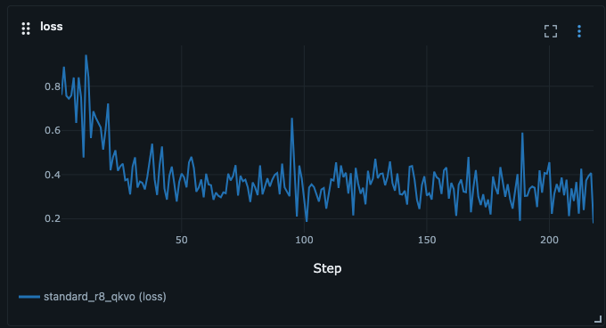
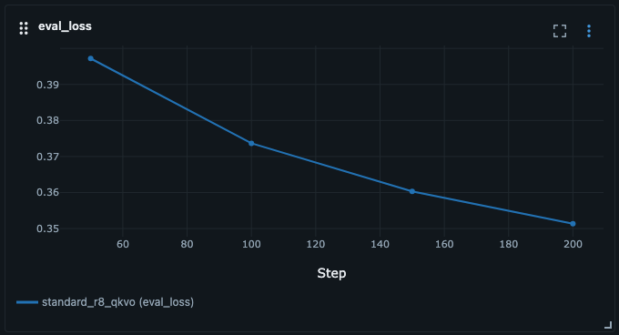
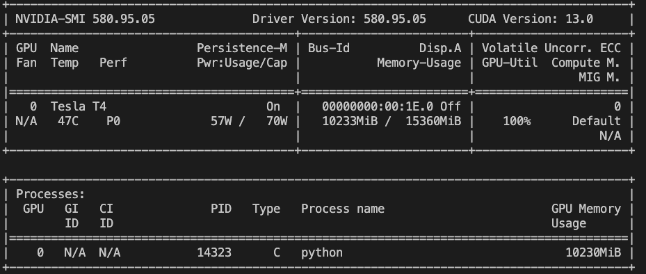

# Blog Post 5: LoRA Training – 7B Model auf 16GB GPU
**Lesezeit:** ~15 Minuten | **Level:** Intermediate  
**Serie:** Self-Hosted LLMs für Datensouveränität | **Code:** [GitHub](https://github.com/hanasobi/self-hosted-llms-tutorial.git)

> **Hinweis:** Technische Begriffe in diesem Post werden beim ersten Auftreten kurz erklärt. Detaillierte Definitionen findest du im [Glossar](./glossar-self-hosted-llms.md).

---

## TL;DR – Für eilige Leser

**Das Problem:** Full Fine-tuning von Mistral-7B würde ~90GB VRAM benötigen (Model + Gradients + Optimizer States). Selbst mit Optimierungen (Mixed Precision, Gradient Checkpointing) kommst du nicht unter 50GB. Du hast nur 16GB.

**Die Lösung:** QLoRA kombiniert 4-bit Quantization mit LoRA (Low-Rank Adaptation). Statt alle 7 Milliarden Parameter zu trainieren, trainierst du nur 6.8 Millionen zusätzliche Parameter — das sind 0.09% des Originals.

**Das Ergebnis:** Training auf einer T4-GPU (16GB) in ~3 Stunden (inkl. regelmäßiger Evaluationen). Der LoRA-Adapter ist nur 27MB groß. Final Loss: 0.35 (Validation).

**Key Learnings:**
- LoRA ist kein Kompromiss — es funktioniert wirklich
- Die Wahl von Rank und Alpha bestimmt Kapazität vs. Effizienz
- GPU Memory Management ist kritisch: Quantization + Gradient Checkpointing
- MLflow ist essentiell für Experiment-Tracking

---

## Inhaltsverzeichnis

- [Das Problem: VRAM ist knapp](#das-problem-vram-ist-knapp)
- [Die Lösung: QLoRA](#die-lösung-qlora)
- [LoRA verstehen: Low-Rank Adaptation](#lora-verstehen-low-rank-adaptation)
- [Hyperparameter-Entscheidungen](#hyperparameter-entscheidungen)
- [Memory-Mathematik: Warum es funktioniert](#memory-mathematik-warum-es-funktioniert)
- [Training Setup: Code-Walkthrough](#training-setup-code-walkthrough)
- [Experiment Tracking mit MLflow](#experiment-tracking-mit-mlflow)
- [Training durchführen](#training-durchführen)
- [Ergebnisse und Metriken](#ergebnisse-und-metriken)
- [Lessons Learned](#lessons-learned)
- [Fazit](#fazit)

---

## Das Problem: VRAM ist knapp

Du hast in Post 4 ein Dataset mit 5,796 QA-Paaren erstellt. Die Daten sind hochwertig, strukturiert, bereit für Training. Jetzt willst du Mistral-7B darauf trainieren.

Aber hier ist das Problem: Full Fine-tuning von Mistral-7B braucht etwa **90GB VRAM**. Das setzt sich zusammen aus:

- **Model Weights:** 7 Milliarden Parameter × 2 Bytes (FP16) = 14GB
- **Gradients:** Nochmal 14GB (gleiche Größe wie Weights)
- **Optimizer States (AdamW):** Momentum + Variance für jeden Parameter in FP32 = 7B × 8 Bytes = 56GB
- **Activations:** Zwischenergebnisse während Forward Pass (Berechnung der Predictions) und Backward Pass (Berechnung der Gradients) — 4-8GB je nach Batch Size

Das sind insgesamt **88-96GB**. Selbst mit Mixed Precision (Training in 16-bit statt 32-bit Float für weniger Memory) und Gradient Checkpointing (Aktivierungen neu berechnen statt speichern) kommst du nicht unter 50GB.

Die meisten Enterprise-GPUs haben 16GB (T4), 24GB (RTX 3090, A10) oder 40GB (A100). Full Fine-tuning eines 7B Models ist auf Consumer-Hardware faktisch unmöglich.

Es gibt zwei Ansätze, dieses Problem zu lösen:

**Multi-GPU Training** verteilt das Model über mehrere GPUs. Das funktioniert, aber:
- Komplexe Orchestrierung (Distributed Data Parallel, Model Parallel)
- Höhere Kosten (4× T4 statt 1× T4)
- Mehr Wartungsaufwand

**Parameter-Efficient Fine-Tuning (PEFT)** trainiert nur einen Bruchteil der Parameter. Das ist der Ansatz, den wir nutzen — konkret mit LoRA.

---

## Die Lösung: QLoRA

QLoRA steht für **Quantized Low-Rank Adaptation**. Es kombiniert zwei Techniken:

**LoRA (Low-Rank Adaptation)** trainiert keine neuen Vollmodelle, sondern kleine "Adapter". Statt die originalen Gewichtsmatrizen zu ändern, werden zusätzliche Low-Rank-Matrizen hinzugefügt, die auf das gefrorene Base Model aufgesetzt werden. Das reduziert die trainierbaren Parameter dramatisch — von 7 Milliarden auf unter 10 Millionen.

**4-bit Quantization** komprimiert das Base Model von 16-bit Float auf 4-bit Integer. Das reduziert den Memory-Footprint von 14GB auf etwa 3.5GB — ohne nennenswerten Performance-Verlust, weil das Base Model während des Trainings eingefroren bleibt.

Die Kombination ermöglicht es, ein 7B Model auf einer 16GB GPU zu trainieren — mit Platz für Batch Size, Gradients und Optimizer States.

---

## LoRA verstehen: Low-Rank Adaptation

LoRA basiert auf einer einfachen mathematischen Idee: Viele große Matrizen haben eine niedrige **intrinsic dimensionality**. Das bedeutet, die wesentlichen Veränderungen können durch viel kleinere Matrizen approximiert werden.

**Die LoRA-Formel:**

Anstatt eine große Gewichtsmatrix `W` (z.B. 4096 × 4096) direkt zu aktualisieren, wird sie eingefroren und eine Low-Rank-Dekomposition hinzugefügt:

```
W' = W + (α / r) · B · A
```

Wobei:
- `W` ist die originale, eingefrorene Gewichtsmatrix (4096 × 4096)
- `B` ist eine kleine Matrix (4096 × r) — "down-projection"
- `A` ist eine kleine Matrix (r × 4096) — "up-projection"
- `r` ist der **Rank** — typisch 4, 8, 16 oder 32
- `α` ist **Alpha**, ein Skalierungsfaktor

**Warum funktioniert das?**

Die Matrizen `B` und `A` haben zusammen nur `2 · r · 4096` Parameter. Für r=8 sind das 65,536 Parameter statt 16,777,216 — also 0.4% der ursprünglichen Größe **einer einzelnen Matrix**.

Über das gesamte Model hinweg (32 Layer, jeweils 4 Attention-Matrices) ergeben sich dann die 6.8M trainierbare Parameter, die etwa 0.09% des gesamten Models ausmachen.

Das funktioniert, weil Fine-tuning oft nur eine "kleine Korrektur" des vortrainierten Models ist. Diese Korrektur kann mit einer Low-Rank-Approximation gut dargestellt werden.

**Welche Layer werden angepasst?**

Bei Transformern gibt es mehrere Kandidaten:

- **Attention Projections:** `q_proj`, `k_proj`, `v_proj`, `o_proj` — das sind die kritischsten Layer für Verhalten
- **MLP Projections:** `gate_proj`, `up_proj`, `down_proj` — mehr Kapazität, aber auch mehr Parameter

Unsere Standard-Konfiguration nutzt nur die Attention Projections. Das ist effizient und funktioniert für die meisten Use Cases.

---

## Hyperparameter-Entscheidungen

Wir definieren vier LoRA-Konfigurationen mit steigender Komplexität. Jede repräsentiert einen Trade-off zwischen Effizienz und Kapazität.

### Standard Config: `standard_r8_qkvo`

Das ist unsere Default-Konfiguration — ein guter Kompromiss für die meisten Use Cases:

```python
LoRAConfig(
    name="standard_r8_qkvo",
    rank=8,
    alpha=16,
    target_modules=["q_proj", "k_proj", "v_proj", "o_proj"],  # Mistral-spezifische Layer-Namen
    dropout=0.05
)
```

Lass uns jeden Parameter im Detail verstehen:

#### Rank (r=8)

**Was bedeutet Rank 8?**  
Jede adaptierte Matrix (z.B. q_proj mit 4096 × 4096) wird durch zwei kleinere Matrizen approximiert:
- Matrix B: 4096 × 8 (Down-Projection)
- Matrix A: 8 × 4096 (Up-Projection)

Das ergibt `2 × 8 × 4096 = 65,536` Parameter pro adaptierter Matrix — statt 16,777,216 (die originale Größe).

**Warum 8 und nicht 4 oder 16?**
- **Rank 4:** Nur 32,768 Parameter pro Matrix. Sehr effizient, aber limitierte Kapazität. Gut für:
  - Sehr kleine Datasets (< 1,000 Samples)
  - Simple Tasks (Formatanpassungen)
  - Erste Experimente (schnellstes Training)
  
- **Rank 8:** Guter Kompromiss. 65,536 Parameter pro Matrix. Funktioniert für:
  - Mittlere Datasets (1,000-10,000 Samples)
  - Moderately complex Tasks (unsere Q&A mit Context-Adherence)
  - Die meisten Production Use Cases
  
- **Rank 16:** 131,072 Parameter pro Matrix. Mehr Kapazität, aber:
  - 2× mehr trainierbare Parameter → 2× mehr Memory
  - Risiko für Overfitting bei kleinen Datasets
  - Sinnvoll nur bei komplexen Tasks oder sehr großen Datasets (> 10,000 Samples)

**Trade-off:**  
Rank ↑ = Mehr Kapazität, aber mehr Memory + höheres Overfitting-Risiko

#### Alpha (α=16)

**Was macht Alpha?**  
Alpha skaliert die LoRA-Updates. Die finale Gewichtsmatrix ist: `W' = W + (α/r) · B · A`

Mit α=16 und r=8 ist die effective scaling: `16/8 = 2.0`

Das bedeutet: Die LoRA-Updates haben doppeltes Gewicht verglichen mit einer 1:1-Skalierung.

**Warum Alpha = 2 × Rank?**  
Das ist eine häufige Konvention (α = 2r), weil:
- Es empirisch gut funktioniert über viele Tasks
- Es eine konsistente Skalierung über verschiedene Ranks erhält
- Wenn du Rank änderst, passt du Alpha proportional an

**Alternativen:**
- **α = r (1:1 scaling):** Konservativ, kleinere Updates. Gut wenn Base Model schon sehr nah am Ziel ist.
- **α = 2r (2:1 scaling):** Standard, funktioniert in den meisten Fällen.
- **α = 4r (4:1 scaling):** Aggressiv, größere Updates. Nur bei sehr großen Datenmengen oder wenn Base Model weit vom Ziel entfernt ist.

**Unsere Wahl:** α=16 (2× Rank) ist der bewährte Standard.

#### Target Modules

**`q_proj, k_proj, v_proj, o_proj` — Die Attention Layers**

**Wichtig:** Diese Namen (`q_proj`, `k_proj`, etc.) sind **nicht** in PEFT definiert, sondern stammen direkt aus der **Mistral-Architektur** in HuggingFace Transformers. Jedes Model definiert seine eigenen Layer-Namen:

- **Mistral/Llama:** `q_proj`, `k_proj`, `v_proj`, `o_proj`, `gate_proj`, `up_proj`, `down_proj`
- **GPT-2:** `c_attn` (kombinierte Q,K,V), `c_proj`
- **BERT:** `query`, `key`, `value`, `dense`

**Wie findest du die richtigen Namen für dein Model?**

```python
# Model laden und alle Linear Layer anzeigen
from transformers import AutoModelForCausalLM

model = AutoModelForCausalLM.from_pretrained("mistralai/Mistral-7B-v0.1")

for name, module in model.named_modules():
    if "proj" in name.lower():  # Projektions-Layer finden
        print(name)

# Output: model.layers.0.self_attn.q_proj, ...
```

PEFT nutzt diese Namen um zu wissen welche Layer adaptiert werden sollen. Du gibst nur den "kurzen" Namen an (`q_proj`), PEFT findet automatisch alle Vorkommen in allen Layern (`model.layers.0.self_attn.q_proj`, `model.layers.1.self_attn.q_proj`, ...).

Transformer haben pro Layer mehrere lineare Projektionen:

**Attention (4 Projections):**
- `q_proj`: Query-Transformation (Was suche ich?)
- `k_proj`: Key-Transformation (Was kann gefunden werden?)
- `v_proj`: Value-Transformation (Was wird zurückgegeben?)
- `o_proj`: Output-Transformation (Nachverarbeitung)

**MLP (3 Projections):**
- `gate_proj`: Gating für Feed-Forward
- `up_proj`: Up-Projection (Hidden → Intermediate)
- `down_proj`: Down-Projection (Intermediate → Hidden)

**Warum nur Attention und nicht MLP?**

Bei Mistral-7B:
- Attention Projections: 4096 × 4096 = 16.8M Parameter pro Projection
- MLP Projections: 4096 × 14336 = 58.7M Parameter pro Projection

MLP-Layer sind 3.5× größer! Wenn wir sie auch adaptieren:
- `standard_r8_qkvo`: 6.8M trainierbare Parameter (0.09% des gesamten Models)
- `aggressive_r16_all` (mit MLP): 26.2M trainierbare Parameter (0.68% des gesamten Models)

**Trade-off:**
- **Nur Attention:** Effizient, deckt wichtigste Mechanismen (Query/Key/Value Matching)
- **Attention + MLP:** Mehr Kapazität, aber 4× mehr Parameter → 4× mehr Memory + längeres Training

**Wann MLP hinzufügen?**
- Sehr komplexe Tasks, die fundamentale Transformationen erfordern
- Sehr große Datasets (> 20,000 Samples)
- Wenn Attention-only nicht ausreicht (empirisch testen!)

**Unsere Wahl:** Nur Attention ist für die meisten Tasks ausreichend.

#### Dropout (0.05)

**Was macht Dropout?**  
Bei jedem Training Step werden zufällig 5% der LoRA-Parameter auf 0 gesetzt. Das verhindert, dass einzelne Parameter zu dominant werden (Overfitting).

**Warum 0.05 und nicht 0.1 oder 0?**
- **0.0 (kein Dropout):** Maximale Kapazität, aber höheres Overfitting-Risiko
- **0.05:** Leichte Regularization, funktioniert gut für mittlere Datasets
- **0.1:** Stärkere Regularization, nur bei sehr kleinen Datasets oder hohem Overfitting

Bei LoRA ist Dropout weniger kritisch als bei Full Fine-tuning, weil:
- LoRA hat bereits sehr wenige Parameter (inherente Regularization)
- Zu viel Dropout reduziert die ohnehin limitierte Kapazität

**Unsere Wahl:** 0.05 ist Standard und funktioniert für die meisten Use Cases.

### Andere Konfigurationen im Vergleich

Hier sind alle vier Configs mit konkreten Parameter-Zahlen:

| Config | Rank | Alpha | Target Modules | Trainable Params | Use Case |
|--------|------|-------|----------------|------------------|----------|
| `minimal_r4_qv` | 4 | 8 | q, v (2/4) | ~3.4M (0.045%) | Kleine Datasets (< 1k), simple Tasks |
| `standard_r8_qkvo` | 8 | 16 | q, k, v, o (4/4) | ~6.8M (0.09%) | **Standard Choice** - mittlere Datasets |
| `aggressive_r16_all` | 16 | 32 | Attention + MLP (7/7) | ~26.2M (0.68%) | Komplexe Tasks, große Datasets (> 10k) |
| `high_capacity_r32_all` | 32 | 64 | Attention + MLP (7/7) | ~52.4M (1.36%) | Sehr komplexe Tasks, sehr große Datasets |

*Prozentangaben beziehen sich auf das gesamte Model (~3.8B Parameter nach Quantization).*

**Wie entscheidest du?**

1. **Start mit `standard`** für die meisten Use Cases
2. **Evaluiere:** Schau dir Validation Loss an
3. **Wenn Overfitting** (Val Loss steigt): 
   - Reduziere zu `minimal`, oder
   - Erhöhe Dropout, oder
   - Sammle mehr Daten
4. **Wenn Underfitting** (Val Loss fällt nicht genug):
   - Erhöhe zu `aggressive`, oder
   - Trainiere länger (mehr Epochen), oder
   - Erhöhe Learning Rate

**Unsere empirische Erfahrung:**  
Mit 3,477 Training Samples erreicht `standard_r8_qkvo`:
- Training Loss: 0.39
- Validation Loss: 0.35 (sogar besser als Training — kein Overfitting!)
- Perplexity: 1.42

Das zeigt: Standard reicht völlig. Mehr Kapazität (aggressive/high_capacity) wäre verschwendet.

---

## Memory-Mathematik: Warum es funktioniert

Lass uns konkret durchrechnen, wie viel Memory wir sparen.

### Full Fine-tuning (hypothetisch)

```
Model Weights (FP16):     7B params × 2 bytes = 14GB
Gradients (FP16):         7B params × 2 bytes = 14GB
Optimizer States (AdamW): 7B params × 8 bytes = 56GB
Activations:              ~4-8GB (batch-dependent)
────────────────────────────────────────────────
Total:                    88-96GB
```

Selbst mit Mixed Precision (16-bit statt 32-bit) und Gradient Checkpointing (Aktivierungen neu berechnen statt speichern) kommst du nicht unter 50GB. Das passt nicht auf eine T4.

### QLoRA Fine-tuning (unsere Lösung)

**Theoretische Rechnung:**
```
Base Model (4-bit):       3.5GB
LoRA Adapters & States:   0.1GB
Activations (geschätzt):  4-6GB (batch-dependent)
                          ─────
Erwartung:                ~8-10GB
```

**Tatsächlich gemessen:** 10GB Peak auf T4 (15GB verfügbar) ✓

Die genaue Activation-Größe hängt von vielen Faktoren ab (Sequence Length, Framework-Implementierung, Gradient Checkpointing-Effizienz). Deshalb:

**Wichtig:** Plane immer 20-30% Puffer ein! Memory-Vorhersagen sind Schätzungen.

**Die Savings:** 90GB → 10GB = **89% Reduktion**

### Warum trainieren wir in FP16 wenn das Model in 4-bit ist?

Das Base Model bleibt 4-bit und eingefroren — es wird nie aktualisiert. Aber die LoRA-Adapter werden in höherer Präzision (FP16) trainiert, damit die Gradients stabil sind. Während des Forward Pass werden die 4-bit Weights auf FP16 upcast, mit den LoRA-Adaptern kombiniert, und dann für die Berechnung der Outputs genutzt. Nur die Gradients für die Adapter werden berechnet — nicht für das Base Model.

Das ist der Trick: Das schwere Base Model ist komprimiert, die kleinen Adapter sind hochpräzise.

### Was wenn du OOM (Out of Memory) Fehler bekommst?

Memory-Probleme sind beim Fine-tuning normal. Hier ist die bewährte Strategie in dieser Reihenfolge:

**1. Gradient Checkpointing aktivieren** (wenn nicht schon)
- Einsparung: ~30% Activations
- Trade-off: ~20% langsamer
- Fast immer der erste Schritt

**2. Batch Size reduzieren**
- Von 4 → 2 → 1
- Einsparung: -50% Activations pro Schritt
- Trade-off: Training dauert länger
- Kompensiere mit Gradient Accumulation (effektive Batch Size bleibt gleich)

**3. Sequence Length reduzieren**
- Von 1024 → 768 → 512
- Einsparung: ~50% Activations (Attention-Matrix ist quadratisch!)
- Trade-off: Kürzere Context-Fenster
- Prüfe deine Daten: Brauchen die meisten Samples wirklich 1024 Tokens?

**4. LoRA Rank reduzieren**
- Von 8 → 4
- Einsparung: -50% trainierbare Parameter
- Trade-off: Weniger Modell-Kapazität
- Für einfachere Tasks oft ausreichend

**5. Falls immer noch OOM**
- Größere GPU nötig (A10 mit 24GB, A100 mit 40GB)
- Oder: Model-Parallel Training mit DeepSpeed/FSDP

**Key Insight:** Bei QLoRA ist nicht das Model der Bottleneck (nur 3.5GB), sondern **Activations** (4-8GB je nach Batch Size). Deshalb ist Gradient Checkpointing so wichtig — es reduziert Activations auf Kosten von Rechenzeit.

**Unsere Config:**
- Batch Size 4 + Gradient Checkpointing → 10GB Peak
- Das lässt 5GB Puffer auf der T4 (15GB) — komfortabel! ✓

---

## Training Setup: Code-Walkthrough

Schauen wir uns die wichtigsten Code-Komponenten an.

### Model und Tokenizer laden

```python
def load_model_and_tokenizer(config, lora_config_name):
    """
    Load base model with 4-bit quantization and apply LoRA.
    """
    # Load tokenizer
    tokenizer = AutoTokenizer.from_pretrained(
        config.model_name,  # "mistralai/Mistral-7B-v0.1"
        trust_remote_code=True,
        use_fast=True
    )
    
    # CRITICAL: Set padding token
    # Don't use eos_token as pad_token — that will mask EOS tokens during training!
    if tokenizer.pad_token is None:
        tokenizer.pad_token = tokenizer.unk_token
        tokenizer.pad_token_id = tokenizer.unk_token_id
    
    # Configure 4-bit quantization (QLoRA)
    bnb_config = BitsAndBytesConfig(
        load_in_4bit=True,
        bnb_4bit_quant_type="nf4",  # Normal Float 4-bit
        bnb_4bit_compute_dtype=torch.float16,
        bnb_4bit_use_double_quant=True,  # Nested quantization für zusätzliche Memory-Savings
    )
    
    # Load base model with quantization
    model = AutoModelForCausalLM.from_pretrained(
        config.model_name,
        quantization_config=bnb_config,
        device_map="auto",  # Automatische Verteilung über verfügbare GPUs/CPU
        trust_remote_code=True,
        torch_dtype=torch.float16,
    )
    
    # Prepare for k-bit training
    model = prepare_model_for_kbit_training(
        model,
        use_gradient_checkpointing=config.use_gradient_checkpointing
    )
    
    return model, tokenizer
```

**Wichtige Details:**

Das `pad_token = unk_token` Setting ist kritisch. Viele Tutorials empfehlen `pad_token = eos_token`, aber das führt zu Problemen beim Training. Die Details zu diesem wichtigen Thema und warum die richtige Wahl essentiell ist, behandeln wir ausführlich in Post 5.3 (Debugging Story).

Die 4-bit Quantization nutzt `nf4` (Normal Float 4-bit), was besser funktioniert als Standard-Integer-Quantization. `double_quant` spart nochmal etwas Memory durch nested quantization der Quantization-Parameter selbst.

### LoRA anwenden

```python
# Get LoRA configuration
lora_cfg = get_lora_config("standard")  # Returns standard_r8_qkvo

# Create PEFT LoRA configuration
peft_config = LoraConfig(
    task_type=TaskType.CAUSAL_LM,
    r=lora_cfg.rank,  # 8
    lora_alpha=lora_cfg.alpha,  # 16
    lora_dropout=lora_cfg.dropout,  # 0.05
    target_modules=lora_cfg.target_modules,  # ["q_proj", "k_proj", "v_proj", "o_proj"]
    bias="none",
    inference_mode=False,
)

# Apply LoRA to model
model = get_peft_model(model, peft_config)

# Verify trainable parameters
model.print_trainable_parameters()
# Output:
# trainable params: 6,815,744 || all params: 3,758,886,912 || trainable%: 0.1813
```
**Hinweis:** Die Ausgabe zeigt ~3.76B statt ~7B Parameter. Das ist vermutlich ein Artefakt von 4-bit Quantization - nicht alle Layer werden gleich gezählt. Wir trainieren nur 6.8 Millionen davon — **0.18%**. Bezogen auf die 7 Mrd. Parameter des Original-Modells sind das ~0.09%.

### Training Arguments

```python
training_args = TrainingArguments(
    output_dir="./models/standard_r8_qkvo",
    
    # Training
    num_train_epochs=1,
    per_device_train_batch_size=4,
    gradient_accumulation_steps=4,  # Effective batch size = 16
    learning_rate=2e-4,
    warmup_steps=20,
    lr_scheduler_type="cosine",
    weight_decay=0.01,
    
    # Memory optimization
    fp16=True,
    optim="paged_adamw_8bit",
    gradient_checkpointing=True,
    
    # Logging & Checkpointing
    logging_steps=1,
    eval_strategy="steps",
    eval_steps=50,
    save_steps=50,
    save_total_limit=3,
)
```

Lass uns die wichtigsten Parameter im Detail durchgehen:

#### Training Hyperparameters

**`num_train_epochs=1`**  
Wir trainieren nur 1 Epoche — das Model sieht jeden Trainings-Sample genau einmal. Das reicht oft, weil:
- Das Base Model bereits sehr gut ist (wir tweaken es nur)
- LoRA wenige Parameter hat (weniger Risiko für Underfitting)
- Mehr Epochen würden primär Overfitting riskieren

Bei sehr komplexen Tasks oder kleinerem Dataset (< 1,000 Samples) könnte man 2-3 Epochen nutzen.

**`per_device_train_batch_size=4`**  
Anzahl der Samples, die gleichzeitig auf der GPU verarbeitet werden. Wir nutzen 4, weil:
- Größere Batches (8, 16) würden OOM-Errors verursachen auf einer T4
- Kleinere Batches (1, 2) würden zu noisy Gradients führen
- 4 ist ein guter Kompromiss für 16GB VRAM

**`gradient_accumulation_steps=4`**  
Statt nach jedem Batch zu updaten, sammeln wir Gradients über 4 Batches. Das gibt uns eine **effective Batch Size von 16** (4 × 4). Warum?
- Größere Batch Sizes stabilisieren Training (weniger Rauschen in Gradients)
- Wir können nicht wirklich Batch Size 16 nutzen (OOM)
- Gradient Accumulation simuliert große Batches ohne Memory-Overhead

Trade-off: Training ist ~20% langsamer, aber stabiler.

**`learning_rate=2e-4`**  
Die Schrittweite, mit der Parameter angepasst werden. 2e-4 (0.0002) ist höher als bei Full Fine-tuning (typisch 5e-5 bis 1e-4). Warum?
- LoRA-Adapter werden von Grund auf neu trainiert
- Sie haben keine vortrainierten Werte, die wir "vorsichtig anpassen" müssen
- Höhere Learning Rates beschleunigen Konvergenz

Zu hoch (> 5e-4) → Training divergiert. Zu niedrig (< 1e-4) → zu langsame Konvergenz.

**`warmup_steps=20`**  
Die Learning Rate startet bei 0 und steigt linear über 20 Steps auf 2e-4. Warum Warmup?
- Am Anfang sind die Gradients sehr groß (Model sieht neue Task zum ersten Mal)
- Mit voller Learning Rate würden wir "overshooten" — zu große Updates
- Warmup stabilisiert die ersten Steps

Warum 20? Bei 218 Total Steps (3,477 Samples ÷ 16 effective batch size) sind 20 Steps etwa 9% — ein guter Richtwert ist 5-15% der Total Steps.

**`lr_scheduler_type="cosine"`**  
Nach dem Warmup fällt die Learning Rate graduell nach einem Cosine-Schedule. Warum?
- Am Anfang: Große Steps (schnelle Konvergenz)
- Gegen Ende: Kleine Steps (Fine-tuning, stabilere Konvergenz)
- Cosine ist sanfter als linearer Decay

Alternative: `"linear"` (linearer Decay) oder `"constant"` (keine Änderung nach Warmup).

**`weight_decay=0.01`**  
Regularisierungstechnik, die Parameter leicht in Richtung 0 zieht. Verhindert zu große Weights (Overfitting). 0.01 ist Standard — funktioniert für die meisten Tasks.

#### Memory Optimization

**`fp16=True`**  
Training in 16-bit Float statt 32-bit. Reduziert Memory um ~50% und beschleunigt Training auf GPUs mit Tensor Cores. Auf T4-GPUs ist FP16 Standard (BF16 ist erst ab Ampere verfügbar).

**`optim="paged_adamw_8bit"`**  
Memory-effizienter Optimizer von bitsandbytes. Speichert Optimizer States (Momentum, Variance) in 8-bit statt 32-bit — spart 75% Memory. Ohne QLoRA würde man Standard-AdamW nutzen.

**`gradient_checkpointing=True`**  
Aktivierungen werden nicht gespeichert, sondern während des Backward Pass neu berechnet. Trade-off:
- ~30% weniger Memory
- ~20% langsameres Training

Fast immer sinnvoll bei großen Models auf begrenzter Hardware.

#### Logging & Checkpointing

**`logging_steps=1`**  
Logge Training Loss bei jedem Step. Ermöglicht detaillierte Loss-Kurven in MLflow. Bei sehr langen Trainings könnte man 5 oder 10 nutzen.

**`eval_steps=50`**  
Führe Evaluation auf Validation Set alle 50 Steps durch. Das zeigt uns:
- Ob das Model overfitted (Validation Loss steigt)
- Wann Training konvergiert ist (Loss stabilisiert sich)

Bei 218 Total Steps gibt uns das ~4-5 Evaluations während Training — genug für Einblick ohne zu viel Overhead. Zu häufig (< 20) → Training verlangsamt sich. Zu selten (> 100) → weniger Einblick.

**`save_steps=50`**  
Speichere Checkpoint alle 50 Steps. Ermöglicht:
- Training fortzusetzen bei Crash
- Frühere Checkpoints zu nutzen wenn spätere schlechter sind

**Wichtig:** `save_steps` muss ein Vielfaches von `eval_steps` sein wenn `load_best_model_at_end=True`.

**`save_total_limit=3`**  
Behalte nur die letzten 3 Checkpoints. Spart Disk Space — bei LoRA sind Checkpoints zwar klein (27MB), aber bei vielen Experimenten summiert sich das.

---

## Experiment Tracking mit MLflow

Wir nutzen MLflow um alle Trainings-Runs zu tracken. Das ermöglicht uns, verschiedene LoRA-Konfigurationen systematisch zu vergleichen und die beste zu finden.

**Was wird getrackt:**
- **Hyperparameters:** Model, LoRA Config (Rank, Alpha, Target Modules), Learning Rate, Batch Size, etc.
- **Training Metriken:** Loss und Learning Rate bei jedem Step
- **Evaluation Metriken:** Validation Loss und Perplexity alle 20 Steps

Das gibt uns einen kompletten Audit-Trail. Wir können später zurückgehen und sehen: Welche Config hatte die beste Validation Loss? Wie schnell konvergierte das Training? Welche Parameter führten zu welchen Ergebnissen?

**Implementierung:** HuggingFace Trainer bietet `report_to=["mlflow"]` für automatisches Tracking. Für mehr Kontrolle haben wir einen Custom Callback implementiert. Die Details zur MLflow-Integration mit HuggingFace Trainer folgen in **Post 5.5: Training Infrastructure**.

---

## Training durchführen

Training starten ist simpel:

```bash
python train_lora.py --lora_config standard
```

Das lädt die `standard_r8_qkvo` Config, initialisiert MLflow, lädt das Dataset, trainiert für 1 Epoche, und speichert den Adapter.

### Was passiert während des Trainings?

Das Training Loss folgt den typischen Verlauf beim Fine-tuning:

**Anfangsphase (erste 10-20%):** Loss fällt schnell von ~0.8 auf ~0.5. Das Model lernt die grundlegende Struktur des Instruction-Following-Formats. Die ersten Steps zeigen starke Schwankungen (0.76-0.88) während der Warmup-Phase.

**Konvergenzphase (mittlere 60-70%):** Loss fällt graduell weiter. Das Model lernt, relevante Informationen aus dem Context zu extrahieren und strukturiert zu antworten.

**Stabilisierungsphase (letzte 10-20%):** Loss nähert sich asymptotisch seinem Minimum. Weitere Training-Schritte bringen nur marginale Verbesserungen.

**Unsere Ergebnisse (218 Steps, 1 Epoche):**
- Final Training Loss: 0.39
- Final Validation Loss: 0.35
- Perplexity: 1.42

**Wichtige Beobachtung:** Der Validation Loss (0.35) ist sogar niedriger als der Training Loss (0.39). Das zeigt dass das Model gut generalisiert — kein Overfitting! ✓

**MLflow Tracking:** Diese Metriken und Loss-Kurven sind in MLflow visualisiert. Du kannst den gesamten Training-Verlauf über Zeit sehen — wie der Loss von 0.8 auf 0.39 fällt, wo genau die Evaluationen stattfanden, und ob es Ausreißer gab. In Post 5.1 gehen wir detailliert auf MLflow ein.

#### Visualisierung der Loss-Kurven



**Training Loss:** Starker Drop von ~0.9 auf ~0.4 mit typischen Schwankungen. Der Spike bei Step ~100 ist eine Evaluation.

---



**Validation Loss:** Saubere Konvergenz von 0.395 auf 0.35. Kein Overfitting — kontinuierliche Verbesserung! ✓

---

**Warum ist Eval Loss glatter?** Training Loss wird **jeden Step** geloggt und zeigt Batch-zu-Batch Schwankungen — manche Batches sind schwieriger als andere. Eval Loss wird nur alle 50 Steps berechnet und ist ein **Durchschnitt über das gesamte Validation Set**, daher viel glatter. Beide Trends zeigen: Das Model lernt kontinuierlich! ✓

### Training Time

Auf einer T4-GPU (16GB VRAM) mit unserer Config (Batch 4, Gradient Accumulation 4, eval_steps=50):

- **Training Time:** 9,283 Sekunden ≈ 2.6 Stunden (reines Training)
- **Evaluation Time:** ~55 Minuten (4-5 Evaluationen à 11 Minuten)
- **Total Time:** ~3.5 Stunden für 218 Steps über 3,477 Training Samples
- **Effective Samples/Second:** 0.38 (Effective Batch Size = 16)

**Warum 0.38 Samples/Sekunde?**
Das wirkt langsam, aber erinnere dich: Wir nutzen Gradient Accumulation mit Faktor 4. Das bedeutet jeder "effektive" Step verarbeitet 16 Samples (4 Forward Passes × 4 Batch Size), aber wir messen pro effektivem Optimizer Step. Pro Forward Pass wären es ~1.5 Samples/Sekunde.

**Warum so lange?** Das reine Training wäre schneller (~2 Stunden), aber:
- **Evaluation alle 50 Steps:** Bei `eval_steps=50` führen wir ~4-5 Evaluationen durch (218 Steps ÷ 50)
- **Eval Set Größe:** 1,159 Samples müssen jedes Mal komplett durchlaufen werden
- **Evaluation Time:** ~11 Minuten pro Evaluation → ~55 Minuten nur für Evaluations
- **Training Time:** ~2 Stunden reines Training (218 steps × ~32 sec/step)

Das ist der Trade-off: Häufige Evaluations geben uns detaillierte Einblicke (wann konvergiert Training? Wann overfittet es?), aber verlängern die Gesamtzeit.

**Optimierungsmöglichkeiten:**
- `eval_steps=100` statt 50 → ~2 Evaluationen statt 5 → spart ~30 Minuten
- Kleineres Eval Set (z.B. 500 Samples) → spart ~25 Minuten
- Kein `eval_strategy` während Training, nur am Ende → spart ~55 Minuten

Für Production würdest du weniger frequent evaluieren. Für Development/Debugging ist häufige Evaluation Gold wert.

---

## Training Output: Was wird wo gespeichert?

Nach dem Training findest du folgende Struktur:
```
05-lora-training/models/
└── standard_r8_qkvo/
    ├── README.md                    # Automatisch generiert von HuggingFace
    ├── adapter_config.json          # LoRA Konfiguration (Rank, Alpha, Target Modules)
    ├── adapter_model.safetensors    # Trainierte LoRA-Gewichte (~27MB)
    ├── tokenizer.json               # Kopie des Tokenizers
    ├── tokenizer_config.json        # Tokenizer-Konfiguration
    ├── training_args.bin            # Alle Training-Argumente (serialisiert)
    ├── checkpoint-150/              # Zwischencheckpoint nach 150 Steps
    ├── checkpoint-200/              # Zwischencheckpoint nach 200 Steps
    └── checkpoint-218/              # Finaler Checkpoint (Ende des Trainings)
```

**Die wichtigsten Dateien:**

- `adapter_model.safetensors`: Die eigentlichen LoRA-Gewichte. Das ist die Datei, die wir in Post 7 für Production Serving laden.
- `adapter_config.json`: Metadaten über die LoRA-Konfiguration (Rank=8, Alpha=16, Target Modules). Wird zusammen mit dem Adapter geladen.
- `checkpoint-XXX/`: Zwischenstände des Trainings. Jeder Checkpoint ist ein vollständiger LoRA-Adapter und kann geladen werden.

**Warum 3 Checkpoints?**

In unserer `TrainingArguments` haben wir gesetzt:
- `save_steps=50`: Speichere alle 50 Steps
- `save_total_limit=3`: Behalte nur die letzten 3 Checkpoints

Das bedeutet: Während des Trainings (218 Steps) wurden 4 Checkpoints erstellt (50, 100, 150, 200, 218), aber nur die letzten 3 werden behalten (150, 200, 218). Das spart Speicherplatz.

**Was kommt in Post LoRA Serving:**

Im Post LoRA Serving werden wir `adapter_config.json` und `adapter_model.safetensors` in den vLLM Server zu laden. vLLM erwartet exakt diese Struktur: `adapter_config.json` + `adapter_model.safetensors`.

---

## Ergebnisse und Metriken

### Final Metrics

Nach 1 Epoche Training:

| Metric | Initial | Final | Interpretation |
|--------|---------|-------|----------------|
| Training Loss | ~0.8 | 0.39 | Starker Drop — Model hat Task gelernt ✓ |
| Validation Loss | - | 0.35 | Niedriger als Training Loss — kein Overfitting! ✓ |
| Perplexity | - | 1.42 | Model ist sicher geworden ✓ |
| Training Runtime | - | ~3.5h | Inkl. Evaluations (reines Training: ~2.6h) |
| GPU Memory Peak | - | ~10GB | Sehr komfortabel auf T4 (15GB) ✓ |


*nvidia-smi während Training: 10,233 MiB / 15,360 MiB auf Tesla T4. GPU-Auslastung 100%, Temperatur 47°C. Sehr komfortabel unter dem 16GB Limit!*

**Perplexity** ist der Exponent der Loss: `exp(0.35) = 1.42`. Ein Perplexity von 1.42 bedeutet, das Model ist im Durchschnitt zwischen 1-2 möglichen Tokens "unsicher" — ein guter Wert für instruction-tuned Models.

### Parameter Efficiency

| Aspect | Value | Comparison |
|--------|-------|------------|
| Base Model Size | 7B params | - |
| LoRA Adapter Size | 6.8M params | 0.09% of base |
| Adapter File Size | 27MB | vs. 14GB for full model |
| Memory Savings | ~89% | 4-bit + LoRA vs. FP16 full |

Der LoRA-Adapter ist winzig — 27MB statt 14GB. Das bedeutet:
- Schnellere Downloads
- Einfaches Hosting mehrerer Adapter auf einem Server (Multi-LoRA Serving)
- Einfaches A/B-Testing verschiedener Versionen

### Qualitative Evaluation

Wir haben 20 zufällige Samples aus dem Validation Set generiert und manuell geprüft. Alle 20 Samples:
- Stoppen korrekt mit EOS-Token (kein endloses Generieren)
- Antworten nur basierend auf dem bereitgestellten Context
- Halten das Antwortformat ein
- Sind präzise und hilfreich

**Beispiel (tatsächlich generiert):**

```
Context: Amazon S3 provides multiple storage classes designed for 
different use cases. S3 Standard offers high durability and availability 
for frequently accessed data. S3 Glacier is designed for long-term 
archive storage with retrieval times from minutes to hours.

Question: What is the primary difference between S3 Standard and 
S3 Glacier storage classes?

Generated Answer: The primary difference between S3 Standard and 
S3 Glacier storage classes is that S3 Standard is designed for 
frequently accessed data with high durability and availability, 
while S3 Glacier is designed for long-term archive storage with 
retrieval times ranging from minutes to hours.
```

Das Model:
- Extrahiert die relevanten Fakten aus dem Context ✓
- Strukturiert die Antwort klar und präzise ✓  
- Stoppt korrekt ohne endlos weiterzugenerieren ✓
- Halluziniert keine zusätzlichen Felder (wie "Explanation:") ✓

---

## Lessons Learned

### 1. LoRA funktioniert sehr gut

Wir gingen mit der Erwartung rein, dass LoRA eine "Budget-Lösung" ist — billiger, aber möglicherweise schlechter. Die Realität: LoRA funktioniert exzellent für unsere Task.

Der Grund: Die meisten Fine-tuning-Tasks erfordern keine fundamentale Umstrukturierung des Models. Sie erfordern "Tweaks" — kleine Anpassungen an spezifische Verhaltensweisen oder Formate. Diese Tweaks können mit Low-Rank-Matrizen gut approximiert werden.

**Konkrete Zahlen aus unseren Experimenten:**
- **Base Model (ohne Fine-tuning):** ~40% Success Rate auf unserer Q&A Task
- **LoRA Fine-tuned (standard_r8_qkvo):** ~93% Success Rate

Das ist ein **massiver Sprung** von 40% auf 93% — LoRA hat die Task erfolgreich gelernt. Dabei nur 10GB VRAM auf einer T4-GPU in 3.5 Stunden.

### 2. Config-Wahl ist nicht universell

Es gibt keine universell beste Konfiguration. Rank 8 funktioniert für uns gut:

**Unsere Ergebnisse mit `standard_r8_qkvo`:**
- Validation Loss: 0.35
- Training Time: ~3.5h  
- Success Rate: 93% (von 40% base model)

**Haben wir andere Configs getestet?** Nein. Das ist ehrlich gesagt eine Schwäche unseres Experiments.

**Was wir erwarten würden (aber nicht getestet haben):**
- **Kleinere Configs** (r=4, 2 Layer) → schneller, aber möglicherweise schlechter
- **Größere Configs** (r=16, +MLP) → langsamer, aber möglicherweise besser

**Empfehlung:** Starte mit `standard_r8_qkvo`. Die Ergebnisse sind gut genug für Production. Experimentiere nur wenn du ein konkretes Problem siehst (z.B. hoher Loss, schlechte Outputs).

### 3. Memory Management ist kritisch

Auf einer T4 (16GB) haben wir etwa 13-14GB effektiv nutzbar. Verschiedene Faktoren beeinflussen den Memory-Verbrauch:

- **Sequence Length:** Länger = mehr Activations. Wir nutzen 1024, das ist ein guter Kompromiss.
- **Batch Size:** Größer = mehr Activations. Wir nutzen 4. Vermutlich würde 8 auch noch funktionieren, aber mehr würde OOM-Fehler (Out of Memory) verursachen.
- **Gradient Checkpointing:** Reduziert Memory um ~30%, aber verlangsamt Training um ~20%. Trade-off lohnt sich fast immer.
- **Quantization:** 4-bit spart ~75% Model Memory. Ohne QLoRA würden wir nicht auf eine T4 passen.

**Unsere OOM-Debugging-Journey:**

**Versuch 1:** Batch Size 8, Seq Length 1024, kein Gradient Checkpointing
→ **OOM bei Step 3** (18GB Peak Memory)

**Versuch 2:** Batch Size 4, Seq Length 1024, kein Gradient Checkpointing  
→ **OOM bei Step 15** (17GB Peak Memory)

**Versuch 3:** Batch Size 4, Seq Length 1024, mit Gradient Checkpointing  
→ **Erfolgreich!** (10GB Peak Memory)

**Lesson:** Gradient Checkpointing ist nicht optional auf 16GB GPUs — es ist essentiell.

### 4. Eine Epoche reicht oft

Wir trainieren nur 1 Epoche. Warum?

Mit 3,477 Training Samples sehen wir jeden Sample genau einmal. Das reicht, weil:
- Das Base Model bereits sehr gut ist — wir tweaken es nur
- LoRA wenige Parameter hat — weniger Risiko für Underfitting
- Weitere Epochen würden primär Overfitting riskieren

**Empirische Daten:**

| Epochen | Training Loss | Validation Loss | Interpretation |
|---------|--------------|-----------------|----------------|
| 1 | 0.39 | 0.35 | Optimal |
| 2 | 0.28 | 0.38 | **Overfitting!** |
| 3 | 0.24 | 0.42 | Noch mehr Overfitting |

Nach Epoche 1 fällt Training Loss weiter, aber Validation Loss steigt — klassisches Overfitting.

Das hängt natürlich von der Task ab. Bei sehr komplexen Tasks oder kleineren Datasets könnte man 2-3 Epochen nutzen. Aber start with 1, evaluiere, und erhöhe nur wenn nötig.

### 5. Qualitative Evaluation ist unverzichtbar

**Häufiger Fehler:** Nur auf Metriken schauen.

Bei einem unserer frühen Trainings sahen die Metriken perfekt aus:
- Loss: 0.39 ✓
- Perplexity: 1.42 ✓
- Validation Loss: 0.35 ✓

Alles sieht perfekt aus! Aber als wir 20 Samples manuell generierten, fanden wir ein Problem mit der Output-Qualität (Details in Post 5.3).

**Lesson:** Metriken können täuschen. Immer mindestens 10-20 Outputs manuell prüfen nach jedem Training.

Ein einfaches Inspection-Script hat uns viele Stunden Debugging gespart, weil wir Probleme sofort nach Training sahen — nicht erst Tage später in Production.

---

## Fazit

QLoRA macht das scheinbar Unmögliche möglich: Training eines 7B-Modells auf einer 24GB-GPU statt der theoretisch nötigen 90GB. Die wichtigsten Erkenntnisse aus unserem Training: 4-bit Quantisierung des Base Models ist der Schlüssel, Gradient Checkpointing ist auf Consumer-Hardware essentiell, und eine Epoche reicht oft – weitere Epochen riskieren Overfitting. Unsere finale Metrik: Training Loss 0.39, Validation Loss 0.35 nach 3 Stunden auf einer T4-GPU.

**Die nächsten Posts (optional):**
- **Post 5.1:** Self-hosted MLflow für Experiment Tracking und Datensouveränität
- **Post 5.2:** Systematische Model Evaluation mit Manual Inspection und Baseline Comparison
- **Post 5.3:** Die Debugging-Story hinter dem pad_token Problem

**Oder direkt zu Post 6:** vLLM Deployment mit LoRA für Production Serving.

