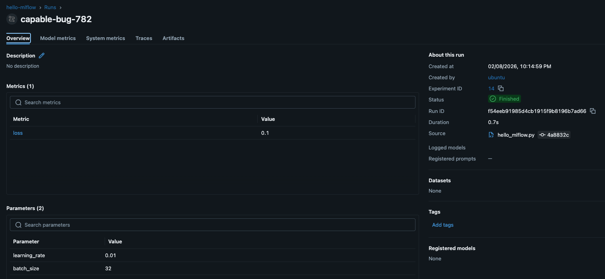
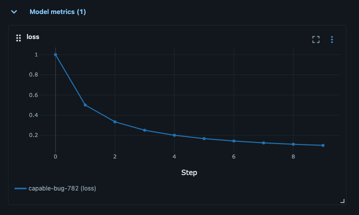
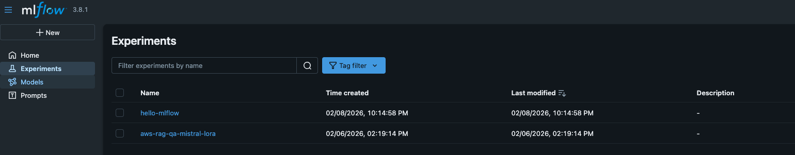
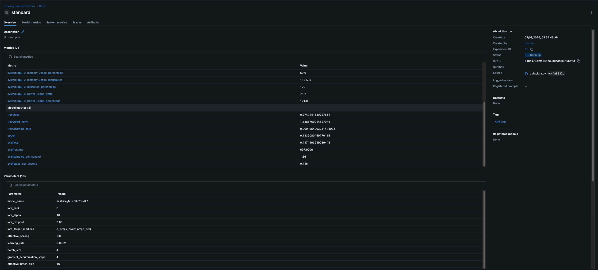
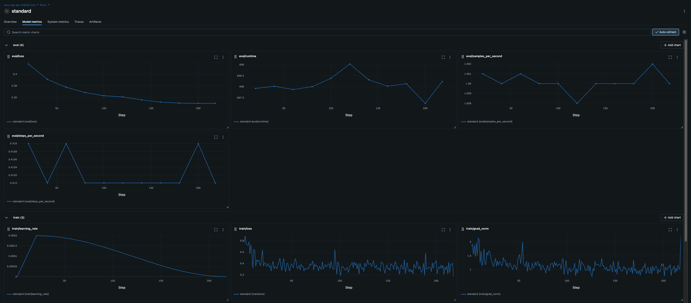
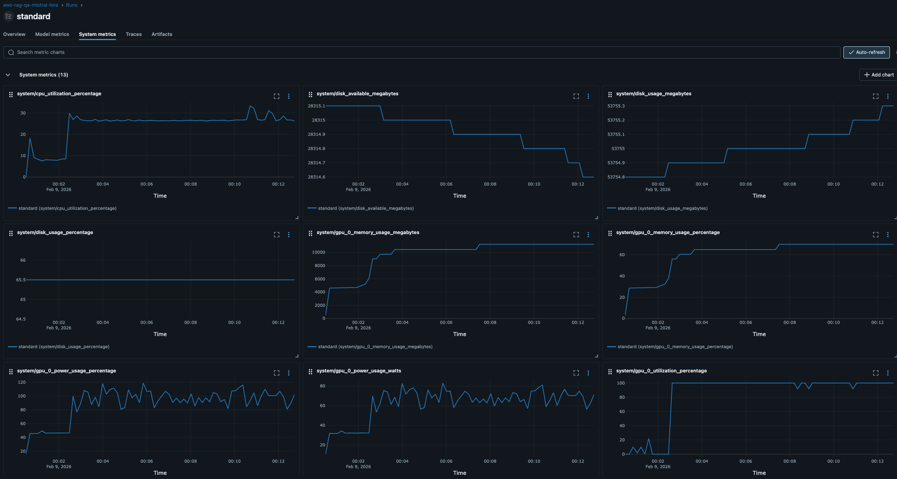

# Blog Post 5.1: Experiment Tracking mit MLflow - Die Kontrolle behalten

**Lesezeit:** ~20 Minuten | **Level:** Intermediate  
**Serie:** Self-Hosted LLMs für Datensouveränität | **Code:** [GitHub](https://github.com/hanasobi/self-hosted-llms-tutorial.git)

---

## TL;DR – Für eilige Leser

**Das Problem:** Mehrere LoRA-Training-Runs mit verschiedenen Hyperparametern werden schnell unübersichtlich: Welches Modell war am besten? Welche Config hatte welche Metriken? Wie reproduziere ich das beste Ergebnis?

**Die Lösung:** MLflow Tracking bietet systematisches Experiment-Management mit automatisiertem Logging von Parametern, Metriken und Modell-Artefakten. Unser Custom Callback gibt volle Kontrolle über das Logging ohne Framework-Magic.

**Das Ergebnis:** Vergleichbare Runs in einer Web-UI, vollständige Reproduzierbarkeit durch Parameter-Tracking, und automatisiertes Metriken-Logging während des Trainings.

**Key Learnings:**
- Custom MLflow Callback ist besser als eingebaute Integration (volle Kontrolle)
- Evaluation-Frequenz ist ein Trade-off: Granularität vs. Training-Performance
- Tutorial-Setup nutzt lokales SQLite - Production braucht PostgreSQL + S3
- Model Registry und Artifact Store kommen in Post 9+ (Automation)

---

## Inhaltsverzeichnis

- [Warum Experiment Tracking?](#warum-experiment-tracking)
- [Was ist MLflow?](#was-ist-mlflow)
- [MLflow vs. Weights & Biases: Datensouveränität](#mlflow-vs-weights--biases-datensouveränität)
- [MLflow Installation & Quick Start](#mlflow-installation--quick-start)
- [Unser Setup für dieses Tutorial](#unser-setup-für-dieses-tutorial)
- [Code-Struktur für unser Projekt](#code-struktur-für-unser-projekt)
- [Implementierung: Die drei Komponenten](#implementierung-die-drei-komponenten)
- [Dein erster LoRA-Training-Run mit MLflow](#dein-erster-lora-training-run-mit-mlflow)
- [Praxisbeispiel: Ein echter Training-Run](#praxisbeispiel-ein-echter-training-run)
- [Best Practices für MLflow Tracking](#best-practices-für-mlflow-tracking)
- [Debugging: Häufige Probleme](#debugging-häufige-probleme)
- [Performance-Überlegungen](#performance-überlegungen)
- [Bonus: System Metrics automatisch loggen](#bonus-system-metrics-automatisch-loggen)
- [Fazit](#fazit)

---

## Warum Experiment Tracking?

Stell dir vor, du trainierst mehrere LoRA-Modelle mit verschiedenen Hyperparametern:

```bash
# Run 1: Standard-Config
python train_lora.py --lora_config standard

# Run 2: Aggressive-Config  
python train_lora.py --lora_config aggressive

# Run 3: Standard-Config mit anderen Learning Rate
python train_lora.py --lora_config standard --learning_rate 0.0001
```

Ohne systematisches Tracking stehst du nach einer Woche vor folgenden Problemen:

1. **Welches Modell war nochmal das beste?** War es das mit rank=16 oder rank=32?
2. **Wie waren nochmal die genauen Hyperparameter?** Du erinnerst dich an "irgendwas mit learning_rate 0.0001", aber war das mit oder ohne warmup?
3. **Lief das Training stabil?** Gab es einen Loss-Spike in Epoche 2, oder verwechselst du das mit einem anderen Run?
4. **Wie reproduziere ich das beste Modell?** Selbst wenn du die Config-Datei hast - welche Version war das genau?

**Das ist nicht nur ärgerlich - es ist unwissenschaftlich und kostet richtig Geld**, besonders wenn jeder Run auf einer GPU-Instanz mehrere Stunden läuft.

MLflow löst diese Probleme durch **systematisches, automatisiertes Tracking** von:
- Hyperparametern (alle Config-Werte)
- Metriken (Loss, Accuracy, etc. über Zeit)
- Artefakten (Modelle, Plots, Datasets)
- Code-Versionen (Git Commit Hash)
- Laufzeit-Informationen (Start, Dauer, Hardware)

## Was ist MLflow?

MLflow ist ein Open-Source-Framework für den kompletten ML-Lifecycle. Es besteht aus mehreren Komponenten:

**MLflow Tracking** (was wir hier nutzen):
- Logging von Parametern, Metriken und Artefakten
- Web-UI zum Vergleichen von Experimenten
- REST API für programmatischen Zugriff
- Verschiedene Backends (Local, S3, PostgreSQL, etc.)

**MLflow Models** (später relevant):
- Standardisiertes Format für ML-Modelle
- Deployment-Tools
- Model Registry für Versionierung

**MLflow Projects** (optional):
- Reproduzierbare Runs
- Packaging von ML-Code

Für unseren LoRA-Training-Workflow fokussieren wir uns auf **MLflow Tracking**. Das ist der Kern, der den größten sofortigen Nutzen bringt.

### MLflow Kernkonzepte

Bevor wir tiefer einsteigen, die wichtigsten Konzepte:

**Experiment:** Container für verwandte Runs (z.B. "aws-rag-qa-mistral-lora")
- Gruppiert alle Training-Runs für ein Projekt
- Jedes Experiment hat eine eindeutige ID
- Beispiel: Alle LoRA-Varianten für AWS-RAG-QA landen in einem Experiment

**Run:** Ein einzelnes Training (z.B. "standard_r8_qkvo")
- Repräsentiert einen spezifischen Training-Job
- Hat eindeutige Run-ID und optional einen Namen
- Enthält alle zugehörigen Parameter, Metriken und Artefakte

**Parameters:** Hyperparameters und statische Konfiguration
- Beispiele: learning_rate, batch_size, lora_rank, lora_alpha, **model_architecture**
- Werden VOR dem Training geloggt (ändern sich NICHT während des Runs)
- **Statisch:** Modell-Größe (total_parameters), LoRA Config
- Wichtig für Reproduzierbarkeit und Vergleichbarkeit
- API: `mlflow.log_param("learning_rate", 0.0001)` → KEINE Step-Nummer!

**Metrics:** Messwerte, die während des Trainings aufgezeichnet werden
- Beispiele: training_loss, eval_loss, perplexity, learning_rate (während Training)
- Werden MIT Step-Nummer geloggt (zeitliche Entwicklung)
- **Dynamisch:** Werte ändern sich über Zeit
- Ermöglichen Loss-Kurven und Performance-Tracking
- API: `mlflow.log_metric("loss", 0.5, step=100)` → MIT Step-Nummer!

**Wichtiger Unterschied:**
```python
# Parameter: Statisch, 1x geloggt
mlflow.log_param("total_parameters", 7_000_000_000)  # Modell-Größe ändert sich nicht

# Metrik: Dynamisch, viele Male geloggt
mlflow.log_metric("loss", 1.5, step=0)    # Step 0
mlflow.log_metric("loss", 0.8, step=100)  # Step 100
mlflow.log_metric("loss", 0.3, step=200)  # Step 200 → Kurve!
```

**Artifacts:** Dateien und Outputs (in diesem Post nicht genutzt)
- Beispiele: Model Checkpoints, Plots, Reports, Config-Files
- Wir speichern Modelle lokal → später Kopie nach S3 für vLLM
- MLflow Artifacts behandeln wir in Post 9+ (Production Model Registry)

**Model Registry:** Zentrale Model-Verwaltung (Post 9+)
- Versionierung von Produktions-Modellen
- Staging-Prozess: dev → staging → production
- Aliases für flexible Deployment-Strategien
- Relevant für automatisierte Pipelines

**In diesem Post nutzen wir:** Experiments, Runs, Parameters, Metrics
**Kommt in Post 9+:** Artifacts, Model Registry

### MLflow vs. einfaches Logging

Der Unterschied wird klar, wenn man beide Ansätze vergleicht:

**Traditionelles Logging** (z.B. in eine Textdatei):
```python
with open("training_log.txt", "a") as f:
    f.write(f"Step {step}: loss={loss}\n")
```

**Probleme**:
- Keine Struktur → schwer zu parsen
- Keine Visualisierung → musst du selbst bauen
- Keine Vergleichbarkeit → wie vergleichst du 10 Runs?
- Keine Artefakt-Verwaltung → wo ist das beste Modell?

**MLflow Tracking**:
```python
mlflow.log_metric("train/loss", loss, step=step)
mlflow.log_param("learning_rate", 0.0001)
mlflow.log_artifact("model/adapter", artifact_path="lora_adapter")
```

**Vorteile**:
- Strukturierte Daten → automatisch in DB gespeichert
- Integrierte Visualisierung → Plots mit einem Klick
- Vergleichbarkeit → parallele Visualisierung aller Runs
- Artefakt-Management → S3-Backend für Modelle (Production)

## MLflow vs. Weights & Biases: Datensouveränität

Eine wichtige Entscheidung beim Experiment-Tracking: **Self-hosted (MLflow) oder Cloud-Service (Weights & Biases)?**

### Weights & Biases (W&B)

W&B ist ein exzellentes kommerzielles Tool mit vielen Features:
- ✅ Schöne UI, einfaches Setup
- ✅ Collaboration-Features (Teams, Sharing)
- ✅ Integrationen (Slack, Email-Notifications)
- ✅ Managed Service (kein Server-Management)

**Aber:**
- ❌ Cloud-Service → **Daten verlassen deine Infrastruktur**
- ❌ Vendor Lock-in → Abhängigkeit von externem Anbieter
- ❌ Kosten skalieren mit Nutzung → teuer bei vielen Experimenten
- ❌ DSGVO-Compliance → externe Datenverarbeitung

### MLflow (Self-hosted)

MLflow ist Open-Source und läuft auf deiner Infrastruktur:
- ✅ **Volle Kontrolle über Daten** (lokal oder eigenes S3)
- ✅ Keine externe Dependency → keine Vendor Lock-in
- ✅ Kostenlos (nur eigene Infrastruktur-Kosten)
- ✅ DSGVO-konform → Daten bleiben intern

**Der Trade-off:**
- ⚠️ Mehr Setup-Aufwand (Server, Datenbank, Storage)
- ⚠️ Wartung liegt bei dir (Updates, Backups, Monitoring)
- ⚠️ Weniger polierte UI (aber ausreichend!)

### Unsere Wahl: MLflow

**Warum MLflow für diese Serie?**

1. **Datensouveränität:** Passt zum roten Faden der Serie (volle Kontrolle)
2. **Didaktik:** Du verstehst, was unter der Haube passiert
3. **Production-Realität:** Viele Unternehmen nutzen self-hosted Tools für Compliance
4. **Flexibilität:** Von lokalem SQLite bis PostgreSQL + S3 skalierbar

**Dieser Post zeigt:** Einfaches lokales Setup (SQLite)
**Post 9+ zeigt:** Production-Setup (PostgreSQL + S3) - aber immer self-hosted!

**Hinweis:** Wenn Datensouveränität keine Rolle spielt und du schnell starten willst, ist W&B eine ausgezeichnete Wahl. Beide Tools können die gleichen Probleme lösen - die Frage ist, wo deine Daten liegen sollen.

---

## MLflow Installation & Quick Start

### Installation

MLflow ist ein Python-Package und wird via pip installiert:

```bash
pip install mlflow
```

Das war's! MLflow ist installiert und bereit zu nutzen.

### Einfaches Beispiel: Hello World

Lass uns MLflow mit einem minimalen Beispiel ausprobieren.

**Schritt 1: Server starten**

```bash
# Terminal 1: Starte MLflow UI
mlflow ui

# Output:
# [INFO] Serving on http://127.0.0.1:5000
```

Der Server läuft jetzt auf `http://localhost:5000`. Daten werden in `./mlruns/` gespeichert.

**Schritt 2: Hello World Script (`hello_mlflow.py`)**

```python
import mlflow

# Experiment setzen
mlflow.set_experiment("hello-mlflow")

# Training simulieren
with mlflow.start_run():
    # Parameter loggen
    mlflow.log_param("learning_rate", 0.01)
    mlflow.log_param("batch_size", 32)
    
    # Metriken loggen (simulierte Loss-Kurve)
    for step in range(10):
        loss = 1.0 / (step + 1)  # 1.0 → 0.1
        mlflow.log_metric("loss", loss, step=step)
    
    print("✓ Run completed! Check http://localhost:5000")
```

**Was passiert hier?**
1. **Experiment:** Alle Runs landen in "hello-mlflow"
2. **Run:** `with mlflow.start_run()` erstellt einen neuen Run
3. **Parameter:** Hyperparameters (statisch, 1x geloggt)
4. **Metriken:** Loss-Werte (dynamisch, mit Step-Nummer)

**Schritt 3: Ausführen**

```bash
# Terminal 2
python hello_mlflow.py
```

**Schritt 4: MLflow UI öffnen**

Öffne `http://localhost:5000` im Browser:




Du siehst:
- Experiment "hello-mlflow"
- Einen Run mit Parameters (learning_rate, batch_size)
- Loss-Kurve von 1.0 → 0.1

**MLflow UI Navigation (Basics):**
- **Experiments-Liste:** Alle Experimente, klick auf "hello-mlflow"
- **Runs-Tabelle:** Jede Zeile = ein Run, sortierbar, Checkbox für Vergleich
- **Run-Details:** Parameter, Metrics (mit Charts), System Metrics
- **Nützliche Features:** Search, Sort, Compare (2+ Runs), Download CSV

---

## Unser Setup für dieses Tutorial

Das `mlflow ui` Beispiel oben funktioniert perfekt für einzelne Projekte. Aber wir nutzen ein **zentrales Setup** für alle unsere Projekte (CV, NLP, LLM Fine-Tuning).

### MLflow Server (zentral)

Statt `mlflow ui` starten wir einen zentralen Server:

```bash
mlflow server \
  --backend-store-uri sqlite:////home/ubuntu/mlflow-tracking/mlflow.db \
  --default-artifact-root /home/ubuntu/mlflow-tracking/mlartifacts \
  --host 0.0.0.0 \
  --port 5000 \
  --allowed-hosts '*'
```

**Was die Parameter bedeuten:**
- `--backend-store-uri`: Zentrale SQLite-Datenbank (nicht `./mlruns/` im Projekt-Ordner!)
- `--default-artifact-root`: Artifact-Speicher (bei uns aktuell leer)
- `--host 0.0.0.0`: Server hört auf allen Interfaces (remote access)
- `--port 5000`: Standard-Port
- `--allowed-hosts '*'`: Zugriff von allen Hosts erlauben

**Warum besser als `mlflow ui`?**
- ✅ **Zentral:** ALLE Projekte (CV, NLP) nutzen gleiche Datenbank
- ✅ **Vergleichbar:** Computer Vision vs. LLM Training direkt vergleichbar
- ✅ **Remote Access:** Von anderen Maschinen erreichbar
- ✅ **Production-like:** Näher am Production-Setup

**In deinem Code:** Setze die Tracking URI

```python
import mlflow

# Verbinde zu zentralem Server (statt default ./mlruns/)
mlflow.set_tracking_uri("http://localhost:5000")

mlflow.set_experiment("aws-rag-qa-mistral-lora")
# ... Rest wie gehabt
```

### Tutorial vs. Production Setup

**Unser Tutorial-Setup (Posts 1-8):**
- **Backend:** SQLite in `/home/ubuntu/mlflow-tracking/mlflow.db`
- **Artifacts:** Keine (Modelle lokal → manuell nach S3 für vLLM)
- **Loggen:** Metriken + Parameter (keine Artifacts)
- **Vorteil:** Einfach, zentral, transparent

**Production Setup (Post 9+):**
- **Backend:** PostgreSQL (skalierbar für Teams)
- **Artifacts:** S3 (unbegrenzte Modell-Versionierung)
- **Model Registry:** Staging (dev → staging → prod)
- **CI/CD:** Automatische Pipelines
- **Nachteil:** Komplexer (Kubernetes, S3-Buckets, Credentials, Kosten)

**Warum Tutorial-Setup jetzt?**
1. **Didaktik:** Erst verstehen WIE Tracking funktioniert
2. **Einfachheit:** Kein Kubernetes/S3 Setup nötig
3. **Ausreichend:** Für Experimente und Lernen perfekt

Ab Post 9 steigen wir auf Production um - dann brauchen wir Model Registry für automatisierte Deployments.

### Echter Training-Run

So sieht ein echter LoRA-Training-Run in unserem Setup aus:



Experiment "aws-rag-qa-mistral-lora" mit mehreren Runs, verschiedenen LoRA-Konfigurationen, direkt vergleichbar.

---

## Code-Struktur für unser Projekt

Unser LoRA-Training-Projekt ist im `05.1-mlflow-tracking/` Ordner organisiert:

```
05.1-mlflow-tracking/
├── scripts/
│   ├── train_lora.py          # Main training script
│   ├── mlflow_callback.py     # Custom callback für Trainer
│   ├── utils.py               # Helper functions
│   └── config.py              # Training & LoRA configs
│
├── models/                    # Trainierte Modelle
│   └── standard_r8_qkvo/      # LoRA config name
│       ├── adapter_model.safetensors
│       ├── adapter_config.json
│       ├── tokenizer.json
│       └── checkpoint-*/      # Optional
│
└── README.md

/home/ubuntu/mlflow-tracking/  # Zentral für alle Projekte
├── mlflow.db                  # SQLite Backend Store
└── mlartifacts/               # Artifact Store (leer)
```

---

## Implementierung: Die drei Komponenten

Unsere MLflow-Integration besteht aus drei Teilen:

1. **MLflow Setup** (`utils.py`): Verbindung zum Server und Experiment-Erstellung
2. **Custom Callback** (`mlflow_callback.py`): Automatisches Logging während des Trainings
3. **Training Integration** (`train_lora.py`): Zusammenführung in der Training-Pipeline

Schauen wir uns jede Komponente im Detail an.

### 1. MLflow Setup

Die `setup_mlflow()` Funktion in `utils.py` kümmert sich um die Initialisierung:

```python
def setup_mlflow(config):
    """
    Setup MLflow tracking.
    
    Connects to MLflow tracking server and creates/gets the experiment.
    In our tutorial: local SQLite backend
    In production: remote server (e.g., Kubernetes)
    """
    import mlflow
    
    # Set tracking URI
    # Tutorial: http://localhost:5000 (zentrale SQLite in /home/ubuntu/mlflow-tracking/mlflow.db)
    # Production: http://mlflow.ai-platform.svc.cluster.local:5000 (PostgreSQL + S3)
    mlflow.set_tracking_uri(config.mlflow_tracking_uri)
    
    # Create or get experiment
    try:
        experiment = mlflow.get_experiment_by_name(config.mlflow_experiment_name)
        if experiment is None:
            experiment_id = mlflow.create_experiment(config.mlflow_experiment_name)
            print(f"Created new MLflow experiment: {config.mlflow_experiment_name} (ID: {experiment_id})")
        else:
            experiment_id = experiment.experiment_id
            print(f"Using existing MLflow experiment: {config.mlflow_experiment_name} (ID: {experiment_id})")
    except Exception as e:
        print(f"Warning: Could not setup MLflow: {e}")
        print("Continuing without MLflow tracking...")
        experiment_id = None
    
    return experiment_id
```

**Was passiert hier?**

1. **Tracking URI setzen**: Verbindung zum MLflow-Server (`http://localhost:5000`, Backend: SQLite in `/home/ubuntu/mlflow-tracking/mlflow.db`)
2. **Experiment finden oder erstellen**: Ein Experiment gruppiert zusammengehörige Runs (z.B. "aws-rag-qa-mistral-lora")
3. **Fehlerbehandlung**: Falls MLflow nicht erreichbar ist, trainieren wir trotzdem weiter (nur ohne Tracking)

**Wichtig**: Die Funktion gibt eine `experiment_id` zurück. Diese brauchen wir später, um Runs dem richtigen Experiment zuzuordnen.

### 2. Custom MLflow Callback

Der Custom Callback ist das Herzstück unserer Integration. Er verbindet den HuggingFace Trainer mit MLflow.

**Warum ein Custom Callback?**

HuggingFace Trainer hat zwar eine eingebaute MLflow-Integration, aber wir nutzen einen Custom Callback aus folgenden Gründen:

1. **Volle Kontrolle**: Wir sehen genau, was wann geloggt wird
2. **Keine Konflikte**: Eingebaute Integration kann mit manueller Run-Verwaltung kollidieren
3. **Flexibilität**: Einfach erweiterbar für custom Metriken oder Transformationen
4. **Transparenz**: Kein "Framework Magic" - alles explizit
5. **Metric Organization**: Wir können Metriken sinnvoll strukturieren (dazu gleich mehr)

Hier ist unsere Implementierung (`mlflow_callback.py`):

```python
from transformers import TrainerCallback
import mlflow
from typing import Dict, Any


class MLflowCallback(TrainerCallback):
    """
    Custom callback that logs training metrics to MLflow.
    
    This callback intercepts the Trainer's logging events and forwards
    the metrics to MLflow manually. It assumes that an MLflow run is
    already active (started with mlflow.start_run()).
    """
    
    def __init__(self, log_model_checkpoints: bool = False):
        """
        Initialize the MLflow callback.
        
        Args:
            log_model_checkpoints: If True, log model checkpoints as MLflow artifacts.
                                  This can consume significant storage, so default is False.
                                  We'll log only the final model instead.
        """
        super().__init__()
        self.log_model_checkpoints = log_model_checkpoints
        self._is_world_process_zero = True  # For single-GPU training, always True
```

Die wichtigste Methode ist `on_log()`, die bei jedem Logging-Schritt aufgerufen wird:

```python
    def on_log(self, args, state, control, logs=None, **kwargs):
        """
        Called when the Trainer logs metrics.
        
        This is the main hook where we intercept metrics and send them to MLflow.
        The Trainer calls this method every `logging_steps` steps with a dictionary
        of metrics that were just computed.
        """
        # Only log from the main process in distributed training
        if not self._is_world_process_zero:
            return
        
        # If there are no logs or no active MLflow run, skip
        if logs is None or not mlflow.active_run():
            return
        
        # Get the current global step (important for x-axis in plots)
        step = state.global_step
        
        # Log each metric individually with proper naming
        for key, value in logs.items():
            # Skip non-numeric values
            if not isinstance(value, (int, float)):
                continue
            
            # Add prefixes for clarity in MLflow UI
            if key.startswith('eval_'):
                # Evaluation metrics: eval_loss → eval/loss
                metric_name = f"eval/{key.replace('eval_', '')}"
            elif key in ['loss', 'grad_norm', 'learning_rate']:
                # Training metrics: loss → train/loss
                metric_name = f"train/{key}"
            elif key == 'epoch':
                # Epoch is special - keep as is
                metric_name = "epoch"
            else:
                # Any other metric, keep as is
                metric_name = key
            
            # Log to MLflow with the current step
            try:
                mlflow.log_metric(metric_name, value, step=step)
            except Exception as e:
                # Don't crash training if MLflow logging fails
                print(f"Warning: Failed to log metric {metric_name}={value}: {e}")
```

**Was macht dieser Code?**

1. **Metric Filtering**: Nur numerische Werte werden geloggt
2. **Metric Naming**: Einheitliche Namenskonvention mit Prefixes (`train/`, `eval/`)
3. **Step Tracking**: Jede Metrik wird mit dem aktuellen Training-Step verknüpft
4. **Fehlertoleranz**: Training läuft weiter, selbst wenn MLflow-Logging fehlschlägt

**Warum wir Metriken umbenennen: `train/loss` statt `loss`**

Ein wichtiger Aspekt unseres Custom Callbacks ist die **Umbenennung von Metriken**. Der Trainer liefert Metriken wie `loss`, `eval_loss`, `learning_rate`. Wir benennen sie um zu:

- `loss` → `train/loss`
- `grad_norm` → `train/grad_norm`
- `learning_rate` → `train/learning_rate`
- `eval_loss` → `eval/loss`
- `eval_runtime` → `eval/runtime`

Der `/` (Slash) erzeugt **Namespaces** - MLflow behandelt das als hierarchische Struktur:

```
train/
  ├─ loss
  ├─ grad_norm
  └─ learning_rate
eval/
  ├─ loss
  └─ runtime
```

**Die Vorteile:**

1. **Automatische Gruppierung in MLflow UI**: Metriken werden nach Namespace organisiert
2. **Bessere Vergleichbarkeit**: `train/loss` und `eval/loss` im gleichen Chart sind visuell klarer
3. **Filtering**: Suche nach `train/*` zeigt nur Training-Metriken
4. **Standard-Konvention**: TensorBoard, Weights & Biases, alle nutzen `/` für Namespaces
5. **Skalierbarkeit**: Später kannst du `train/gpu_memory`, `debug/gradients` etc. hinzufügen

**Zusätzliche Callback-Methoden**:

```python
    def on_train_begin(self, args, state, control, **kwargs):
        """Called at the beginning of training."""
        if mlflow.active_run():
            print("MLflowCallback: Active MLflow run detected, will log metrics")
        else:
            print("WARNING: No active MLflow run! Metrics will not be logged.")
    
    def on_train_end(self, args, state, control, **kwargs):
        """Called at the end of training."""
        if mlflow.active_run():
            print("MLflowCallback: Training completed, all metrics logged to MLflow")
```

Diese Methoden geben uns **Feedback während des Trainings** und helfen beim Debugging (z.B. wenn wir vergessen haben, einen MLflow-Run zu starten).

### 3. Integration in train_lora.py

Jetzt fügen wir alles zusammen. In `train_lora.py` passiert die Integration in drei Schritten:

**Schritt 1: MLflow Setup (in `main()`)**

```python
def main():
    # ... argument parsing ...
    
    # Setup MLflow
    experiment_id = None
    if not args.no_mlflow:
        experiment_id = setup_mlflow(config)
        if experiment_id:
            # Start MLflow run with descriptive name
            mlflow.start_run(experiment_id=experiment_id, run_name=args.lora_config)
    
    try:
        # Training code here...
    finally:
        # Always end the run, even if training fails
        if experiment_id and not args.no_mlflow:
            mlflow.end_run()
```

**Wichtig**: Der `try-finally` Block stellt sicher, dass wir den MLflow-Run immer beenden, auch bei Fehlern oder Keyboard-Interrupt.

**Schritt 2: Hyperparameter Logging (in `train()`)**

```python
def train(model, tokenizer, train_dataset, eval_dataset, config, lora_cfg, experiment_id):
    # ... setup code ...
    
    # Log hyperparameters to MLflow
    if experiment_id:
        print("\nLogging hyperparameters to MLflow...")
        mlflow.log_params({
            # Model configuration
            "model_name": config.model_name,
            "lora_rank": lora_cfg.rank,
            "lora_alpha": lora_cfg.alpha,
            "lora_dropout": lora_cfg.dropout,
            "lora_target_modules": ",".join(lora_cfg.target_modules),
            "effective_scaling": lora_cfg.effective_scaling,
            
            # Training configuration
            "learning_rate": config.learning_rate,
            "batch_size": config.per_device_train_batch_size,
            "gradient_accumulation_steps": config.gradient_accumulation_steps,
            "effective_batch_size": config.effective_batch_size,
            "num_epochs": config.num_epochs,
            "max_seq_length": config.max_seq_length,
            
            # Optimization configuration
            "use_4bit": config.use_4bit,
            "use_gradient_checkpointing": config.use_gradient_checkpointing,
            "warmup_steps": config.warmup_steps,
            "lr_scheduler": config.lr_scheduler_type,
        })
        
        # Log model architecture info as parameters (not metrics!)
        # Why params? These are STATIC (don't change during training)
        # Metrics = dynamic time-series (loss, accuracy)
        # Parameters = static config (model size, hyperparameters)
        param_stats = count_parameters(model)
        mlflow.log_params({
            "total_parameters": param_stats['total'],
            "trainable_parameters": param_stats['trainable'],
            "trainable_percentage": f"{param_stats['percentage']:.2f}",
        })
```

**Schritt 3: Callback-Integration**

```python
    # Create custom MLflow callback
    # Note: log_model_checkpoints=False - wir loggen NICHT zu MLflow Artifacts
    # Modelle werden lokal via HuggingFace gespeichert (siehe Schritt 4)
    mlflow_cb = create_mlflow_callback(log_model_checkpoints=False)
    
    # Create Trainer with callback
    trainer = Trainer(
        model=model,
        args=training_args,
        train_dataset=train_dataset,
        eval_dataset=eval_dataset,
        data_collator=data_collator,
        callbacks=[mlflow_cb],  # Add MLflow callback here
    )
```

Der Callback wird automatisch bei jedem Logging-Schritt aufgerufen und sendet die Metriken an MLflow.

**Schritt 4: Finale Metriken und Artefakte**

```python
    try:
        # Train the model
        train_result = trainer.train()
        
        # ... print results ...
        
        # Final evaluation
        eval_results = trainer.evaluate()
        
        # Log final metrics to MLflow
        if experiment_id:
            mlflow.log_metrics({
                "final_train_loss": train_result.training_loss,
                "final_eval_loss": eval_results['eval_loss'],
                "final_perplexity": torch.exp(torch.tensor(eval_results['eval_loss'])).item(),
                "train_runtime_seconds": train_result.metrics['train_runtime'],
                "samples_per_second": train_result.metrics['train_samples_per_second'],
            })
        
        # Save model locally via HuggingFace
        trainer.save_model(output_dir)
        tokenizer.save_pretrained(output_dir)
        
        # Files saved to output_dir:
        # - adapter_model.safetensors (~30MB - LoRA weights)
        # - adapter_config.json (LoRA configuration)
        # - tokenizer.json + tokenizer_config.json
        # 
        # Use Case: Später nach S3 kopieren für vLLM Deployment
        # 
        # MLflow Model Registry (Post 9+) würde hier nutzen:
        # if experiment_id:
        #     mlflow.log_artifacts(output_dir, artifact_path="lora_adapter")
        # 
        # Das ermöglicht:
        # - Zentrale Model Registry
        # - Versionierung (v1, v2, v3...)
        # - Deployment-Integration (CI/CD → MLflow → Kubernetes)
```

**Was passiert am Ende des Trainings?**

1. **Finale Metriken**: Training Loss, Eval Loss, Perplexity, Runtime werden zu MLflow geloggt
2. **Lokale Modell-Speicherung**: LoRA Adapter + Tokenizer in `./models/lora_config_name/`
3. **Bereit für S3 Upload**: Ordner kann direkt für vLLM Deployment verwendet werden

**Gespeicherte Dateien (lokal):**

```
models/standard_r8_qkvo/              ← Dein output_dir
├── adapter_model.safetensors         # LoRA-Gewichte (die wichtigste Datei! ~30-100 MB)
├── adapter_config.json               # LoRA-Konfiguration (rank, alpha, target_modules)
├── tokenizer.json                    # Tokenizer
├── tokenizer_config.json             # Tokenizer-Config
├── training_args.bin                 # Training-Parameter
├── README.md                         # Auto-generiert von HuggingFace
└── checkpoint-*/                     # Zwischencheckpoints (falls save_steps gesetzt)
```

**Die wichtigsten Files:**
- `adapter_model.safetensors` → LoRA-Gewichte (~30-100 MB je nach Konfiguration)
- `adapter_config.json` → Konfiguration zum Laden des Adapters
- `tokenizer.json` + `tokenizer_config.json` → Für Inferenz nötig

**Workflow für vLLM Deployment:**
```bash
# 1. Training fertig → Adapter liegt lokal
models/standard_r8_qkvo/

# 2. Nach S3 kopieren (später, manuell)
aws s3 sync models/standard_r8_qkvo/ s3://my-bucket/models/standard_r8_qkvo/

# 3. vLLM nutzt Adapter aus S3 (Post 7+)
```

**Warum KEINE MLflow Artifacts?**
- Einfachheit: Direkte Kontrolle über Dateien
- Flexibilität: Manuelle S3-Verwaltung für vLLM
- MLflow Model Registry: Kommt in Post 9+ für Production CI/CD Workflows

---

## Dein erster LoRA-Training-Run mit MLflow

Jetzt, wo du die Implementierung kennst, lass uns einen kompletten Training-Run durchführen und in MLflow tracken.

### Quick-Start Workflow

```bash
# Terminal 1: MLflow Server starten
mlflow server \
  --backend-store-uri sqlite:////home/ubuntu/mlflow-tracking/mlflow.db \
  --default-artifact-root /home/ubuntu/mlflow-tracking/mlartifacts \
  --host 0.0.0.0 \
  --port 5000 \
  --allowed-hosts '*'

# Terminal 2: Training starten
python train_lora.py --lora_config standard
```

**Live-Tracking:**
1. Browser → `http://localhost:5000`
2. Klick auf Experiment "aws-rag-qa-mistral-lora"
3. Run "standard" → Metriken werden live aktualisiert
4. Warte auf Trainingsende (Dauer hängt von Hardware und Config ab)

**Zweiten Run für Vergleich:**
```bash
# Terminal 2 (nach erstem Training)
python train_lora.py --lora_config aggressive
```

**Runs vergleichen:**
1. MLflow UI → beide Runs anwählen (Checkboxen)
2. "Compare" Button
3. Parallel Coordinates, Scatter Plots, Side-by-side Tabelle

### Zusammenfassung

```
1. mlflow server --backend-store-uri ... # Terminal 1: Server starten
2. python train_lora.py --lora_config X  # Terminal 2: Training
3. Browser → http://localhost:5000      # Live-Tracking
4. Training abwarten                     # Dauer variiert je nach Config
5. Zweiten Run starten                   # Andere Config
6. Runs vergleichen (Compare Button)    # Welcher ist besser?
```

**Das Ergebnis:**
- ✅ Alle Hyperparameter dokumentiert
- ✅ Loss-Kurven gespeichert
- ✅ Runs vergleichbar
- ✅ Reproduzierbar (alle Configs in MLflow)
- ✅ Zentral für alle Projekte (CV, NLP, etc.)

---

## Praxisbeispiel: Ein echter Training-Run

Schauen wir uns einen echten Training-Run aus unserem AWS-RAG-QA-Projekt an.

### Standard Config Run

**LoRA-Konfiguration:**
- `lora_rank`: 16
- `lora_alpha`: 32
- `learning_rate`: 0.0001
- `batch_size`: 4
- `num_epochs`: 1

**Training-Ergebnisse:**
- Final Train Loss: 0.39
- Final Eval Loss: 0.35
- Final Perplexity: 1.42

**Was du in MLflow siehst:**    
Run Overview:


Run Model Metrics:


**Metriken-Kurven:**
- `train/loss`: Fällt kontinuierlich von 1.2 → 0.39
- `eval/loss`: Fällt von 0.8 → 0.35, bleibt stabil
- `train/learning_rate`: Warmup (erste 20 Steps), dann decay

**Modell-Speicherort:**
```
05.1-mlflow-tracking/models/standard_r8_qkvo/
├── adapter_model.safetensors  (~27 MB)
├── adapter_config.json
├── tokenizer.json
└── checkpoint-*/
```

---

## Best Practices für MLflow Tracking

Basierend auf unserer Erfahrung empfehle ich:

### 1. Beschreibende Run-Namen

**Schlecht**: `run_1`, `run_2`, `test`
**Gut**: `standard_lr1e4`, `aggressive_warmup200`, `baseline_v2`

```python
mlflow.start_run(run_name=f"{lora_config}_lr{learning_rate}")
```

### 2. Konsistente Parameter-Namen

Verwende immer die gleichen Keys:
- `lora_rank` (nicht mal `rank`, mal `lora_r`)
- `learning_rate` (nicht mal `lr`, mal `learning_rate`)

Das erleichtert Filtering und Vergleich.

### 3. Logging- und Evaluation-Frequenz anpassen

**logging_steps** (Metriken zu MLflow):
- Wenig Overhead - selbst alle 1-5 Steps ist vertretbar
- Mehr Datenpunkte = genauere Kurven in MLflow UI
- Trade-off: UI-Performance bei sehr vielen Steps

**eval_steps** (Validation Evaluation):
- Hoher Overhead - direkter Impact auf Training-Zeit
- Experimentiere mit verschiedenen Werten (10, 20, 50)
- Kleinere Werte für Debugging, größere für schnelles Experimentieren

**Unsere Erfahrung**: eval_steps hat deutlich mehr Impact auf Performance als logging_steps.

### 4. Tags für Metadaten nutzen

```python
mlflow.set_tag("experiment_phase", "hyperparameter_search")
mlflow.set_tag("dataset_version", "v3_augmented")
mlflow.set_tag("notes", "Testing new preprocessing pipeline")
```

Tags sind durchsuchbar aber nicht Teil der Metrik-Visualisierung → perfekt für Kontext.

### 5. Wann MLflow Artifacts nutzen? (Production Preview)

**Unser aktueller Ansatz (Tutorial):**
- Modelle lokal mit HuggingFace speichern
- Gut für: Experimente, Lernen, manuelle Workflows
- Einfach, transparent, keine Cloud-Dependencies

**Production-Ansatz (ab Post 9):**
- Modelle in MLflow Artifact Store (S3)
- MLflow Model Registry für Versionierung
- Gut für: Teams, CI/CD, automatisierte Deployments

**Dann werden Artifacts essentiell für:**
- Zentrale Model-Versionierung (v1, v2, v3...)
- Team-weiten Zugriff auf alle Modell-Varianten
- Deployment-Pipelines (Argo → MLflow Registry → Kubernetes)
- Audit-Trail (wer hat wann welches Modell deployed)

### 6. Experiment-Organisation

Gruppiere Runs in sinnvolle Experiments:

```
aws-rag-qa-mistral-lora/
├── baseline_runs/
├── hyperparameter_search/
├── ablation_studies/
└── final_models/
```

Jedes Experiment hat seine eigene ID und kann separat verwaltet werden.

## Debugging: Häufige Probleme

### Problem 1: Metric Renaming funktioniert nicht

**Symptom**: Du siehst `loss`, `eval_loss` statt `train/loss`, `eval/loss` in MLflow - obwohl dein Custom Callback die Umbenennung implementiert.

**Ursache**: HuggingFace Trainer hat eine **versteckte Auto-Detection** für MLflow! Wenn ein `mlflow.active_run()` existiert, loggt der Trainer **automatisch** alle Metriken zu MLflow mit Original-Namen - **BEVOR** dein Custom Callback läuft!

**Lösung:**
```python
# In TrainingArguments:
TrainingArguments(
    report_to=[],  # Deaktiviere eingebaute Integrations
    ...
)
```

Das reduziert das Auto-Logging des Trainers. Dein Custom Callback loggt dann sauber mit `train/` und `eval/` Prefixes.

### Problem 2: Metriken werden GAR NICHT geloggt

**Symptom**: Überhaupt keine Metriken in MLflow, Run bleibt leer.

**Mögliche Ursache**: Hast du vielleicht das versucht?
```python
# ❌ NICHT VERWENDEN (zu aggressiv!)
os.environ["DISABLE_MLFLOW_INTEGRATION"] = "TRUE"
```

Diese Variable deaktiviert ALLES - auch deinen Custom Callback kann davon betroffen sein.

**Lösung**: Entferne diese Zeile komplett. Nutze stattdessen nur `report_to=[]` (siehe Problem 1).

### Problem 3: Experiment nicht gefunden
- Doppelte Metriken stören nicht (wir filtern nach `train/*` und `eval/*`)
- Funktioniert zuverlässig

**Das Learning:**
HuggingFace Trainer ist zu "helpful" - er versucht MLflow automatisch zu nutzen, sobald er einen aktiven Run sieht. Das ist gut gemeint, aber kollidiert mit Custom Callbacks. **Immer** `report_to=[]` setzen, wenn du Custom Callbacks nutzt!

---

### Problem 4: "No active run"

**Symptom**: Callback funktioniert nicht, keine Metriken in MLflow

**Ursache**: `mlflow.start_run()` wurde nicht aufgerufen

**Lösung**:
```python
# Immer vor dem Training
mlflow.start_run(experiment_id=experiment_id, run_name="my_run")

# Training code...

# Immer nach dem Training
mlflow.end_run()
```

### Problem 5: Metriken erscheinen nicht in UI

**Symptom**: Run existiert, aber Metriken sind leer

**Ursache**: Callback wurde nicht dem Trainer hinzugefügt

**Lösung**:
```python
trainer = Trainer(
    model=model,
    args=training_args,
    callbacks=[mlflow_cb],  # Nicht vergessen!
)
```

### Problem 6: MLflow Server nicht erreichbar

**Symptom**: `setup_mlflow()` wirft Exception

**Ursache**: Tracking URI falsch oder Server down

**Lösung**:
```python
# Test connectivity
import mlflow
mlflow.set_tracking_uri("http://your-mlflow-server:5000")
try:
    mlflow.list_experiments()
    print("✓ MLflow server reachable")
except Exception as e:
    print(f"✗ MLflow server not reachable: {e}")
```

## Performance-Überlegungen

MLflow-Logging hat minimalen Overhead, aber ein paar Dinge solltest du beachten:

### 1. Zwei Performance-Faktoren

**logging_steps** - Minimaler Overhead:
- Jeder `mlflow.log_metric()` Call ist ein HTTP-Request
- Bei `logging_steps=1` und 10.000 Training Steps → 10.000 HTTP-Requests
- In der Praxis: Selbst alle 1-5 Steps ist vertretbar (HTTP-Request ist schnell)

**eval_steps** - Signifikanter Overhead:
- Kompletter Forward-Pass durch Validation-Dataset
- Direkter Impact auf Training-Zeit (kann 20-30% ausmachen)
- Experimentiere mit verschiedenen Werten je nach Bedarf (detaillierte Kurven vs. schnelles Training)

**Fazit**: eval_steps beeinflusst Performance deutlich mehr als logging_steps.

### 2. Artifact-Größe (Production-Überlegung)

**Hinweis**: In unserem Tutorial loggen wir keine Artifacts zu MLflow. Diese Überlegung ist relevant für Production-Setup (Post 9+).

**Problem**: LoRA-Adapter sind zwar klein (~20-100 MB), aber bei 100 Runs → 2-10 GB.

**Lösung**:
- S3-Backend mit Lifecycle-Policies (alte Artefakte automatisch löschen)
- Nur finale Modelle loggen, nicht alle Checkpoints
- Komprimierung nutzen (MLflow unterstützt `.tar.gz`)

### 3. Database-Performance (Production-Überlegung)

**Problem**: Bei 1000+ Runs wird die MLflow-UI langsam (relevant bei Production mit PostgreSQL).

**Lösung**:
- Regelmäßiges Cleanup alter/fehlgeschlagener Runs
- PostgreSQL-Indizes auf häufig gefilterten Spalten
- Experimente sinnvoll strukturieren (nicht alles in einem Experiment)

**Tutorial-Setup**: Bei unserem lokalen SQLite-Setup mit <100 Runs kein Problem.

---

## Bonus: System Metrics automatisch loggen

MLflow kann **automatisch System-Metriken** während des Trainings loggen - CPU, GPU, Memory, Disk Usage - ohne dass du manuell Code schreiben musst!

### Setup (3 einfache Schritte)

**1. Dependencies installieren:**
```bash
pip install psutil           # Für CPU/Memory/Disk Metrics
pip install nvidia-ml-py     # Für GPU Metrics (optional, nur mit NVIDIA GPUs)
```

**2. Aktiviere System Metrics in deinem Code:**
```python
import os
os.environ["MLFLOW_ENABLE_SYSTEM_METRICS_LOGGING"] = "true"

# WICHTIG: Setze dies VOR mlflow.start_run()
mlflow.start_run(...)
```

**3. Training starten - fertig!**

MLflow loggt jetzt automatisch:
- **CPU**: Auslastung pro Core (%)
- **Memory**: RAM Usage (MB), verfügbarer Speicher
- **Disk**: Usage (%), I/O
- **GPU** (falls vorhanden): Auslastung (%), Memory (MB), Power (Watt), Temperature

### Was du bekommst



**Praktischer Nutzen:**
- 🔍 **Debugging**: Bottlenecks erkennen (CPU vs. GPU vs. I/O bound?)
- 📊 **Optimierung**: Ist GPU voll ausgelastet? Nutzt Training alle Cores?
- 💰 **Kosten**: GPU-Zeit effizient nutzen (100% Auslastung = optimal)
- ⚠️ **Warnungen**: Out-of-Memory Crashes vorhersehen

### Beispiel Integration

```python
import os
import mlflow
from utils import setup_mlflow

# 1. Aktiviere System Metrics
os.environ["MLFLOW_ENABLE_SYSTEM_METRICS_LOGGING"] = "true"

# 2. MLflow Setup wie gehabt
experiment_id = setup_mlflow(config)
mlflow.start_run(experiment_id=experiment_id, run_name="standard")

# 3. Training - System Metrics werden automatisch geloggt!
trainer.train()

mlflow.end_run()
```

**Overhead:** Minimal (CPU für Logging alle 10 Sekunden)

**Wo sichtbar?** MLflow UI → Run → "System metrics" Tab

**Hinweis:** Das ist ein **Preview-Feature** in MLflow 2.x - perfekt für unser Tutorial, in Production ggf. Prometheus nutzen (Post 8).

---

## Fazit

MLflow Tracking verwandelt Trial-and-Error in systematisches Experiment-Management. Unser lokales SQLite-Setup (Posts 1-8) ist bewusst einfach gehalten - perfekt zum Lernen der Konzepte ohne Production-Komplexität. Custom Callbacks geben volle Kontrolle, eval_steps ist der wichtigste Performance-Hebel (Trade-off zwischen Kurven-Granularität und Training-Zeit), und Metriken + Parameter reichen für Experiment-Vergleiche. **Ab Post 9+ steigen wir auf Production-Setup um** (PostgreSQL, S3, Model Registry) - dann werden zentrale Artifact-Speicherung und automatisierte Deployment-Pipelines essentiell.

**Im nächsten Post** zeigen wir systematische Evaluation-Methoden: intrinsische Metriken (Perplexity, ROUGE), extrinsische Evaluation mit echten Test-Fragen, und wie wir Evaluation-Ergebnisse in MLflow loggen für direkten Run-Vergleich.

