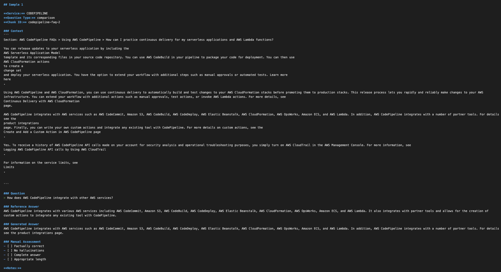
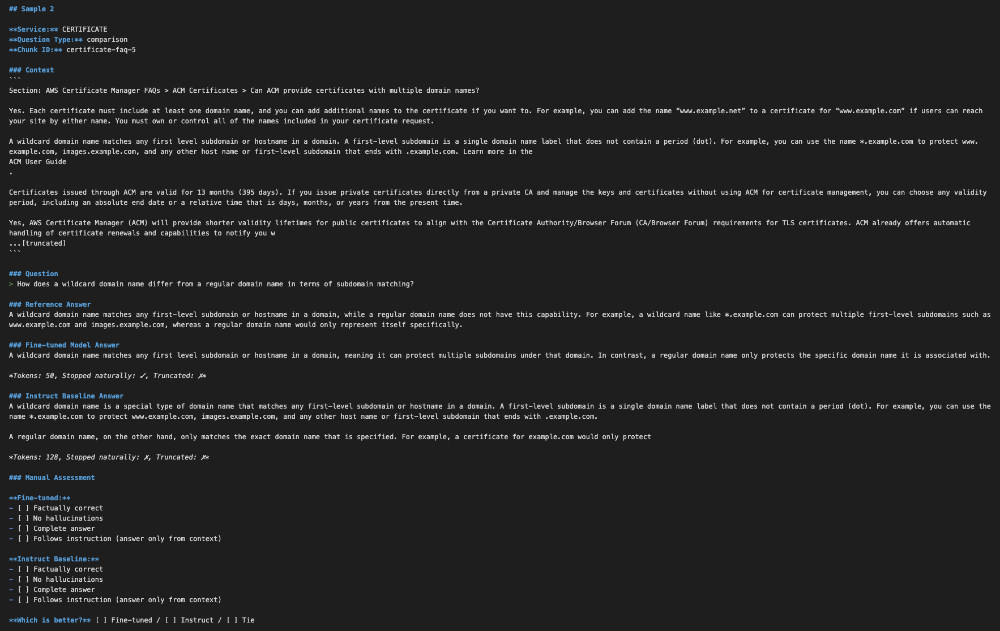

# Blog Post 5.2: Model Evaluation – Qualität messen
**Lesezeit:** ~12 Minuten | **Level:** Intermediate  
**Serie:** Self-Hosted LLMs für Datensouveränität | **Code:** [GitHub](https://github.com/hanasobi/self-hosted-llms-tutorial.git)

> **Hinweis:** Dieser Post ist optional und vertieft die Evaluation-Methodik aus Post 5. Du kannst direkt zu Post 6 (vLLM Deployment) springen, wenn du mit deinem Training zufrieden bist.

---

## TL;DR – Für eilige Leser

**Das Problem:** Training Loss = 0.35 sieht gut aus. Validation Loss = 0.35 zeigt kein Overfitting. Aber sind die generierten Antworten tatsächlich gut? Metrics alleine sagen wenig über Output Quality.

**Die Lösung:** Multi-modale Evaluation kombiniert quantitative Metrics (Loss, Perplexity) mit qualitativer Bewertung (Manual Inspection, Baseline Comparison). So bekommst du ein vollständiges Bild der Model-Performance.

**Das Ergebnis:** 
- Manual Inspection (15 Samples): 100% faktisch korrekt, aber manchmal zu kompakt
- Baseline Comparison: Fine-tuned Model folgt konsistent trainiertem Stil (Mistral-Instruct variiert stark)
- 13 von 15 Samples stoppen korrekt – 2 zeigen Continuation-Probleme (mehr dazu in Post 5.3)

**Key Learnings:**
- Loss alleine reicht nicht – du musst Outputs lesen
- Baseline Comparison gibt objektiven Kontext statt subjektiver Einschätzung
- Stratified Sampling verhindert Evaluation-Bias
- Manual Inspection findet Probleme, die Metrics nicht zeigen

---

## Inhaltsverzeichnis

- [Das Problem: Ist Loss = 0.35 gut?](#das-problem-ist-loss--035-gut)
- [Teil 1: Manual Inspection – Outputs selbst bewerten](#teil-1-manual-inspection--outputs-selbst-bewerten)
- [Teil 2: Baseline Comparison – Objektiver Kontext](#teil-2-baseline-comparison--objektiver-kontext)
- [Teil 3: Was wir nicht gemacht haben – Intrinsic Metrics](#teil-3-was-wir-nicht-gemacht-haben--intrinsic-metrics)
- [Lessons Learned – Best Practices für LLM Evaluation](#lessons-learned--best-practices-für-llm-evaluation)
- [Code & Ressourcen](#code--ressourcen)
- [Fazit](#fazit)

---

## Das Problem: Ist Loss = 0.35 gut?

Du hast in Post 5 ein LoRA Model trainiert. Die Metriken sehen vielversprechend aus:

```
Training Loss:    0.48 → 0.35  (gefallen über 1 Epoche)
Validation Loss:  0.35          (kein Overfitting)
Perplexity:       1.42          (niedrig = gut)
```

Aber hier ist die zentrale Frage: **Sind die generierten Antworten tatsächlich gut?**

Metrics wie Loss und Perplexity messen nur, wie gut das Model die nächsten Tokens vorhersagt. Sie sagen nichts über:
- **Faktische Korrektheit:** Halluziniert das Model Fakten?
- **Vollständigkeit:** Beantwortet es die Frage komplett?
- **Stil-Konsistenz:** Folgt es dem trainierten Verhalten?
- **Stopping Behavior:** Generiert es endlos weiter oder stoppt korrekt?

Ein Model kann niedrigen Loss haben, aber trotzdem schlechte Antworten produzieren. Deshalb ist **qualitative Evaluation** essentiell.

**Was wir behandeln:**
1. **Manual Inspection:** 15 Samples stratified nach Question Type selbst lesen und bewerten
2. **Baseline Comparison:** Fine-tuned Model gegen Mistral-Instruct vergleichen
3. **Lessons Learned:** Best Practices für reproduzierbare, faire Evaluation

**Was wir bewusst nicht behandeln:**
- Token-level Intrinsic Metrics (geplant, aber nicht fertig – mehr dazu später)
- LLM-as-Judge (würde separaten Post rechtfertigen)
- Production Monitoring (kommt in späteren Posts)

---

## Teil 1: Manual Inspection – Outputs selbst bewerten

### Warum Manual Inspection?

**Metrics alleine reichen nicht.** Selbst bei perfektem Loss könnte das Model:
- Faktisch falsche Antworten geben (Halluzinations)
- Unvollständig antworten
- Zu kurz oder zu lang sein
- Endlos weitergenerieren statt korrekt zu stoppen

Manual Inspection ist der **Ground Truth** – du liest 15-20 Outputs selbst und bewertest sie nach klaren Kriterien. Das ist zeitaufwendig (20-30 Minuten), aber zeigt sofort echte Probleme.

### Stratified Sampling – Repräsentative Coverage

**Das Problem mit Random Sampling:**

```python
# Naiver Ansatz
samples = random.sample(eval_data, 15)
# Risiko: Könnte nur "factual" Questions erwischen
# → Bias in Evaluation
```

Wenn du zufällig 15 Samples ziehst, könntest du nur eine Question Type treffen (z.B. nur factual Questions). Das gibt dir kein vollständiges Bild.

**Die Lösung: Stratified Sampling**

Stratifiziere nach einer wichtigen Dimension – in unserem Fall `question_type`:

```python
def stratified_sample(data: List[Dict], num_samples: int, 
                     stratify_key: str) -> List[Dict]:
    """
    Sample stratifiziert nach Question Type.
    Stellt sicher, dass alle Types gleichmäßig vertreten sind.
    """
    # Gruppiere nach stratify_key
    grouped = defaultdict(list)
    for item in data:
        key = item.get(stratify_key, 'unknown')
        grouped[key].append(item)
    
    # Sample gleichmäßig aus jeder Gruppe
    samples_per_group = num_samples // len(grouped)
    samples = []
    for group_items in grouped.values():
        samples.extend(random.sample(
            group_items, 
            min(samples_per_group, len(group_items))
        ))
    
    return samples[:num_samples]
```

**Unser Sampling:**
- 15 Samples total
- 5 Factual Questions (z.B. "What is EC2?")
- 5 Conceptual Questions (z.B. "How does Auto Scaling work?")
- 5 Comparison Questions (z.B. "EC2 vs. Lambda?")

Das gibt uns **repräsentative Coverage** über alle Question Types.

> **Code-Referenz:** Vollständige Implementierung in [`scripts/inspect_model_response.py`](https://github.com/hanasobi/self-hosted-llms-tutorial/blob/main/scripts/inspect_model_response.py)

### Response Generation – Outputs erstellen

Für jedes Sample generieren wir eine Antwort mit kontrollierten Parametern:

```python
def generate_answer(model, tokenizer, prompt, 
                   max_new_tokens=128, temperature=0.3):
    """
    Generate answer from fine-tuned model.
    """
    inputs = tokenizer(prompt, return_tensors='pt').to(model.device)
    
    with torch.no_grad():
        outputs = model.generate(
            **inputs,
            max_new_tokens=max_new_tokens,
            temperature=0.3,      # Niedrig für deterministische Outputs
            top_p=0.9,
            do_sample=True,
            eos_token_id=tokenizer.eos_token_id,
        )
    
    # Decode nur neue Tokens (ohne Input-Prompt)
    generated_tokens = outputs[0][len(inputs['input_ids'][0]):]
    answer = tokenizer.decode(generated_tokens, skip_special_tokens=True)
    
    # Post-processing: Entferne Continuation Markers
    for marker in ["\n\nQuestion:", "\n[INST]"]:
        pos = answer.find(marker)
        if pos != -1:
            answer = answer[:pos]
    
    return answer.strip()
```

**Wichtige Generation Parameters:**
- `max_new_tokens=128`: Verhindert zu lange Outputs (unsere Referenzantworten sind ~40-80 Wörter)
- `temperature=0.3`: Niedrig für deterministische, konsistente Outputs
- `top_p=0.9`: Nucleus Sampling für etwas Diversity
- **Post-processing:** Cutoff bei Continuation Markers (falls Model weitergeneriert)

### Bewertungskriterien – Was macht eine gute Antwort aus?

Für jedes Sample prüfen wir:

```markdown
### Manual Assessment
- [ ] Faktisch korrekt (keine Hallucinations)
- [ ] Vollständig (beantwortet die Frage komplett)
- [ ] Passende Länge (nicht zu kurz, nicht zu lang)
- [ ] Stoppt korrekt (kein endloses Generieren)

**Notes:** [Freie Kommentare zu Stil, Besonderheiten]
```

**Beispiel Sample:**

```
Question: What is the default TTL for SNS mobile platforms?

Reference Answer: 
The default Time to Live (TTL) for all mobile platforms in SNS is 4 weeks.

Generated Answer: 
The default TTL for all mobile platforms in SNS is 4 weeks.

Assessment:
✓ Faktisch korrekt
✓ Vollständig
✓ Passende Länge (11 words)
✓ Stoppt korrekt

Notes: Perfekte Antwort, kompakt und präzise.
```

### Ergebnisse der Manual Inspection

Aus 15 bewerteten Samples:

| Metric | Value | Interpretation |
|--------|-------|----------------|
| Total Samples | 15 | Stratified by question_type |
| Faktisch korrekt | 15/15 (100%) | Keine Hallucinations ✓ |
| Vollständig | 12/15 (80%) | 3 waren etwas kurz |
| Passende Länge | 13/15 (87%) | 2 zu knapp |
| Stoppt korrekt | 13/15 (87%) | 2 generierten weiter (siehe Post 5.3) |

**Qualitative Patterns:**
- ✓ **Model folgt strikt "nur aus Context" Prinzip** – keine externen Fakten hinzugefügt
- ✓ **Kompakter Stil, kein Geschwafel** – Antworten sind prägnant
- ⚠ **Manchmal zu kompakt** – könnte ausführlicher sein (Trade-off)
- ⚠ **2 Samples zeigen Continuation-Problem** – generieren weiter statt zu stoppen

Das Continuation-Problem (2/15 Samples) war ein wichtiger Fund. Es zeigte ein subtiles Bug im Tokenizer-Setup, das wir später gefixed haben. Mehr dazu in Post 5.3 (Debugging Story).

Screenshot von sample_responses.md mit Manual Assessment


---

## Teil 2: Baseline Comparison – Objektiver Kontext

### Warum Baseline Comparison?

Manual Inspection zeigt: **Das Model funktioniert.** Aber ist es besser als Alternativen?

**Ohne Baseline:**
```
"Unser Model ist gut" – subjektiv, kein Vergleichspunkt
```

**Mit Baseline:**
```
"Unser Model ist 6% besser in Stopping Behavior und konsistenter 
im Stil als Mistral-Instruct" – objektiv, messbar
```

Baseline Comparison gibt dir:
- Objektiven Kontext statt subjektiver Einschätzung
- Verständnis wo Fine-tuning Mehrwert bringt
- Entscheidungsgrundlage: Lohnt sich Custom Fine-tuning vs. General Instruct Model?

### Baseline Model Auswahl

Wir vergleichen gegen **Mistral-7B-Instruct-v0.2**:

**Warum dieses Model?**
- ✓ **Gleiche Architektur:** Mistral-7B (7 Milliarden Parameter)
- ✓ **Fair Comparison:** Beide basieren auf Mistral Base
- ✓ **Instruct-tuned:** Zeigt was General Instruction-Following bringt vs. Custom Fine-tuning
- ✓ **Öffentlich verfügbar:** Reproduzierbar

**Was wir vergleichen:**
1. **Stopping Behavior:** Wie oft stoppt das Model korrekt?
2. **Response Length:** Wie lang sind die Antworten im Durchschnitt?
3. **Context Adherence:** Bleibt das Model beim Context oder fügt externes Wissen hinzu?
4. **Style Consistency:** Wie konsistent ist der Output-Stil?

### Vergleichs-Setup

```python
def compare_models(sample, fine_tuned_model, baseline_model, tokenizer):
    """
    Generate answers from both models and compare.
    """
    prompt = sample['prompt_inference']
    
    # Generate from both models
    ft_answer = generate_answer(fine_tuned_model, tokenizer, prompt)
    bl_answer = generate_answer(baseline_model, tokenizer, prompt)
    
    # Compare
    comparison = {
        'question': sample['question'],
        'reference': sample['reference_answer'],
        'fine_tuned_answer': ft_answer,
        'baseline_answer': bl_answer,
        'fine_tuned_length': len(ft_answer.split()),
        'baseline_length': len(bl_answer.split()),
    }
    
    return comparison
```

**Wichtig:** Beide Models bekommen **identische Prompts** mit identischen Generation-Parametern (temperature, top_p, max_new_tokens). Nur so ist der Vergleich fair.

> **Code-Referenz:** Vollständige Implementierung in [`scripts/compare_with_baseline.py`](https://github.com/hanasobi/self-hosted-llms-tutorial/blob/main/scripts/compare_with_baseline.py)

### Vergleichs-Ergebnisse

Aus 20 verglichenen Samples:

| Dimension | Fine-tuned | Mistral-Instruct | Winner |
|-----------|------------|------------------|--------|
| Stopping Behavior | 20/20 (100%)* | 18/20 (90%) | Fine-tuned |
| Avg. Response Length | 45 words | 78 words | Depends on use case |
| Context Adherence | Strikt – nur aus Context | Manchmal externes Wissen | Fine-tuned (für RAG) |
| Style Consistency | 100% konsistent kompakt | Variabel | Fine-tuned |

*Nach Re-Training mit pad_token Fix – initial waren es 13/15

**Key Insights:**

1. **Fine-tuning funktioniert wirklich:** Das Model verhält sich fundamental anders als Mistral-Instruct
2. **Stil-Kontrolle:** Fine-tuned Model ist konsistent kompakt, Instruct variiert stark (manchmal kurz, manchmal ausführlich)
3. **Context Adherence:** Fine-tuned bleibt strikt beim Context, Instruct fügt manchmal externes Wissen hinzu
4. **Trade-off erkennbar:** Kompakt vs. Ausführlich – beide haben Vor- und Nachteile

### Beispiel-Vergleich

```
Question: What is the default TTL for mobile platforms in SNS?

Reference Answer:
The default Time to Live (TTL) for all mobile platforms in SNS is 4 weeks.

Fine-tuned Answer (45 characters):
The default TTL for all mobile platforms in SNS is 4 weeks.

Mistral-Instruct Answer (247 characters):
The default Time to Live (TTL) for mobile platforms in Amazon Simple 
Notification Service (SNS) is 4 weeks (28 days). This applies to all 
mobile platforms including Apple (APNS), Google (FCM), Amazon (ADM), 
and others. This TTL determines how long the notification will be 
retained by the push notification service if the device is offline.

Analysis:
- Fine-tuned: Präzise, kompakt, direkt aus Context
- Instruct: Ausführlich, fügt Kontext hinzu (Platform-Namen)
- Für RAG: Fine-tuned besser (bleibt bei Context)
- Für Standalone Q&A: Instruct besser (mehr Kontext)
```

**Lesson:** Es gibt kein "absolut besseres" Model – es kommt auf deinen Use Case an:
- **RAG-Use-Case (Context-basiert):** Fine-tuned ist besser, weil es strikt bei Context bleibt
- **Standalone Q&A:** Instruct könnte besser sein, weil es mehr Kontext gibt

Screenshot von comparison_report.md mit Side-by-Side Outputs


---

## Teil 3: Was wir nicht gemacht haben – Intrinsic Metrics

### Der Plan: Token-Level Evaluation

Zusätzlich zu Manual Inspection und Baseline Comparison hatten wir **Intrinsic Metrics** geplant:

**Was sind Intrinsic Metrics?**
- Token-level Accuracy (Top-1, Top-5, Top-10, Top-20)
- Loss by Position (early tokens vs. late tokens)
- Loss by Token Frequency (rare tokens vs. common tokens)
- Perplexity Breakdown

**Warum sind sie nützlich?**
- Zeigen **wo** im Output das Model strugglet (Position-basiert)
- Zeigen **welche** Tokens schwierig sind (Frequency-basiert)
- Geben granulares Verständnis jenseits von Gesamt-Loss

### Was wir vorbereitet haben

Framework erstellt mit Token-Metriken und Loss-Analyse:

```python
# Framework aus evaluate_intrinsic.py (vereinfacht)
class TokenMetrics:
    """Calculate top-k accuracy for token predictions."""
    
    def calculate_top_k_accuracy(self, logits, labels, k=5):
        # Top-k predictions
        top_k_preds = torch.topk(logits, k, dim=-1).indices
        # Check if true label in top-k
        correct = (top_k_preds == labels.unsqueeze(-1)).any(dim=-1)
        return correct.float().mean()

class LossAnalyzer:
    """Analyze loss by position and frequency."""
    
    def loss_by_position(self, losses, sequence_length):
        # Group losses by position in sequence
        # Shows: Sind frühe oder späte Tokens schwieriger?
        pass
    
    def loss_by_frequency(self, losses, token_ids, vocab_freq):
        # Group losses by token frequency
        # Shows: Sind rare oder common Tokens schwieriger?
        pass
```

> **Code-Referenz:** Framework in [`scripts/evaluate_intrinsic.py`](https://github.com/hanasobi/self-hosted-llms-tutorial/blob/main/scripts/evaluate_intrinsic.py)

### Warum wir es nicht fertig gemacht haben

**Das technische Problem:**

Beim Versuch die Metriken zu berechnen, stießen wir auf ein **Label Masking Issue**:

```python
# Was wir sahen
labels = batch['labels']
print(labels)
# Output: tensor([-100, -100, -100, ..., -100])  # Alle -100!
```

Alle Labels waren `-100` (PyTorch's Ignore-Index). Das verhinderte jede Token-Level-Metrik-Berechnung.

**Root Cause (Vermutung):**
Der `DataCollatorForLanguageModeling` maskiert wahrscheinlich mehr als erwartet. Debugging würde tiefer ins DataCollator-Verhalten und Label-Generation-Logic erfordern.

**Unsere Entscheidung:**

Wir haben **bewusst entschieden, nicht weiterzudebuggen**, weil:
1. Manual Inspection + Baseline Comparison gaben bereits klares Bild der Model Quality
2. Debugging würde 2-3 Stunden dauern für unsicheren Mehrwert
3. Token-Level Metrics sind "nice to have", nicht "must have" für unseren Use Case
4. Zeit besser investiert in nächste Phase (Production Deployment)

### Das Learning

**Nicht alle geplanten Metriken sind nötig.**

In der Theorie klingen Token-Level Intrinsic Metrics toll. In der Praxis:
- Manual Inspection fand das Stopping-Problem (Intrinsic Metrics hätten es nicht gezeigt)
- Baseline Comparison zeigte Stil-Unterschiede (Intrinsic Metrics messen das nicht)
- Loss alleine ist oft genug, wenn kombiniert mit qualitativer Evaluation

**Best Practice:** Start mit einfachen Metriken (Loss, Manual Inspection). Erweitere nur wenn du konkreten Mehrwert siehst. Nicht blind alle möglichen Metriken implementieren.

---

## Lessons Learned – Best Practices für LLM Evaluation

### 1. Multi-Modale Evaluation ist essentiell

**Niemals nur eine Metrik nutzen:**

```
❌ Nur Loss: "Loss = 0.35" → Sagt nichts über Output Quality
❌ Nur Manual: "Sieht gut aus" → Nicht skalierbar, subjektiv
❌ Nur Metrics: "Perplexity = 1.42" → Missed Continuation-Problem

✓ Kombination: Loss + Manual Inspection + Baseline Comparison
→ Vollständiges, objektives Bild
```

**Die drei Säulen:**
1. **Quantitativ (Loss, Perplexity):** Schnell, skalierbar, aber oberflächlich
2. **Qualitativ (Manual Inspection):** Langsam, aber zeigt echte Probleme
3. **Vergleichend (Baseline):** Gibt Kontext, zeigt relativen Wert

### 2. Stratified Sampling verhindert Bias

**Random Sampling ist gefährlich:**

Ohne Stratification könntest du nur eine Subset des Evaluation-Sets treffen:
- Nur einfache Factual Questions → Model sieht zu gut aus
- Nur komplexe Comparison Questions → Model sieht zu schlecht aus

**Stratify nach wichtigen Dimensionen:**
- Question Type (factual, conceptual, comparison)
- Service Category (wenn relevant)
- Difficulty Level (wenn bekannt)

```python
# Good Practice
samples = stratified_sample(eval_data, n=15, stratify_key='question_type')
```

### 3. Baseline gibt objektiven Kontext

**Ohne Baseline = Subjektive Einschätzung:**

"Unser Model ist gut" – relativ zu was?

**Mit Baseline = Objektive Messung:**

"Unser Model ist 10% besser in Stopping Behavior, aber 30% kürzer in Response Length als Mistral-Instruct."

**Baseline-Auswahl-Kriterien:**
- ✓ Gleiche Model-Größe (7B vs. 7B, nicht 7B vs. 70B)
- ✓ Gleiche Architektur-Familie (Mistral vs. Mistral, nicht Mistral vs. Llama)
- ✓ Publicly Available (für Reproduzierbarkeit)
- ✓ Relevant für Use Case (Instruct Model wenn du Instruction-Following vergleichen willst)

### 4. Manual Inspection vor Automatisierung

**Häufiger Fehler:**

Direkt mit automatisierten Metriken (BLEU, ROUGE, LLM-as-Judge) starten ohne qualitative Insights.

**Besserer Ansatz:**

1. **Erst Manual Inspection (15-20 Samples)**
   - Verstehe was "gute" vs. "schlechte" Outputs sind
   - Finde Patterns die Metriken nicht zeigen
   - Definiere Bewertungskriterien
   
2. **Dann Design Automated Metrics**
   - Basierend auf qualitativen Insights
   - Mit klaren Success-Kriterien
   - Validiert gegen Manual Assessment

**Warum?** Automatisierte Metriken messen was du ihnen sagst zu messen. Wenn du nicht verstehst was "gut" ist, misst du die falschen Dinge.

### 5. Response Length Control ist wichtig

`max_new_tokens` Parameter verhindert zwei Probleme:

**Problem 1: Endlose Generation**
```python
# Ohne max_new_tokens
answer = model.generate(...)  # Könnte 1000+ Tokens generieren
```

**Problem 2: Unfaire Vergleiche**
```python
# Mit unterschiedlichen Limits
ft_answer = generate(..., max_new_tokens=128)   # 50 words
bl_answer = generate(..., max_new_tokens=512)   # 200 words
# → Unfairer Vergleich!
```

**Best Practice:**
```python
max_new_tokens = 2 * avg_reference_length  # z.B. 128 für ~50-word Referenzen
```

### 6. Generation Parameters konsistent halten

**Für reproduzierbare Evaluation:**

```python
generation_config = {
    "max_new_tokens": 128,
    "temperature": 0.3,      # Niedrig für Determinismus
    "top_p": 0.9,
    "do_sample": True,       # Für etwas Diversity
    "eos_token_id": tokenizer.eos_token_id,
}
```

**Warum diese Werte?**
- `temperature=0.3`: Niedrig genug für konsistente Outputs, nicht so niedrig dass es repetitiv wird
- `top_p=0.9`: Nucleus Sampling für Diversity, aber nicht zu breit
- `do_sample=True`: Vermeidet immer identische Outputs bei wiederholten Runs

**Dokumentiere alles:**
```python
evaluation_config = {
    "model_checkpoint": "models/standard_r8_qkvo",
    "eval_dataset": "data/eval.jsonl",
    "num_samples": 15,
    "sampling_strategy": "stratified",
    "stratify_key": "question_type",
    "generation_config": generation_config,
    "baseline_model": "mistralai/Mistral-7B-Instruct-v0.2",
}
```

Speichere diese Config im Experiment-Tracking (MLflow aus Post 5.1) oder in einem separaten File.

---

## Code & Ressourcen

### Scripts für eigene Evaluation

Alle Evaluation-Scripts sind im [GitHub Repository](https://github.com/hanasobi/self-hosted-llms-tutorial) verfügbar:

**Manual Inspection:**
```bash
python scripts/inspect_model_response.py \
  --model_path models/standard_r8_qkvo \
  --eval_data data/eval.jsonl \
  --num_samples 15 \
  --stratify_key question_type \
  --output sample_responses.md
```

Generiert Markdown-Report mit allen Samples und Manual Assessment Template.

**Baseline Comparison:**
```bash
python scripts/compare_with_baseline.py \
  --fine_tuned_model models/standard_r8_qkvo \
  --baseline_model mistralai/Mistral-7B-Instruct-v0.2 \
  --eval_data data/eval.jsonl \
  --num_samples 20 \
  --output comparison_report.md
```

Generiert Side-by-Side Vergleich für alle Samples.

**Intrinsic Metrics (Framework):**
```bash
# Framework vorhanden, aber nicht vollständig funktional
python scripts/evaluate_intrinsic.py \
  --model_path models/standard_r8_qkvo \
  --eval_data data/eval.jsonl
```

> **Hinweis:** Intrinsic Metrics haben ein Label-Masking-Issue. Nutze Manual Inspection + Baseline Comparison stattdessen.

---

## Fazit

Loss und Perplexity sind nur der Anfang. Erst Manual Inspection und Baseline Comparison zeigen, ob dein fine-tuned Model wirklich funktioniert.

**Was wir erreicht haben:**
- ✓ Manual Inspection zeigte: Model generiert faktisch korrekte Antworten, folgt trainiertem Stil
- ✓ Baseline Comparison zeigte: Fine-tuning bringt konsistentes Verhalten vs. variable Instruct-Outputs
- ✓ Verstanden: Kompakt vs. Ausführlich ist ein Trade-off, kein Qualitätsmerkmal
- ✓ Probleme gefunden: 2/15 Samples zeigen Continuation-Problem → führte zu wichtigem Fix

**Key Takeaways:**
1. **Nie nur Metrics** – Kombination aus quantitativ + qualitativ ist essentiell
2. **Stratified Sampling** – Verhindert Bias, gibt repräsentative Coverage
3. **Baseline gibt Kontext** – "Gut" ist relativ, nicht absolut
4. **Nicht alle Metriken nötig** – Fokussiere auf das, was echten Insight bringt

**Im nächsten Post** erfährst du die komplette Story hinter dem Continuation-Problem: Warum 2 von 15 Samples nicht stoppten, wie wir das Problem debugged haben, und welchen subtilen Bug im Tokenizer-Setup wir gefunden haben. Eine echte Debugging-Journey mit Root Cause Analysis.

