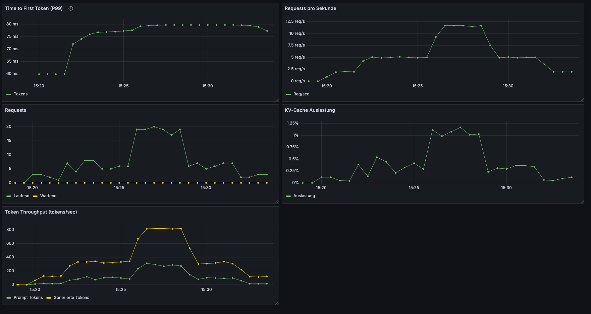

# Blog Post 6: LoRA Serving – Dein Fine-tuned Model in Produktion

**Lesezeit:** ~18 Minuten | **Level:** Intermediate  
**Serie:** Self-Hosted LLMs für Datensouveränität | **Code:** [GitHub](https://github.com/hanasobi/self-hosted-llms-tutorial.git)

> **Hinweis:** Technische Begriffe in diesem Post werden beim ersten Auftreten kurz erklärt. Detaillierte Definitionen findest du im [Glossar](./glossar-self-hosted-llms.md).

---

## TL;DR – Für eilige Leser

**Das Problem:** Du hast ein Base Model auf Kubernetes (Post 2) und einen trainierten LoRA-Adapter (Post 5). Aber der Adapter liegt als Datei auf S3 – das laufende vLLM weiß nichts davon.

**Die Lösung:** Drei Änderungen am bestehenden Deployment: Ein Init-Container lädt den Adapter von S3, zwei zusätzliche CLI-Flags aktivieren LoRA in vLLM. Das war's.

**Das Ergebnis:** Das fine-tuned Model läuft in Produktion mit dramatischem Qualitätsunterschied: 93% korrekte Antworten (vs. 40% ohne Fine-tuning), 60% schnellere Response-Zeiten, und nur 27MB zusätzlicher Speicherbedarf.

**Key Learnings:**
- LoRA Serving in vLLM braucht nur `--enable-lora` und `--lora-modules`
- Init-Container sind das sauberste Pattern für Adapter-Delivery
- Der Qualitätssprung ist nicht graduell sondern fundamental – Base Model vs. LoRA ist wie Nacht und Tag
- Monitoring mit Prometheus/Grafana zeigt sofort ob das System unter Last stabil bleibt

---

## Inhaltsverzeichnis

- [Das Ziel: Vom Training zum Serving](#das-ziel-vom-training-zum-serving)
- [Was sich ändert: Post 2 → Post 6](#was-sich-ändert-post-2--post-6)
- [Init-Container: Adapter von S3 laden](#init-container-adapter-von-s3-laden)
- [vLLM mit LoRA konfigurieren](#vllm-mit-lora-konfigurieren)
- [Deployment und Smoke Test](#deployment-und-smoke-test)
- [Qualitätsvergleich: Base Model vs. LoRA Adapter](#qualitätsvergleich-base-model-vs-lora-adapter)
- [Monitoring: Grafana Dashboard für vLLM](#monitoring-grafana-dashboard-für-vllm)
- [Load Testing: Realistische Last](#load-testing-realistische-last)
- [Lessons Learned](#lessons-learned)
- [Fazit](#fazit)

---

## Das Ziel: Vom Training zum Serving

In Post 2 haben wir Mistral-7B als Base Model auf Kubernetes deployed. In Post 5 haben wir einen LoRA-Adapter trainiert, der das Base Model auf RAG-basierte QA-Aufgaben spezialisiert. Jetzt verbinden wir beides.

Das Ziel dieses Posts ist konkret: Den LoRA-Adapter `aws-rag-qa` auf der bestehenden vLLM-Infrastruktur deployen und verifizieren, dass er in Produktion funktioniert. Am Ende des Posts hast du ein laufendes System, das du per API-Call zwischen Base Model und Fine-tuned Model umschalten kannst.

Dabei ändern wir überraschend wenig am bestehenden Setup. Das ist eine der Stärken von LoRA: Der Adapter ist nur 27MB groß und wird zur Laufzeit auf das Base Model aufgesetzt. Kein neues Model-Image, kein neuer Download von 4GB Weights – nur ein kleines Delta.

---

## Was sich ändert: Post 2 → Post 6

Das Deployment aus Post 2 bleibt zu ~80% identisch. Hier sind die drei Änderungen:

**1. Init-Container** – Lädt den LoRA-Adapter von S3 in ein Shared Volume  
**2. Zwei neue CLI-Flags** – `--enable-lora` und `--lora-modules` aktivieren LoRA in vLLM  
**3. Shared Volume** – Ein `emptyDir` Volume verbindet Init-Container und vLLM-Container

Das Base Model (`TheBloke/Mistral-7B-v0.1-AWQ`) bleibt exakt dasselbe. Die GPU-Konfiguration bleibt dieselbe. Resources, Tolerations, NodeSelector – alles unverändert.

Schauen wir uns die drei Änderungen im Detail an.

---

## Init-Container: Adapter von S3 laden

Der LoRA-Adapter besteht aus zwei Dateien, die wir in Post 5 trainiert und nach S3 hochgeladen haben:

- `adapter_config.json` (~1KB) – LoRA-Konfiguration (Rank, Alpha, Target Modules)
- `adapter_model.safetensors` (~27MB) – Die trainierten LoRA-Gewichte

Diese Dateien müssen im Pod verfügbar sein, bevor vLLM startet. Dafür nutzen wir einen Kubernetes Init-Container – einen Container der vor dem Hauptcontainer läuft und das Filesystem vorbereitet.

```yaml
initContainers:
- name: download-adapter
  image: amazon/aws-cli:latest
  command:
  - /bin/sh
  - -c
  - |
    echo "Downloading LoRA adapter from S3..."
    aws s3 cp s3://hanasobi-ai-triton-models/llm-models/mistral-7b-aws-rag-qa/v1/adapter_config.json /mnt/adapters/aws-rag-qa/adapter_config.json
    aws s3 cp s3://hanasobi-ai-triton-models/llm-models/mistral-7b-aws-rag-qa/v1/adapter_model.safetensors /mnt/adapters/aws-rag-qa/adapter_model.safetensors
    echo "Download complete!"
    ls -lh /mnt/adapters/aws-rag-qa/
  volumeMounts:
  - name: adapter-storage
    mountPath: /mnt/adapters
```

**Warum Init-Container statt das Adapter-File ins Image zu baken?**

Separation of Concerns. Das vLLM-Image bleibt generisch und unverändert – wir nutzen dasselbe offizielle `vllm/vllm-openai:v0.14.1-cu130` Image wie in Post 2. Der Adapter wird zur Deploy-Zeit geladen, nicht zur Build-Zeit. Das hat drei Vorteile: Adapter-Updates brauchen keinen Image-Rebuild, dasselbe Pattern funktioniert für beliebig viele Adapter, und verschiedene Environments (Dev, Staging, Prod) können verschiedene Adapter-Versionen laden.

**Authentifizierung gegen S3** erfolgt über IRSA (IAM Roles for Service Accounts). Der `serviceAccountName: workflow-sa` im Pod-Spec gibt dem Init-Container automatisch AWS-Credentials, ohne dass wir Keys im Manifest oder in Environment-Variablen hinterlegen müssen. Das ist der sichere Weg – keine Secrets im Code, keine Rotation nötig, und alles ist auditierbar.

**Die S3-Pfadstruktur** folgt einer Konvention, die spätere Adapter-Versionen und Multi-Adapter-Setups unterstützt:

```
s3://bucket/llm-models/{model-name}/{version}/
  ├── adapter_config.json
  └── adapter_model.safetensors
```

Wenn wir in Post 7 einen verbesserten Adapter trainieren (mit Negativbeispielen), laden wir ihn einfach als `v2/` hoch – der Init-Container zeigt dann auf den neuen Pfad.

---

## vLLM mit LoRA konfigurieren

Im Hauptcontainer kommen zwei neue CLI-Flags zu den bestehenden Args hinzu:

```yaml
containers:
- name: vllm
  image: vllm/vllm-openai:v0.14.1-cu130
  command: ["vllm"]
  args:
  - "serve"
  - "TheBloke/Mistral-7B-v0.1-AWQ"
  - "--port=8000"
  - "--enable-lora"                              # NEU
  - "--lora-modules"                             # NEU
  - "aws-rag-qa=/mnt/adapters/aws-rag-qa"       # NEU
  - "--max-model-len=4096"
  - "--gpu-memory-utilization=0.88"
```

**`--enable-lora`** aktiviert die LoRA-Unterstützung in vLLM. Ohne dieses Flag ignoriert vLLM alle Adapter-Pfade. Das Flag aktiviert die interne Logik für dynamisches Adapter-Loading und -Unloading.

**`--lora-modules aws-rag-qa=/mnt/adapters/aws-rag-qa`** registriert einen Adapter unter dem Namen `aws-rag-qa` und zeigt auf das Verzeichnis, in das der Init-Container die Dateien heruntergeladen hat. Dieser Name wird später im API-Call als `model`-Parameter verwendet.

Das Shared Volume verbindet die beiden Container:

```yaml
volumes:
- name: adapter-storage
  emptyDir: {}
```

Ein `emptyDir` existiert nur solange der Pod lebt. Bei jedem Pod-Restart lädt der Init-Container den Adapter neu von S3. Das dauert wenige Sekunden (27MB Download) und stellt sicher, dass immer die aktuelle Version geladen wird. Für unseren Use Case ist das ausreichend – bei größeren Adaptern oder vielen Adaptern wäre ein PersistentVolumeClaim effizienter.

**Memory Overhead:** Der LoRA-Adapter ist 27MB auf Disk und belegt auch im GPU-Speicher nur wenig zusätzlichen Platz – vernachlässigbar bei 24GB VRAM auf der L4. Die `gpu-memory-utilization=0.88` Einstellung aus Post 2 bleibt unverändert, es ist genug Headroom vorhanden.

**Das vollständige Manifest** findest du in zwei Versionen im Repository:
- [deployment.yaml](https://github.com/hanasobi/self-hosted-llms-tutorial/tree/main/06-lora-serving/kubernetes/deployment.yaml) – Production-Version (clean, ohne Kommentare)
- [deployment.annotated.yaml](https://github.com/hanasobi/self-hosted-llms-tutorial/tree/main/06-lora-serving/kubernetes/deployment.annotated.yaml) – Lernversion mit detaillierten Kommentaren zu jeder Entscheidung

---

## Deployment und Smoke Test

Das Deployment ist ein einzelner `kubectl apply`:

```bash
kubectl apply -f deployment.yaml
```

Beobachte den Pod-Start:

```bash
kubectl get pods -n ml-models -w
```

Du siehst vier Phasen:

```
NAME                    READY   STATUS           AGE
vllm-6cc7769bfd-xgfg9   0/1     Pending          17s   # Warten auf GPU Node
vllm-6cc7769bfd-xgfg9   0/1     Init:0/1         106s  # Init-Container lädt Adapter
vllm-6cc7769bfd-xgfg9   0/1     PodInitializing  2m8s  # vLLM startet, lädt Base Model
vllm-6cc7769bfd-xgfg9   1/1     Running          5m40s # vLLM bereit
```

**~5,5 Minuten bis Running** – aber das ist noch nicht das Ende. Nach dem Wechsel auf `Running` braucht vLLM intern noch ~2 Minuten für das Laden des Base Models, die Initialisierung des KV-Cache und die Erfassung der CUDA Graphs. Erst danach nimmt der `/health`-Endpoint Requests an. **Total Cold Start bei Scale-to-Zero: ~7-8 Minuten.**

Von diesen ~8 Minuten entfallen ~90 Sekunden auf das Hochfahren des GPU Nodes. Wir nutzen Scale-to-Zero für die GPU Node Group (siehe Post 2): Wenn kein vLLM-Pod läuft, fährt der Cluster die teuren GPU-Nodes herunter. Das spart ~$500/Monat, bedeutet aber, dass beim ersten Deployment der Kubernetes Autoscaler erst einen neuen Node provisionieren muss. Sobald der Node läuft, starten Init-Container und vLLM deutlich schneller. Bei einem Pod-Restart auf einem bereits laufenden Node entfällt die Pending-Phase komplett, und der Startup dauert ~4-5 Minuten.

**Verifiziere in den Logs, dass der Adapter geladen wurde:**

```bash
kubectl logs -n ml-models deployment/vllm | grep -i lora
```

Du solltest eine Zeile wie diese sehen:

```
INFO: Loaded new LoRA adapter: name 'aws-rag-qa', path '/mnt/adapters/aws-rag-qa'
```

### Smoke Test: System verifizieren

Starte einen Port-Forward:

```bash
kubectl port-forward -n ml-models svc/vllm-service 8000:8000
```

**Schritt 1: Health-Check**

Bevor wir Requests schicken, prüfen wir ob vLLM bereit ist:

```bash
curl -i http://localhost:8000/health
# Erwartete Antwort: HTTP/1.1 200 OK
```

**Schritt 2: Verfügbare Models prüfen**

```bash
curl -s http://localhost:8000/v1/models | python3 -m json.tool
```

Hier sollten sowohl das Base Model als auch `aws-rag-qa` aufgelistet sein.

**Schritt 3: Base Model (ohne Adapter)**

```bash
curl -s http://localhost:8000/v1/completions \
  -H "Content-Type: application/json" \
  -d '{
    "model": "TheBloke/Mistral-7B-v0.1-AWQ",
    "prompt": "[INST] What is Amazon S3? [/INST]",
    "max_tokens": 100,
    "temperature": 0.7
  }' | python3 -m json.tool
```

**Schritt 4: LoRA Adapter**

```bash
curl -s http://localhost:8000/v1/completions \
  -H "Content-Type: application/json" \
  -d '{
    "model": "aws-rag-qa",
    "prompt": "[INST] What is Amazon S3? [/INST]",
    "max_tokens": 100,
    "temperature": 0.7
  }' | python3 -m json.tool
```

Der einzige Unterschied ist der `model`-Parameter. Die vLLM-API routet den Request automatisch: Bei `"model": "aws-rag-qa"` werden die LoRA-Gewichte auf das Base Model aufgesetzt, bei `"model": "TheBloke/Mistral-7B-v0.1-AWQ"` läuft nur das Base Model.

---

## Qualitätsvergleich: Base Model vs. LoRA Adapter

Ein Smoke Test zeigt, dass das System läuft. Aber funktioniert der Adapter wirklich besser als das Base Model? Dafür haben wir eine systematische Evaluation mit 15 ungesehenen Testfragen durchgeführt – Fragen, die nicht im Training-Dataset enthalten waren.

### Testaufbau

Das Evaluation-Script ([rag_qa_evaluation.py](https://github.com/hanasobi/self-hosted-llms-tutorial/tree/main/06-lora-serving/scripts/rag_qa_evaluation.py)) schickt jede Frage zweimal an vLLM: einmal mit `"model": "TheBloke/Mistral-7B-v0.1-AWQ"` (Base) und einmal mit `"model": "aws-rag-qa"` (LoRA). Die 15 Testfälle ([eval_15_samples.jsonl](https://github.com/hanasobi/self-hosted-llms-tutorial/tree/main/06-lora-serving/eval/eval_15_samples.jsonl)) decken 3 Fragetypen ab (factual, comparison, conceptual) über 11 verschiedene AWS Services. Jede Frage enthält einen Kontext-Abschnitt aus AWS-Dokumentation und eine Reference Answer zum Vergleich.

Das Script läuft als Pod im Cluster – die vollständige Ausführungsanleitung findest du in der [TESTS_README.md](https://github.com/hanasobi/self-hosted-llms-tutorial/tree/main/06-lora-serving/TESTS_README.md).

```python
# Vereinfachter Auszug aus rag_qa_evaluation.py
def send_request(model, prompt):
    response = requests.post(
        "http://vllm-service:8000/v1/completions",
        json={
            "model": model,
            "prompt": prompt,
            "max_tokens": 200,
            "temperature": 0.7
        }
    )
    return response.json()['choices'][0]['text']
```

### Ergebnisse: Der Unterschied ist fundamental

| Metrik | Base Model | LoRA Adapter | Differenz |
|--------|-----------|--------------|-----------|
| Korrekte Antworten | ~40% (6/15) | 93% (14/15) | **+133%** |
| Durchschnittliche Latenz | 2.57s | 1.01s | **-60%** |
| Median Latenz | 3.51s | 0.84s | **-76%** |

Das sind keine graduellen Verbesserungen. Das Base Model ist für RAG-QA-Aufgaben **fundamental ungeeignet**, während der LoRA-Adapter konsistent präzise Antworten liefert.

### Warum scheitert das Base Model?

Das Base Model zeigt vier Fehlertypen, die in einem RAG-QA-System inakzeptabel sind:

**Leere Antworten (27%):** Bei 4 von 15 Tests gibt das Base Model gar keine Antwort. Die extrem niedrige Latenz (0.14-0.18s) zeigt, dass es sofort aufgibt, ohne Text zu generieren.

**Whitespace-Müll (13%):** Hunderte Newlines gefolgt von generischem Text, der die Frage nicht beantwortet.

**Halluzinierte Follow-up-Fragen (20%):** Das Model erfindet neue Fragen und beantwortet diese statt der gestellten Frage. Es verlässt den Instruction-Kontext und generiert ein fiktives Interview.

**Weitschweifige Antworten:** Bei den verbleibenden Tests produziert es lange Texte mit nur teilweise relevanten Informationen.

### Drei konkrete Beispiele

**Beispiel 1 – Factual Question (DynamoDB):**

Frage: *"Does DynamoDB support audit logging for item level changes on tables?"*

```
Base Model:  [leer – keine Antwort]              Latenz: 0.18s
LoRA Adapter: "Yes, DynamoDB does support audit    Latenz: 0.50s
               logging for item level changes 
               on tables."
```

Das Base Model generiert null Tokens. Der LoRA-Adapter gibt eine korrekte, präzise Antwort.

**Beispiel 2 – Comparison Question (EC2 Data Transfer):**

Frage: *"How do charges differ for data transfer between instances in different availability zones compared to instances in different regions?"*

```
Base Model:  [nur Newlines – keine Antwort]       Latenz: 3.51s
LoRA Adapter: "For data transfer between           Latenz: 1.36s
               instances in different availability 
               zones, each instance is charged at 
               Data Transfer rates for its data in 
               and data out. In contrast, data 
               transfer between instances in 
               different regions is charged at..."
```

Das Base Model verbringt 3.5 Sekunden damit, Newlines zu generieren. Der LoRA-Adapter strukturiert die Antwort klar und adressiert beide Seiten des Vergleichs.

**Beispiel 3 – Conceptual Question (ElastiCache):**

Frage: *"How does Amazon ElastiCache improve application performance?"*

```
Base Model:  "ElastiCache is designed to provide   Latenz: 3.51s
              high-performance caching... 
              Question: Which applications can 
              benefit from ElastiCache? [/INST]
              ElastiCache is well suited for..."

LoRA Adapter: "Amazon ElastiCache improves          Latenz: 1.40s
               application performance by allowing 
               you to retrieve information from a 
               fast, managed, in-memory system 
               instead of relying on slower 
               disk-based systems."
```

Das Base Model erfindet eine Follow-up-Frage und beantwortet die dann auch noch. Der LoRA-Adapter bleibt fokussiert auf die gestellte Frage.

### Warum ist LoRA auch schneller?

Das klingt kontraintuitiv: Ein zusätzlicher Adapter sollte langsamer sein, nicht schneller. Die Erklärung liegt in der Token-Generierung. Das Base Model generiert oft bis `max_tokens` (200) erreicht wird, weil es nicht weiß, wann es aufhören soll. Es produziert Whitespace, Follow-up-Fragen oder weitschweifigen Text. Der LoRA-Adapter wurde darauf trainiert, nach der Antwort natürlich zu stoppen – typischerweise nach 20-50 Tokens.

Weniger generierte Tokens bedeuten direkt kürzere Latenz. Der LoRA-Overhead (Adapter-Gewichte auf jede Attention-Matrix addieren) wird durch die drastisch geringere Token-Anzahl mehr als kompensiert.

### Das Negativbeispiel: Wo LoRA (noch) versagt

Test 15 stellt eine Frage über Apache Flink, aber der Kontext behandelt Amazon MSK – ein völlig anderer Service. Die korrekte Antwort wäre: *"The provided context does not contain sufficient information to answer this question."*

Stattdessen gibt der LoRA-Adapter eine kurze, ungenaue Antwort. Er wurde nicht auf Negativbeispiele trainiert und erkennt den Mismatch zwischen Frage und Kontext nicht. Das Base Model halluziniert in diesem Fall sogar eine ausführliche Flink-Erklärung aus seinem parametrischen Wissen.

**Dieses Problem adressieren wir in Post 7**, wo wir das Training-Dataset um Negativbeispiele erweitern und einen verbesserten Adapter (v2) trainieren.

---

## Monitoring: Grafana Dashboard für vLLM

In Post 2 haben wir Prometheus eingerichtet, um vLLM-Metriken zu scrapen. Prometheus sammelt die Rohdaten – aber Rohdaten alleine helfen dir im Alltag wenig. Du willst auf einen Blick sehen: Ist das System gesund? Wie verhält es sich unter Last? Baut sich eine Queue auf?

Dafür nutzen wir Grafana. Grafana verbindet sich mit Prometheus als Datenquelle und visualisiert die Metriken in Dashboards. Falls du Grafana noch nicht im Cluster hast: Die Installation ist ein `helm install` – wir gehen hier nicht auf die Grafana-Installation selbst ein, sondern auf das Dashboard-Design für vLLM.

### Dashboard importieren

Unser vLLM-Dashboard ([vllm_dashboard.json](https://github.com/hanasobi/self-hosted-llms-tutorial/tree/main/06-lora-serving/grafana/vllm_dashboard.json)) importierst du in Grafana über **Dashboards → Import → Upload JSON file**. Voraussetzung ist eine konfigurierte Prometheus-Datenquelle, die auf den Prometheus-Service im Cluster zeigt.

### Die 5 Panels erklärt

Das Dashboard zeigt 5 Panels, die zusammen ein vollständiges Bild des vLLM-Systems geben:

**Time to First Token (TTFT) P99:** Wie lange wartet ein User auf das erste Token? Das ist der wichtigste Latenz-Indikator. P99 bedeutet: 99% aller Requests sind schneller als dieser Wert. Wenn TTFT steigt, merkt der User das sofort.

**Requests pro Sekunde:** Der Throughput des Systems. Zeigt dir direkt, wie viel Last gerade anliegt und ob das System die Requests verarbeiten kann.

**Requests (Laufend vs. Wartend):** Das kritischste Panel für Kapazitätsplanung. Solange die "Wartend"-Linie bei 0 bleibt, hat das System Kapazität. Sobald sich eine Queue aufbaut, brauchst du entweder mehr Replicas oder kürzere Requests.

**KV-Cache Auslastung:** Der Key-Value-Cache hält die Attention-States aller aktiven Requests im GPU-Speicher. Bei 4096 Tokens pro Request können wir theoretisch 30 parallele Requests halten (aus Post 2). Dieses Panel zeigt, wie nah wir an dieses Limit kommen.

**Token Throughput:** Prompt Tokens (Input) vs. Generierte Tokens (Output) pro Sekunde. Das Verhältnis zeigt, ob das System mehr mit Prompt-Verarbeitung oder mit Generierung beschäftigt ist. Bei LoRA-Requests sind die Antworten typischerweise kürzer – das sehen wir direkt im Throughput.

---

## Load Testing: Realistische Last

Ein Smoke Test mit einzelnen Requests zeigt, dass das System funktioniert. Aber wie verhält es sich unter realistischer Last? Unser Load-Test-Script simuliert 14 Minuten realistischen Traffic mit verschiedenen Lastmustern.

### Testphasen

| Phase | Dauer | RPS | Zweck |
|-------|-------|-----|-------|
| Warmup | 2 Min | 2 | System aufwärmen |
| Normal | 4 Min | 5 | Moderate Dauerlast |
| Spike | 3 Min | 12 | Last-Spitze simulieren |
| Recovery | 3 Min | 5 | Erholung nach Spike |
| Cooldown | 2 Min | 2 | Auslaufen lassen |

Der Test nutzt einen Mix aus verschiedenen Prompt-Typen (kurze Fragen, mittellange Fragen, RAG-Context mit Fragen) und sendet 70% der Requests an den LoRA-Adapter und 30% an das Base Model. Das spiegelt einen realistischen Workload wider, in dem die meisten Requests den fine-tuned Adapter nutzen.

### Ausführung im Cluster

Das Script ([vllm_load_test.py](https://github.com/hanasobi/self-hosted-llms-tutorial/tree/main/06-lora-serving/scripts/vllm_load_test.py)) läuft als Pod im Cluster, um realistische Latenzen zu messen (kein Port-Forward-Overhead). Die vollständige Ausführungsanleitung mit allen `kubectl`-Befehlen findest du in der [TESTS_README.md](https://github.com/hanasobi/self-hosted-llms-tutorial/tree/main/06-lora-serving/TESTS_README.md).

**Tipp:** Öffne während des Tests das Grafana Dashboard, stelle den Zeitbereich auf "Last 15 minutes" und aktiviere Auto-Refresh (5s). So siehst du die Metriken live.

### Ergebnisse: Das Dashboard unter Last

Hier ist unser Grafana Dashboard während des vollständigen 14-Minuten-Lasttests:



Die 5 Testphasen sind in allen Panels klar erkennbar. Der Spike ab ~15:25 treibt alle Metriken hoch, und die Recovery-Phase zeigt, wie sich das System normalisiert.

Vor dem Test hatten wir konservativ geschätzt, wie sich das System verhalten würde. Die realen Ergebnisse waren deutlich besser:

| Metrik | Geschätzt (Spike) | Gemessen (Spike) | Bewertung |
|--------|-------------------|-------------------|-----------|
| TTFT P99 | 2-5s | ~80ms | Faktor 30x besser |
| KV-Cache Auslastung | 20-40% | ~1.25% | Kaum beansprucht |
| Laufende Requests | 10-20 | ~20 | Wie erwartet |
| Wartende Requests | 5-15 | 0 | Keine Queue! |
| Token Throughput | – | ~800 tokens/s (generiert) | Sehr effizient |

Die Diskrepanz bei TTFT und KV-Cache ist bemerkenswert. Unsere Schätzungen basierten auf Single-Request-Latenzen aus der Evaluation (~1-3s pro Antwort), aber vLLM's Continuous Batching verarbeitet viele kurze Requests massiv parallel. Die TTFT misst nur die Zeit bis zum *ersten* Token – und das ist bei Batched Requests extrem schnell.

### Was die Zahlen bedeuten

**Keine Queue, selbst bei 12.5 RPS.** Die "Wartend"-Linie bleibt durchgehend bei 0. Das System verarbeitet jeden Request sofort – wir sind weit von der Kapazitätsgrenze entfernt. Bei unserem RAG-QA Use Case (kurze Prompts, kurze Antworten) hat eine einzelne L4-GPU reichlich Headroom.

**KV-Cache bei ~1.25% Peak.** Theoretisch können wir 30 parallele Requests mit je 4096 Tokens halten. Bei typischen RAG-QA-Requests (500-1000 Tokens total) nutzen wir nur einen Bruchteil davon. Für längere Kontexte oder Chat-Szenarien mit History sähe das anders aus.

**Token Throughput zeigt effizientes Batching.** Während der Spike-Phase generiert vLLM ~800 Tokens pro Sekunde – deutlich mehr als die ~350 Tokens/s an Prompt-Verarbeitung. Das zeigt, dass Continuous Batching funktioniert: vLLM generiert parallel für viele Requests, statt sie sequentiell abzuarbeiten.

**Fazit des Load Tests:** Mit einem einzelnen L4-Pod verarbeiten wir stabil 12.5 RPS mit Sub-100ms TTFT. Für ein Tutorial-Setup ist das mehr als ausreichend. In Produktion mit höherer Last würde man horizontal skalieren (mehr Replicas) – aber die Zahlen zeigen, dass eine einzelne L4 überraschend viel Kapazität hat.

---

## Lessons Learned

**Der Deployment-Aufwand ist minimal, der Qualitätsgewinn maximal.** Drei Änderungen am bestehenden Manifest (Init-Container, zwei Flags) transformieren ein unbrauchbares Base Model in ein produktionsreifes RAG-QA-System. Die 93% vs. 40% Erfolgsrate ist kein marginaler Unterschied – es ist die Grenze zwischen "nutzlos" und "einsatzbereit".

**Init-Container sind das richtige Pattern für Adapter-Delivery.** Die Alternative wäre, den Adapter ins Container-Image zu baken oder ihn zur Laufzeit im Hauptcontainer herunterzuladen. Init-Container trennen Concerns sauber: Das vLLM-Image bleibt generisch, der Adapter wird unabhängig versioniert und deployt.

**Cold Start ist real.** Der erste LoRA-Request nach einem Pod-Start hat eine signifikant höhere Latenz, weil vLLM den Adapter erstmals in GPU-Memory laden muss. In Production solltest du Warmup-Requests nach dem Pod-Start einbauen, z.B. über einen Kubernetes Startup Probe oder ein Post-Start-Hook.

**Monitoring ist kein Bonus, sondern Pflicht.** Ohne das Grafana Dashboard hätten wir nicht gesehen, dass unsere konservativen Schätzungen um Faktor 30 daneben lagen. Die realen TTFT-Werte (80ms) vs. unsere Annahmen (2-5s) zeigen: Messen schlägt Schätzen. Und das "Wartend = 0" im Requests-Panel gibt Confidence, dass eine einzelne L4 für unseren Use Case ausreicht.

---

## Fazit

LoRA Serving in vLLM ist erfreulich unkompliziert: Init-Container für den Adapter-Download, zwei CLI-Flags für die Aktivierung, und das System ist produktionsbereit. Die Evaluation mit 15 ungesehenen Testfragen bestätigt den dramatischen Qualitätsunterschied – 93% korrekte Antworten mit LoRA vs. ~40% ohne. Das Monitoring zeigt, dass das System unter Last stabil bleibt.

**Im nächsten Post** generieren wir selbst neue Trainingsdaten – komplett Self-Hosted, ohne externe APIs. In Post 7 erweitern wir das Dataset um Negativbeispiele, bei denen das Model lernt, "insufficient information" zu antworten, und trainieren damit einen verbesserten Adapter (v2). In Post 8 schließen wir dann die letzte Lücke zur vollständigen Datensouveränität: Mit einem Self-Hosted LLM-as-Judge automatisieren wir die Evaluation, ohne auf externe APIs angewiesen zu sein.

