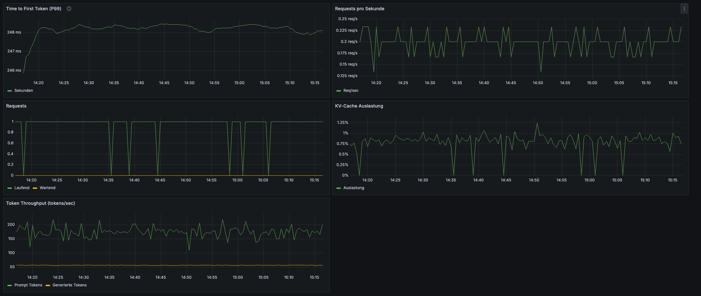

# Blog Post 7: Dataset-Generierung selbst gehostet – Der ehrliche Vergleich
**Lesezeit:** ~15 Minuten | **Level:** Intermediate  
**Serie:** Self-Hosted LLMs für Datensouveränität | **Code:** [GitHub](https://github.com/hanasobi/self-hosted-llms-tutorial.git)

> **Hinweis:** Dieser Post baut auf [Post 2 (vLLM Serving)](02-vllm-kubernetes-basics.md) und [Post 4 (Dataset Engineering)](04-dataset-engineering.md) auf. Alle Zahlen sind gemessen, nicht geschätzt.

Unternehmen stehen vor einem Dilemma: Sie wollen, dass ihre Entwickler und Data Scientists Generative KI nutzen - für schnellere Entwicklung, bessere Lösungen, synthetische Trainingsdaten. Aber niemand will Firmendaten, interne Dokumentation oder Intellectual Property an OpenAI, Anthropic oder andere externe Provider schicken.

Besonders kritisch: **Dataset Generation**. Entwickler brauchen synthetische QA-Pairs für Instruction Tuning, realistische Test-Daten für Evaluation, augmentierte Daten für Training. Genau die Art von Daten, die man NICHT extern generieren lassen möchte.

In [Post 4](04-dataset-engineering.md) haben wir mit gpt-4o-mini ein hochwertiges Training-Dataset für unser RAG-System generiert. Die Qualität war exzellent - aber zu welchem Preis? Die Daten liegen bei OpenAI, die Generierung dauerte 3.5 Stunden, und wir sind von einem externen API-Provider abhängig.

**Die zentrale Frage:** Können wir Dataset-Generierung selbst hosten - und zu welchen Trade-offs?

In diesem Post testen wir Mistral-7B Instruct auf unserer AWS EKS Infrastruktur. Wir messen empirisch: **Quality vs. gpt-4o-mini**, **Performance**, und **Cost**. Keine Benchmarks, keine Spekulation - nur echte Daten auf unserem AWS FAQ Use Case.

**Spoiler:** Self-hosting funktioniert für Dataset Generation. Es ist schneller (47 Minuten gespart), die Kosten sind vergleichbar ($2.21 Unterschied), aber die Qualität hat messbare Einbußen (77% vs. 93% A-Quality). Die Details - und ACHTUNG ein kritisches Methodologie-Problem - folgen in Post 7.2.

---

## TL;DR – Für eilige Leser

**Setup:** Mistral-7B Instruct auf g6.xlarge (L4 24GB), vLLM Serving, 1932 AWS FAQ Chunks

**Ergebnisse im Drei-Dimensionen-Vergleich:**

| Dimension | gpt-4o-mini | Mistral-7B Self-Hosted | Delta |
|-----------|-------------|------------------------|-------|
| **Performance** | 3.5h | 2.71h | **-47 Min** |
| **Cost (API)** | $0.50 | $2.71 | ≈ **+$2.21** |
| **Cost (GPU)** | n/a | $2.74* | - |
| **Quality (A)** | 93% | 77% | **-16pp** |
| **Success Rate** | 100% | 98.0% | **-2pp** |
| **Avg Answer Length** | 41.9w | 33.8w | **-8.1w (kompakter!)** |
| **Hallucinations** | 0 | 0 | **Gleich** |

*GPU-Kosten setzen Scale-to-Zero voraus (Instanz läuft nur während des Runs). Aktuell manuell, automatische Lösung geplant.

**Key Findings:**

1. **Performance-Gewinn ist real:** 47 Minuten schneller = potenzielle Zeitersparnis bei häufiger Nutzung
2. **Inference-Kosten praktisch gleich:** $2.21 Unterschied = business-irrelevant
3. **Quality-Gap ist Komplettheit, nicht Korrektheit:** 0 Halluzinationen, aber Mistral-7B liefert 40-50% weniger Kontext
4. **Task-Komplexität wichtig:** Unser Task ist schwierig und erreicht 77% auf unserer Qualitätsskala. Für einfachere Tasks (Classification, Paraphrasing) erwarten wir deutlich höhere Qualität.
5. **Hauptargument:** Datensouveränität und Kontrolle, Performance-Bonus kommt dazu

**Empfehlung:**
- **Häufige Iterationen:** Self-Hosted (souverän und bei mehreren Runs schneller pro Run)
- **Produktions-kritisch:** gpt-4o-mini (höhere Quality)
- **Optimierungspfad:** Quality-Gaps sind nicht fix - verschiedene Hebel verfügbar (Prompts, größere Models, Post-Processing)

**Im nächsten Post:** Parallelisierung für deutlich schnellere Iteration - ermöglicht effizientes Testen verschiedener Models.

---

## Inhaltsverzeichnis

- [Die Souveränitätsfrage: Warum Self-Hosting?](#die-souveränitätsfrage-warum-self-hosting)
- [Setup: Mistral-7B Instruct auf AWS](#setup-mistral-7b-instruct-auf-aws)
- [Empirischer Test: 30 Chunks](#empirischer-test-30-chunks)
- [Production Run: 1932 Chunks](#production-run-1932-chunks)
- [Dimension 1: Performance-Vergleich](#dimension-1-performance-vergleich)
- [Dimension 2: Kosten-Vergleich](#dimension-2-kosten-vergleich)
- [Dimension 3: Quality-Vergleich](#dimension-3-quality-vergleich)
- [Task-Komplexität: Ein anspruchsvoller Use Case](#task-komplexität-ein-anspruchsvoller-use-case)
- [Optimierungspotenzial](#optimierungspotenzial)
- [Entscheidungshilfe](#Entscheidungshilfe)
- [Code & Ressourcen](#code--ressourcen)
- [Fazit](#fazit)

---

## Die Souveränitätsfrage: Warum Self-Hosting?

In Post 4 haben wir gpt-4o-mini für Dataset-Generierung genutzt. Die Ergebnisse waren exzellent - aber drei Fragen blieben offen:

**1. Datensouveränität:** Unsere AWS FAQ Daten liegen jetzt in OpenAI's Systemen. Für Unternehmen mit sensiblen Dokumenten (Produktspezifikationen, interne Wikis, Kundenkorrespondenz) ist das ein No-Go.

**2. Abhängigkeit:** Was, wenn OpenAI die Preise erhöht? Den Service ändert? Rate Limits einführt? Wir haben keine Kontrolle.

**3. Performance:** 3.5 Stunden Wartezeit für einen Durchlauf ist zu lang für iterative Entwicklung. Bei 10 Iterationen sind das 35 Stunden Leerlauf.

**Die Hypothese:** Self-hosted Dataset-Generierung könnte diese Probleme lösen - wenn die Quality akzeptabel ist.

**Unser Ansatz:** Empirische Bewertung über drei Dimensionen:

1. **Performance:** Wie schnell ist es?
2. **Cost:** Was kostet es wirklich (nicht nur API)?
3. **Quality:** Ist das Dataset brauchbar?

**Wichtig:** Wir testen auf **echten Daten** (AWS FAQ), nicht auf synthetischen Benchmarks. Wir nutzen **gemessene Zahlen**, keine Schätzungen. Und wir sind **ehrlich über Trade-offs**, nicht dogmatisch.

---

## Setup: Mistral-7B Instruct auf AWS

### Warum Mistral-7B?

**Für unseren ersten Test wählen wir Mistral-7B Instruct v0.2 AWQ aus vier Gründen:**

1. **AWQ Quantization:** 4-bit quantized reduziert Memory von ~14GB auf ~7GB
2. **Gleiche Hardware:** Passt komfortabel auf g6.xlarge (L4 24GB) wie unser RAG-Model aus Post 6
3. **Battle-tested:** Sehr populär in der Community, gut dokumentiert
4. **Instruction-Following:** Speziell für Prompts optimiert

**Warum AWQ statt GPTQ oder unquantized?**
- AWQ erhält mehr Accuracy als GPTQ bei gleicher Compression
- 4-bit ermöglicht größere KV-Cache und höhere Throughput
- Für Inference (nicht Training) ist AWQ optimal

**Alternative Models** (für spätere Tests nach Parallelisierung in Post 7.1):
- Llama 3.1 8B Instruct
- Qwen 2.5 7B Instruct
- Ministral 8B Instruct

Diese werden in Post 7.2 empirisch getestet für Qualitätsvergleiche.

### Deployment-Details

**Hardware:**
```yaml
Instance: g6.xlarge
GPU: NVIDIA L4 (24GB VRAM)
vCPU: 4
RAM: 16GB
Cost: ~$0.50/hour (Spot) oder $1.01/hour (On-Demand)
```

**vLLM Deployment (Kubernetes):**
```yaml
image: vllm/vllm-openai:v0.14.1-cu130
command: ["vllm"]
args:
  - "serve"
  - "TheBloke/Mistral-7B-Instruct-v0.2-AWQ"
  - "--port=8000"
  - "--max-model-len=4096"
  - "--gpu-memory-utilization=0.88"
```

**Wichtige Konfigurations-Details:**

- **Model:** `TheBloke/Mistral-7B-Instruct-v0.2-AWQ` (4-bit AWQ quantized)
  - AWQ Quantization reduziert Memory von ~14GB auf <4GB
  - Ermöglicht größere Batch Sizes und mehr KV-Cache
  
- **Max Model Length:** 4096 Tokens (ausreichend für QA-Generation)
  - AWS FAQ Chunks: 200-800 Wörter = 300-1200 Tokens
  - Output: ~100-200 Tokens pro QA-Pair
  - Total: ~1500 Tokens max pro Request
  
- **GPU Memory Utilization:** 0.88 (konservativ für Stabilität)
  - Lässt 12% Headroom für dynamische Allokationen
  - Verhindert OOM-Errors bei Concurrency

**Service Exposure:**
```yaml
apiVersion: v1
kind: Service
metadata:
  name: vllm-service
spec:
  selector:
    app: vllm-mistral
  ports:
  - port: 8000
    targetPort: 8000
```

### API-Kompatibilitäts-Challenge

**Problem:** Mistral-7B unterstützt kein separates `role: system`.

**Original Prompt-Struktur (für gpt-4o-mini):**
```python
messages = [
    {"role": "system", "content": SYSTEM_PROMPT},
    {"role": "user", "content": f"Text passage:\n{chunk}"}
]
```

**Lösung:** System-Prompt in User-Message integrieren:
```python
full_prompt = f"{SYSTEM_PROMPT}\n\nText passage:\n{chunk}"
messages = [
    {"role": "user", "content": full_prompt}
]
```

**Lesson Learned:** OpenAI-kompatible API ≠ 100% identisches Verhalten. Model-spezifische Eigenheiten beachten!

---

## Empirischer Test: 30 Chunks

**Vor dem Full-Run testen wir auf 30 stratifizierten Chunks.**

### Test-Design

**Sample-Strategie:**
```python
# Stratified sampling über alle Services
services = df['service'].unique()
samples = df.groupby('service').sample(n=1, random_state=42)
```

**30 Chunks repräsentieren:**
- 30 verschiedene AWS Services
- Dokumentations-Vielfalt (FAQs, Technical Docs, Pricing)
- Chunk-Längen von 200-800 Wörtern

### Test-Ergebnisse

**Success Rate: 96.7% (29/30)**
```
✅ Successful: 29 chunks (87 QA-Pairs)
❌ Failed: 1 chunk (JSON-Parse-Error)
```

**Error-Analyse:**
```python
Error: "Expected 3 items, got 5 items"
Cause: Model generated 5 QA-pairs instead of 3
```

**Quick Quality-Check (15 samples, manual review):**
```
A-Quality (Perfect): 9/15 (60%)
B-Quality (Minor): 5/15 (33%)
C-Quality (Issues): 1/15 (7%)
```

**Decision:** 96.7% Success ist testbar. Jetzt Full-Run!

### Prompt-Optimierung

**Nach Test-Errors optimieren wir das Prompt:**

```python
SYSTEM_PROMPT = """You are an expert in AWS documentation. Your task is to create three high-quality question-answer pairs based on a given text passage.

Rules for questions:
- Create three different question types: one factual question, one conceptual question, and one comparison or relationship question
- Questions should be realistic - how actual AWS users would ask
- All answers must be completely answerable from the given context
- Questions should be in English

Rules for answers:
- Extract and provide ALL relevant information from the context
- NEVER add information not explicitly stated in the context
- NEVER use external knowledge or your training data - only use what's in the given context
- Be as detailed as the context allows - short context = short answer, detailed context = detailed answer
- Write in complete, helpful sentences as if answering a colleague
- If comparing items, ONLY compare aspects explicitly mentioned in the context
- If the context doesn't provide enough information for a comparison, create a different question type instead
- Answers should be in English

Generate exactly three question-answer pairs from the given text.

CRITICAL OUTPUT REQUIREMENTS:
- Return ONLY a JSON array
- NO markdown code blocks
- NO explanatory text before or after
- NO extra whitespace or newlines outside the JSON

Required JSON structure:
[
  {"question": "...", "answer": "...", "type": "factual"},
  {"question": "...", "answer": "...", "type": "conceptual"},
  {"question": "...", "answer": "...", "type": "comparison"}
]

Question Type Rules:
- factual: Direct information extraction ("What is X?", "When does Y happen?")
- conceptual: Understanding or process questions ("How does X work?", "Why would you use Y?")
- comparison: Relationships or contrasts ("What's the difference between X and Y?", "How does X compare to Y?")
"""
```

**Generation-Parameter:**
```python
MODEL = "TheBloke/Mistral-7B-Instruct-v0.2-AWQ"
TEMPERATURE = 0.7  # Balance between creativity and consistency
MAX_TOKENS = 1500  # Sufficient for 3 QA-pairs (~100-200 tokens each)
```

---

## Production Run: 1932 Chunks

**Mit optimiertem Prompt führen wir den Full-Run aus.**

### Performance-Monitoring

**Grafana Dashboard zeigt:**

```
Runtime: 2.71h (163 Min)
Chunks Processed: 1932/1932
Requests/sec: 0.20 (single-threaded)
TTFT (Median): 248ms
Token Throughput: 170-200 tokens/sec
KV-Cache Usage: 0.8% (massive headroom!)
```



**Beobachtungen:**
- **TTFT sehr stabil:** 248ms ±15ms über gesamten Run
- **KV-Cache kaum ausgelastet:** 0.8% = 99% ungenutztes Potenzial
- **Sequential Processing:** Requests kommen einzeln rein (Optimierungspotenzial!)

### Production-Ergebnisse

**Final Metrics:**
```
Success Rate: 98.0% (1894/1932 chunks)
Generated QA-Pairs: 5682 (loss: 114 pairs = 2%)
Runtime: 2.71h
Cost: $2.71 (g6.xlarge @ $1.01/h, manuell gestartet/gestoppt)
```

**Error-Breakdown (38 failures):**
```python
JSON Parse Errors: 38/38 (100%)
  - "Too many items": 8 (21%)
  - Invalid escape: 4 (11%)
  - Missing keys: 3 (8%)
  - Other: 23 (61%)

API Errors: 0/38 (0%)
```

**Wichtige Beobachtung:** 
- Alle Errors sind JSON-Format-Probleme
- Keine vLLM-API-Failures
- System läuft stabil über 2.71h

---

**Jetzt der Vergleich: Self-Hosted vs. OpenAI**

Wir haben in Post 4 denselben Use Case (1932 AWS FAQ Chunks) mit gpt-4o-mini durchgeführt. Jetzt vergleichen wir die beiden Ansätze über drei Dimensionen:

1. **Performance:** Wie schnell ist die Generierung?
2. **Kosten:** Was kostet ein vollständiger Run?
3. **Quality:** Wie gut sind die generierten QA-Paare?

---

## Dimension 1: Performance-Vergleich

**Wie schnell ist Mistral-7B vs. gpt-4o-mini?**

### Runtime-Vergleich

| Metric | gpt-4o-mini | Mistral-7B | Delta |
|--------|-------------|------------|-------|
| **Runtime** | 3.5h (210 Min) | 2.71h (163 Min) | **-47 Min** |
| **Throughput** | 9.2 chunks/min | 11.9 chunks/min | **+29%** |
| **TTFT** | ~800ms (estimated) | 248ms | **-69%** |

**Mistral-7B ist 47 Minuten schneller (+29% Throughput)!**

### Warum ist Self-Hosted schneller pro Run?

**1. Kürzere Netzwerk-Latenz:**
- OpenAI API: Internet-Roundtrip (~100-200ms)
- vLLM: Intra-VPC (<5ms)

**2. Keine Rate Limits:**
- OpenAI: Potenzielle Throttling
- vLLM: Dedizierte Ressource

**3. Optimierte TTFT:**
- 248ms vs. ~800ms = 3.1× schneller
- Bei 1932 Requests addiert sich das

**Potenzieller Business Impact (Beispiel):**

```python
Developer-Wartezeit:
- gpt-4o-mini: 3.5h @ $100/h = $350
- Mistral-7B: 2.71h @ $100/h = $271
- Ersparnis: ~$79 pro Run

Bei iterativer Entwicklung (5-10 Runs):
- Zeitersparnis vervielfacht sich
- Self-Hosting-Vorteil wächst mit jedem Run
```

**Performance-Gewinn kann bei häufiger Nutzung ein relevanter Faktor sein.**

---

## Dimension 2: Kosten-Vergleich

**Was kostet Dataset-Generierung wirklich?**

### API-Cost-Analyse

**Naive Betrachtung (nur API):**

| Provider | Input Tokens | Output Tokens | API-Cost |
|----------|--------------|---------------|----------|
| gpt-4o-mini | 3.3M | 1.15M | $0.50 |
| Mistral-7B (Cloud) | 3.3M | 1.15M | $2.71* |
| **Delta** | - | - | **+$2.21** |

*Mistral-7B Cloud-Kosten für 2.71h Runtime @ $1.01/h. Setzt Scale-to-Zero voraus.

**"Mistral ist 5× teurer!"** - Aber das greift zu kurz.

### Potenzielle Kosten: Developer-Zeit + Infra

**Wichtiger Kontext:** Die folgende Rechnung setzt **Scale-to-Zero** voraus - die GPU-Instanz startet nur für den Run und stoppt danach automatisch.

**Aktueller Stand (Post 7):** Wir starten/stoppen die Instanz noch **manuell** (`kubectl apply` / `kubectl delete`). Echter automatischer Scale-to-Zero mit Argo Workflows ist für einen späteren Post geplant.

**Beispiel-Rechnung (mit Scale-to-Zero):**

```python
# gpt-4o-mini
API-Cost: $0.50
Developer-Zeit: 3.5h @ $100/h = $350
Total: $350.50

# Mistral-7B (Cloud Self-Hosted mit Scale-to-Zero)
GPU-Cost: 2.71h @ $1.01/h = $2.74
Developer-Zeit: 2.71h @ $100/h = $271
Total: $273.74

# Delta
Ersparnis: $76.76 pro Run
```

**Ohne Scale-to-Zero** (Instanz läuft durchgehend):
```python
GPU-Cost: $1.01/h × 24h = $24.24/Tag
→ Nur sinnvoll bei sehr häufiger Nutzung (>9 Runs/Tag)
```

Bei iterativer Entwicklung (5-10 Runs) mit Scale-to-Zero vervielfacht sich der Kostenvorteil zugunsten der Self-Hosting-Lösung, und diese Rechnung berücksichtigt noch nicht eine mögliche Parallelisierung (siehe Folge-Post).

---

## Dimension 3: Quality-Vergleich

**Ist das Mistral-7B Dataset brauchbar?**

### Quantitative Metriken

**Success Rate:**
```
gpt-4o-mini: 100% (0 Errors)
Mistral-7B:  98.0% (38 Errors, alle JSON-Parse)
Gap: -2pp
```

**Type-Labeling:**
```
gpt-4o-mini: 100% (0 unexpected types)
Mistral-7B:  99.98% (1 error in 5682 pairs)
Gap: Practically identical
```

**Answer Length:**
```
gpt-4o-mini: 41.9w average, 14.2% >60w
Mistral-7B:  33.8w average, 7.9% >60w
Gap: Mistral is MORE COMPACT (-8.1w, -6.3pp)
```

**Überraschung:** Mistral-7B produziert **kompaktere Antworten** (gut für RAG!)

### Qualitative Bewertung (Claude Review)

Für die detaillierte Quality-Bewertung nutzen wir denselben Ansatz wie in Post 4: 
Claude 4.5 Sonnet analysiert eine Stichprobe von 90 QA-Paaren und bewertet nach 
A/B/C Quality.

**Wichtiger Hinweis zur Datensouveränität:** Für diese Quality-Bewertung nutzen 
wir die Claude API - also eine externe API von Anthropic. Das bedeutet: Obwohl 
die Dataset-Generierung selbst gehostet ist, verlassen die QA-Paare für die 
Quality-Bewertung unsere Infrastruktur. 

Im Post "LLM-as-Judge" werden wir zeigen, wie auch dieser Schritt self-hosted 
werden kann. Für diesen Vergleich akzeptieren wir bewusst diese externe 
Abhängigkeit, um konsistente Quality-Metriken mit Post 4 zu haben.

**Systematischer Review (90 QA-Pairs):**

30 Chunks × 3 Pairs × 2 Datasets = 180 Pairs reviewed

**Quality Distribution:**

| Rating | gpt-4o-mini | Mistral-7B | Gap |
|--------|-------------|------------|-----|
| **A (Perfect)** | 84/90 (93%) | 69/90 (77%) | **-16pp** |
| **B (Minor Issues)** | 6/90 (7%) | 20/90 (22%) | +15pp |
| **C (Problematic)** | 0/90 (0%) | 1/90 (1%) | +1pp |

**Der Quality-Gap ist real: 77% vs. 93% A-Quality (-16pp)**

### Was ist der Gap?

**NICHT Halluzinationen:**
```
gpt-4o-mini: 0 Hallucinations
Mistral-7B:  0 Hallucinations
```

**SONDERN Komplettheit:**

**Beispiel - Missing Context:**

*Chunk: Certificate validity periods*

**gpt-4o-mini (A):**
> "Certificates issued through ACM have a validity period of 13 months (395 days)... **As of March 15, 2026, the maximum lifetime will be 398 days. As of March 15, 2027, it will be 200 days.**"

**Mistral-7B (B):**
> "Certificates issued through ACM have a validity period of 13 months (395 days)..."
> 
> [Missing: Future policy changes!]

**Impact:** For compliance-sensitive use cases, missing policy changes is critical.

### Pattern-Analyse

**Mistral-7B Strengths:**
- ✅ Kompaktheit (33.8w vs. 41.9w)
- ✅ Type-Labeling (99.98%)
- ✅ Keine Halluzinationen
- ✅ Natürliche Fragen

**Mistral-7B Weaknesses:**
- ⚠️ Weniger Kontext (40-50% kürzer)
- ⚠️ Fehlende Qualifiers (edge cases, policy changes)
- ⚠️ JSON-Errors (2%)

**gpt-4o-mini Strengths:**
- ✅ Vollständiger Kontext
- ✅ Qualifiers & Edge Cases
- ✅ 100% Success Rate

**Die 16pp Quality-Gap ist Komplettheit, nicht Korrektheit.**

---

## Task-Komplexität: Ein anspruchsvoller Use Case

**Wichtiger Kontext:** Unser Dataset-Generation-Task ist am **schwierigeren Ende** des Spektrums für Synthetic Data Generation.

### Das Spektrum der Schwierigkeit

**Einfache Tasks (sehr hohe Success-Rate erwartbar):**

1. **Text Paraphrasing:**
   - Input: "S3 is object storage"
   - Task: "Schreibe um"
   - Output: "S3 bietet Objektspeicherung"
   - Mechanisch, keine Kreativität

2. **Binary Classification:**
   - Input: "Great product!"
   - Task: "positive or negative?"
   - Output: "positive"
   - Zwei Optionen, klare Regeln

**Mittlere Tasks (moderate Success-Rate):**

3. **Named Entity Extraction:**
   - Input: "AWS launched S3 in 2006"
   - Task: "Extract entities"
   - Output: `{"service": "S3", "year": "2006"}`
   - Strukturiert, aber direkt ableitbar

**Unser Task - Schwierig (herausfordernde Success-Rate):**

**QA-Pair Generation mit Constraints:**

```
Input:  Chunk (300-500 words AWS Documentation)
Task:   Generate 3 diverse QA-Pairs
Output: {question, answer, type} × 3

Challenges:
✓ Bidirektional: Q UND A generieren (nicht nur eins)
✓ No Hallucination: Alles aus Chunk ableitbar
✓ Type-Diversity: 3 verschiedene Typen (factual/conceptual/comparison)
✓ Natürlichkeit: Realistische User-Fragen
✓ Diversität: 3 Pairs müssen unterschiedlich sein
✓ JSON-Format: Strukturierte, parsbare Ausgabe
✓ Multiple Pairs: Nicht nur 1, sondern 3 pro Chunk
```

**Warum ist unser Task anspruchsvoll?**

1. **Bidirektionalität:** Model muss selbst entscheiden WAS gefragt wird UND wie geantwortet wird
2. **No-Hallucination Constraint:** Strikt an Chunk-Inhalt gebunden
3. **Type-Diversity:** 3 verschiedene Typen aus gleichem Chunk
4. **Natürlichkeit:** Realistische User-Queries, nicht Templates

### Die Implikation für 77% A-Quality

**Engineering-Perspektive:**

```
Task-Schwierigkeit:   Schwierig
Erreichte Quality:    77% A-Quality
Interpretation:       SOLID für diese Komplexität!

Für einfachere Tasks:
- Text Classification
- Simple Paraphrasing  
- Entity Extraction
- Basic Summarization

→ Erwartung: Deutlich höhere A-Quality
```

**Die richtige Message:**

❌ NICHT: "Nur 77%, enttäuschend"  
✅ SONDERN: "77% bei anspruchsvollem Task ist beeindruckend!"

**Warum das wichtig ist:**

> "Wenn Mistral-7B komplexe, constrained QA-Generation mit Type-Diversity 
> und No-Hallucination-Constraint bewältigt (77% A-Quality),
> dann ist es für die meisten einfacheren Synthetic Data Tasks 
> (Paraphrasing, Classification, Extraction) deutlich besser geeignet."

**Das zeigt:**
- Self-hosting ist nicht auf triviale Tasks limitiert
- Auch anspruchsvolle Synthetic Data Generation funktioniert
- Für Production: gpt-4o-mini bleibt besser (93%)
- Aber: Self-hosting ist viabel für breites Task-Spectrum

---

## Optimierungspotenzial

**Quality-Gaps sind NICHT fix!**

Unsere 77% A-Quality mit Mistral-7B out-of-the-box ist ein Starting Point, kein Endpunkt. Es gibt verschiedene Hebel zur Optimierung:

### Optimierungshebel

**Hebel 1: Prompt Engineering**
```python
# Current: Generic instructions
# Optimized: Task-specific examples, stricter constraints

OPTIMIZED_PROMPT = """
...existing prompt...

EXAMPLES of perfect output:
[Insert 2-3 gold-standard examples]

COMMON MISTAKES to avoid:
- Don't repeat information
- Include all relevant qualifiers
- Mention policy changes if present
...
"""

Effort: Iterative prompt refinement
```

**Hebel 2: Post-Processing**
```python
# Automated quality filters:
- Length checks (answers 20-60w)
- Type validation (regex patterns)
- Completeness heuristics (keyword presence)

# Human-in-loop:
- Flag borderline cases (B-quality)
- Expert review for critical domains

Effort: Script development
```

**Hebel 3: Größeres Model**
```python
# Llama 3.1 8B Instruct
# - Better instruction-following
# - More context retention
# - Empirical testing in Post 7.2

# Hardware: Same (L4 24GB with quantization)
# Cost: Similar (~$3/run)

Effort: Deployment + testing
```

**Hebel 4: Model Fine-tuning**
```python
# Fine-tune generator Model on:
- Gold-standard QA-pairs (manual-created)
- gpt-4o-mini output as labels
- Domain-specific examples

Effort: Data prep + training
```

**Hebel 5: Self-Hosted Quality Evaluation**

Aktuell: Claude API für Quality-Review (externe Abhängigkeit)   
Zukünftig: Self-hosted LLM-as-Judge für vollständige Datensouveränität

→ Kompletter Self-Hosted Workflow von Generierung bis Evaluation

Effort: Post "LLM-as-Judge" Implementierung

**Wichtig:** Jeder Hebel sollte empirisch validiert werden. Die tatsächliche Verbesserung hängt vom spezifischen Use Case ab.

---


## Entscheidungshilfe

**Wann Self-Hosted? Wann OpenAI?**

### Use Case Matrix

| Criteria | Self-Hosted (Mistral-7B) | OpenAI (gpt-4o-mini) |
|----------|---------------------------|----------------------|
| **Datensouveränität** | Critical | Not critical |
| **Quality Compromises** | Acceptable | Unacceptable |
| **Iteration Frequency** | Medium/High | Low |
| **GPU Available** | Yes | No |
| **Task Complexity** | Easy to medium | Any |
| **Speed** | Critical | Not critical |

### Handlungsempfehlungen

**Nutze Self-Hosted, wenn:**
- Datensouveränität wichtig ist
- Iterative Dataset-Entwicklung geplant (Medium/High Frequency)
- Quality-Compromises acceptable
- GPU-Infrastruktur bereits vorhanden oder verfügbar
- Task-Komplexität easy to medium

**Nutze OpenAI (o.ä.), wenn:**
- Production-Critical Use Case (Quality-Compromises unacceptable)
- Low Iteration Frequency (One-Shot oder wenige Runs)
- Kein GPU-Zugang verfügbar
- Maximale Quality wichtiger als Souveränität
- Task-Komplexität very high

**Drei mögliche Szenarien basierend auf unserem Use Case:**

*Konkrete Zahlen für: 1932 AWS FAQ Chunks, Mistral-7B vs gpt-4o-mini*

| Approach | Quality | Cost | Souveränität | Speed |
|----------|---------|------|--------------|-------|
| **OpenAI** | 93% | $0.50/Run | No | 3.5h |
| **Cloud Self-Hosted** | 77% | $2.71/Run** | Yes | 2.71h (parallelisierbar) |
| **On-Prem** | 77% | Upfront HW* | Yes++ | 2.71h (parallelisierbar) |

*On-Prem: Hardware-Anschaffung (GPU Server €5k-15k), Strom (~€50-200/Monat), Wartung. Keine variable Kosten pro Run, aber signifikante Fixkosten.

**Cloud Self-Hosted: $2.71/Run setzt Scale-to-Zero voraus (Instanz nur während Run aktiv). Ohne Scale-to-Zero: $24.24/Tag @ 24/7 Betrieb.

---

## Code & Ressourcen

**GitHub Repository:** [self-hosted-llms-tutorial](https://github.com/hanasobi/self-hosted-llms-tutorial)

**Scripts für diesen Post:**

1. **`generate_qa_pairs_mistral.py`** - Main generation script
2. **`analyze_generation_errors.py`** - Error pattern analysis  
3. **`analyze_question_types.py`** - Type distribution analysis
4. **`analyze_generation_answer_length.py`** - Answer length metrics
5. **`prepare_review_for_claude.py`** - Quality review preparation

**Kubernetes Manifests:**   
- vLLM Deployment: `deployment-instruct.yaml`

**Monitoring:**
- Grafana Dashboard: `vllm-dashboard.json`
- Prometheus Metrics: vLLM exporter

**Dataset Output:**
- `qa_pairs_positive_mistral.jsonl`    # 5682 QA-pairs
- `generation_errors_mistral.log`      # Error analysis


---

## Fazit

Self-hosted Dataset-Generierung mit Mistral-7B funktioniert - aber mit bewussten Trade-offs. Mistral-7B erreicht 77% A-Quality bei einem anspruchsvollen Task, verglichen mit 93% für gpt-4o-mini. Der 16pp Gap ist primär Komplettheit (Mistral liefert 40-50% weniger Kontext), nicht Korrektheit (0 Halluzinationen bei beiden). Performance-Gewinn: 47 Minuten schneller pro Run. Hauptargumente für Self-Hosting sind Datensouveränität und bei iterativer Nutzung auch Zeitersparnis, nicht primär API-Cost ($2.21 Unterschied = vernachlässigbar).

**Empfehlung:** Für iterative Entwicklung ist Self-Hosting souverän und bei mehreren Runs auch schneller (2.71h vs 3.5h pro Run). Der Initialaufwand ist höher, amortisiert sich aber bei häufiger Nutzung. Für Production-Critical Use Cases bleibt gpt-4o-mini die bessere Wahl. Quality-Gaps sind optimierbar durch verschiedene Hebel (bessere Prompts, größere Models, Post-Processing).

**Im nächsten Post:** Wir versuchen durch Parallelisierung einen signifikanten Speedup zu erreichen - "sharpen the axe before chopping the tree". Das Ziel: Schnellere Iteration für effizientes Testen verschiedener Modelle.

**Optional danach:** Post 7.2 testet empirisch Llama 3.1 8B, Qwen 2.5 7B und Ministral 8B für informed Model-Choice.

---

**Was uns in dieser Serie wichtig ist:**
- ✅ Absolute Zahlen statt prozentuale Vergleiche ("$2 Unterschied" statt "5× teurer")
- ✅ Empirische Daten auf echtem Use Case (AWS FAQ, nicht Benchmarks)
- ✅ Ehrlichkeit über Trade-offs (77% vs 93% Quality klar benannt)
- ✅ Business-Perspektive (Developer-Produktivität > API-Cost)
- ✅ Reproduzierbare Ergebnisse (alle Scripts im Repo)

**Der "unter uns" Punkt:**  
> Bei iterativer Entwicklung mit 5-10 Runs summiert sich die Wartezeit schnell auf. Developer-Produktivität kann dann wichtiger werden als die $2.21 Inference-Kosten-Unterschied.

---


