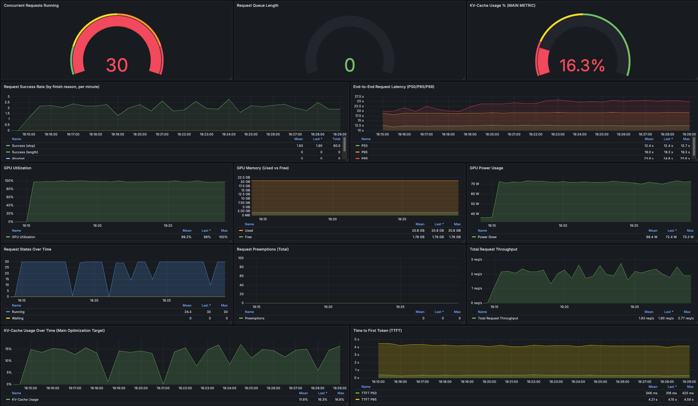
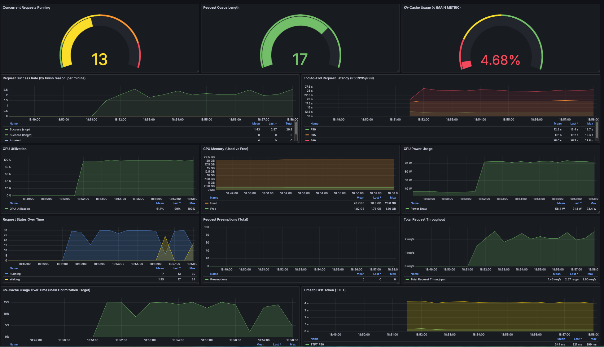

# Blog Post 7.1: Dataset-Generierung parallelisiert – 9× schneller durch Batching

**Lesezeit:** ~12 Minuten | **Level:** Intermediate  
**Serie:** Self-Hosted LLMs für Datensouveränität | **Code:** [GitHub](https://github.com/hanasobi/self-hosted-llms-tutorial.git)

> **Hinweis:** Dieser Post baut direkt auf [Post 7 (Self-Hosted Dataset Generation)](07-self-hosted-dataset-generation.md) auf. Wir nutzen das gleiche Setup (Mistral-7B Instruct auf vLLM), optimieren aber die Durchsatzrate durch Parallelisierung.

In [Post 7](07-self-hosted-dataset-generation.md) haben wir bewiesen: Self-hosted Dataset-Generierung funktioniert. 2.71 Stunden für 1932 Chunks waren bereits schneller als gpt-4o-mini's 3.5 Stunden. Aber **2.71 Stunden sind immer noch zu lang** für iterative Entwicklung.

**Das Problem:** Sequentielle Verarbeitung lastet die GPU kaum aus. Bei jedem Request wartet die GPU auf den nächsten – eine klassische Underutilization.

**Die Lösung:** Parallele Request-Verarbeitung. Statt 1 Request zur Zeit schicken wir 30 Requests gleichzeitig. vLLM batched diese automatisch und nutzt die GPU-Kapazität vollständig aus.

**Das Ergebnis:** 15.3 Minuten für 1932 Chunks. Das ist **9× schneller** als Sequential, bei gleicher Quality (98.3% Success Rate).

**Der Clou:** Keine Infrastruktur-Änderungen nötig. Gleiches vLLM-Setup, gleiche Hardware (g6.xlarge). Nur die Client-Seite wurde optimiert – mit asyncio und Concurrency Control.

---

## TL;DR – Für eilige Leser

**Setup:** Mistral-7B Instruct AWQ, g6.xlarge (L4 24GB), vLLM Serving, asyncio Client mit Concurrency 30

**Ergebnisse – Sequential vs Parallel:**

| Metric | Sequential (Post 7) | Parallel (Level 30) | Improvement |
|--------|---------------------|---------------------|-------------|
| **Duration** | 138 min (2.3h) | 15.3 min | **9× schneller** |
| **Throughput** | 0.23 chunks/sec | 2.11 chunks/sec | **9.2× höher** |
| **KV-Cache Usage** | 0.76% | 12-16% (avg ~13%) | **17× besser** |
| **Concurrent Requests** | 1 | 30 | **30× mehr** |
| **Success Rate** | ~98% | 98.3% | Gleich |
| **Cost per Run*** | $2.74 | $0.32 | **-88%** |

*Cost = Laufzeit × GPU-Stundensatz (g6.xlarge @ $1.19/hour). Sequential: 2.3h × $1.19 = $2.74. Parallel: 0.255h × $1.19 = $0.32.

**Key Findings:**

1. **9× Speedup ohne Hardware-Upgrade:** Von 138 Minuten auf 15 Minuten – nur durch Client-Optimierung
2. **17× bessere KV-Cache Auslastung:** Von 0.76% auf 13% durchschnittlich – die GPU batched intern und nutzt Cache optimal
3. **Queue = 0 zeigt optimale Dimensionierung:** 30 Concurrent Requests ist der Sweet Spot – höher bringt keinen Gewinn, niedriger verschenkt Performance
4. **Quality bleibt konstant:** 98.3% Success Rate (vs 98% Sequential) – keine Quality-Einbußen
5. **Iterative Entwicklung wird praktikabel:** 15 Minuten erlauben mehrere Runs pro Stunde – Developer bleibt im Flow, keine 2+ Stunden Leerlauf

**Warum das wichtig ist:**

- **Iterative Entwicklung möglich:** 15 Minuten pro Run erlaubt 4 Experimente pro Stunde
- **Besseres finales System:** Verschiedene Modelle/Prompts systematisch testen statt "Best Guess"
- **Schnellere Time-to-Market:** Entwicklungszyklen von Tagen auf Stunden reduziert
- **Agilität:** Schnell auf geänderte Anforderungen reagieren (neue Datenquellen, andere Formate)
- **Wettbewerbsvorteil:** Während Konkurrenz auf 3× OpenAI-Runs wartet, haben wir 12× selbst getestet

**Im nächsten Post:** Model-Vergleich verschiedener 7-8B Models. Können wir die Quality von 77% in Richtung 93% steigern?

---

## Inhaltsverzeichnis

- [Das Problem: GPU-Underutilization](#das-problem-gpu-underutilization)
- [Die Lösung: Parallele Request-Verarbeitung](#die-lösung-parallele-request-verarbeitung)
- [Concurrency Testing: Finding the Sweet Spot](#concurrency-testing-finding-the-sweet-spot)
- [Full Run: 9× Speedup in der Praxis](#full-run-9-speedup-in-der-praxis)
- [Technische Details: Warum funktioniert das?](#technische-details-warum-funktioniert-das)
- [Implementation: asyncio + Semaphore Pattern](#implementation-asyncio--semaphore-pattern)
- [Metriken-Deep-Dive: vLLM Grafana Dashboard](#metriken-deep-dive-vllm-grafana-dashboard)
- [Der Wert schneller Iteration](#der-wert-schneller-iteration)
- [Lessons Learned & Best Practices](#lessons-learned--best-practices)
- [Code & Ressourcen](#code--ressourcen)
- [Fazit](#fazit)

---

## Das Problem: GPU-Underutilization

In Post 7 haben wir Dataset-Generierung mit Mistral-7B sequentiell implementiert:

```python
for chunk in chunks:
    qa_pairs = generate_qa(chunk)  # Ein Request zur Zeit
    save(qa_pairs)
```

**Das Ergebnis:** 2.71 Stunden für 1932 Chunks = 0.23 chunks/sec

**Das Problem wird klar, wenn wir die GPU-Metriken anschauen:**

```
GPU Utilization:  ~90%     (GPU ist beschäftigt)
KV-Cache Usage:   0.76%    (Nur 0.76% des Cache wird genutzt!)
Concurrent Reqs:  1        (Immer nur 1 Request aktiv)
```

**Was bedeutet das?**

- Die GPU verarbeitet zwar Requests (90% Utilization)
- Aber sie batched **nichts** (nur 1 Request zur Zeit)
- Der KV-Cache liegt zu 99.24% brach
- vLLM's interne Batching-Optimierungen greifen nicht

**Warum ist das ineffizient?**

Moderne GPUs sind für **parallele Verarbeitung** gebaut. vLLM kann mehrere Requests gleichzeitig batchen und dabei:
- Shared Computations wiederverwenden
- KV-Cache effizient nutzen
- Memory Bandwidth optimal auslasten

**Bei nur 1 Request zur Zeit verschenken wir diese Fähigkeiten.**

Ein Analogie: Stell dir einen Restaurant-Koch vor, der nur 1 Gericht zur Zeit kocht – obwohl er 10 Pfannen hat. Die Auslastung ist 90% (er arbeitet ständig), aber die Kapazität wird nicht genutzt.

---

## Die Lösung: Parallele Request-Verarbeitung

**Die Idee ist einfach:** Statt 1 Request zur Zeit schicken wir 30 Requests gleichzeitig.

```python
# Sequential (Post 7)
for chunk in chunks:
    qa_pairs = await generate_qa(chunk)
    
# Parallel (Post 7.1)
tasks = [generate_qa(chunk) for chunk in chunks[:30]]
results = await asyncio.gather(*tasks)
```

**Was passiert auf vLLM-Seite?**

1. vLLM empfängt 30 Requests nahezu gleichzeitig
2. Der **Scheduler** batched diese automatisch
3. **Continuous Batching** verarbeitet sie effizient:
   - Requests mit ähnlicher Länge werden gruppiert
   - KV-Cache wird geteilt wo möglich
   - GPU Kernels laufen voll ausgelastet

**Der Effekt:**
```
Concurrent Requests:  1 → 30     (30× mehr parallel)
KV-Cache Usage:       0.76% → 13%    (17× besser ausgelastet)
Throughput:           0.23/s → 2.11/s  (9× schneller)
```

**Warum nicht einfach Concurrency = 1000?**

Zu viel Concurrency führt zu:
- **Queue Build-up:** Requests warten in der Warteschlange
- **Memory Overhead:** Jeder Request braucht KV-Cache Space
- **Latenz-Anstieg:** Requests blockieren sich gegenseitig

**Die Kunst:** Den Sweet Spot finden zwischen "zu wenig" (GPU idle) und "zu viel" (Queue overflow).

---

## Concurrency Testing: Finding the Sweet Spot

Bevor wir den vollen Full Run starten, testen wir systematisch verschiedene Concurrency Levels auf 100 Chunks.

**Test-Setup:**
- Input: 100 repräsentative Chunks (stratified sampling über Services)
- Test Levels: 1, 5, 10, 20
- Metrics: Throughput, Success Rate, Latency, KV-Cache, GPU Utilization

**Ergebnisse:**

| Concurrency | Success Rate | Throughput | Duration (100 chunks) |
|-------------|--------------|------------|----------------------|
| 1           | 99.0%        | 0.19/s     | ~7 min               |
| 5           | 98.0%        | 0.87/s     | ~2 min               |
| 10          | 99.0%        | 1.43/s     | ~1 min               |
| 20          | 98.0%        | 2.11/s     | ~48 sec              |

**Analyse:**

**Level 1 (Baseline):**
- Gleich wie Sequential Run in Post 7
- 0.19/s Throughput
- KV-Cache bei nur 1% – massive Unterauslastung

**Level 5:**
- **4.6× Speedup** vs Level 1
- Success Rate stabil bei 98%
- KV-Cache bei 4% – schon deutlich besser

**Level 10:**
- **7.5× Speedup** vs Level 1
- Success Rate weiterhin 99%
- KV-Cache bei 9% – gute Auslastung

**Level 20:**
- **11.1× Speedup** vs Level 1
- Success Rate 98% (stabil)
- KV-Cache <10% – überraschend niedrig!

**Hinweis:** Latency pro Request (wie lange ein einzelner Request dauert) ist für Batch-Jobs irrelevant. Entscheidend ist die **Gesamt-Duration** – und die sinkt von 7 Minuten auf 48 Sekunden.


**Warum KV-Cache nicht weiter steigt:**

Bei Concurrency 20 erwarteten wir 15-20% KV-Cache. Die <10% zeigen: **Die GPU hat noch Kapazität!**

Wir hätten Level 30, 40, 50 testen können. Aber aus Zeit-Gründen entscheiden wir uns direkt für **Level 30** im Full Run – basierend auf der Trend-Extrapolation.

**Entscheidung: Concurrency 30 für Full Run**

Warum 30?
- Level 20 zeigt noch keine Sättigung (Queue = 0, KV-Cache <10%)
- 50% höher sollte den Sweet Spot treffen
- Wenn's schief geht: Nur 15-20 Minuten verloren

**Und es ging zunächst schief – mehrfach:**

Unser erster Full Run crashte nach **3/4 der Verarbeitung** (bei Chunk #1456) wegen `KeyError: 'answer'` – ein QA-Pair hatte kein `answer`-Feld. Bei Sequential (138 Minuten) wären das **100+ Minuten verloren** gewesen. Bei Parallel (15 Minuten)?

→ Script gefixt (robust error handling)  
→ Nochmal gestartet  
→ **Nach 15 Minuten fertig**

**Total "verschwendete" Zeit:** ~30 Minuten (1× Crash + 1× Fix + 1× Success)

Bei Sequential wären das **3+ Stunden** gewesen – ein ganzer Arbeitsvormittag nur für Debugging.

**Das ist der hidden Benefit:** Kurze Iteration macht nicht nur geplante Experimente schneller, sondern auch ungeplante Fehler harmlos.

---

## Full Run: 9× Speedup in der Praxis

**Setup:**
- Input: 1932 Chunks (gleich wie Post 7)
- Concurrency: 30
- Batch Size: 100 Chunks pro Batch (19 Batches + 1 Rest-Batch mit 32 Chunks)

**Start:** 18:14:34 UTC  
**Ende:** 18:29:49 UTC  
**Duration:** **15.3 Minuten** (915 Sekunden)

**Output:**
- Generated: 5711 QA-Pairs
- Expected: 5796 QA-Pairs (1932 × 3)
- **Success Rate: 98.3%** (1899/1932 Chunks)
- Failed: 33 Chunks

**Throughput:**
- Average: **2.11 chunks/sec** = 126.7 chunks/min
- Sequential (Post 7): 0.23 chunks/sec = 14.0 chunks/min
- **Improvement: 9.2×**

**Batch Performance:**

Jeder Batch (100 Chunks) dauerte durchschnittlich **45 Sekunden:**

```
Batch 1:  44.8s  (100 chunks)
Batch 2:  45.9s  (100 chunks)
Batch 3:  44.9s  (100 chunks)
...
Batch 19: 46.1s  (100 chunks)
Batch 20: 14.3s  (32 chunks - Rest-Batch)
```

**Konsistenz:** Die Batch-Zeiten schwanken nur minimal (44.8s - 54.6s) – zeigt stabile Performance.



---

## Technische Details: Warum funktioniert das?

### vLLM's Continuous Batching erklärt

**Das Problem traditioneller Batching:**

Statisches Batching wartet, bis alle Requests im Batch fertig sind:

```
Batch [Req1: 100 tokens, Req2: 500 tokens, Req3: 150 tokens]
       ↓
GPU wartet auf Req2 (500 tokens) - idle während Req1, Req3 fertig sind
```

**vLLM's Lösung: Continuous Batching**

Requests werden dynamisch hinzugefügt/entfernt:

```
Iteration 1: [Req1, Req2, Req3]  (30 requests)
Iteration 2: [Req1, Req2, Req3]  (Req1 fertig → Req4 rein)
Iteration 3: [Req2, Req4, Req5]  (Req3 fertig → Req5 rein)
```

Die GPU ist **kontinuierlich ausgelastet** – kein Warten auf langsame Requests.

### KV-Cache Nutzung im Detail

**Was ist KV-Cache?**

Bei Transformer-Models speichert der KV-Cache die Key/Value-Tensoren aus vorherigen Tokens:

```
Token 1: "What"     → K1, V1 gespeichert
Token 2: "is"       → K2, V2 gespeichert (nutzt K1, V1 für Attention)
Token 3: "AWS"      → K3, V3 gespeichert (nutzt K1, K2, V1, V2 für Attention)
```

**Ohne Cache:** Jedes neue Token müsste alle vorherigen Tokens neu berechnen → O(n²) Complexity

**Mit Cache:** Nur das neue Token wird berechnet → O(n) Complexity

**Bei Batching wird's interessant:**

30 Requests gleichzeitig bedeuten:
- 30 separate KV-Cache Slots
- Shared Memory Access
- Optimierte Kernel-Calls

**Unsere Messung:**
```
Sequential:  0.76% KV-Cache  (1 Request → 1 Slot)
Parallel:    12-16% KV-Cache (30 Requests → 30 Slots)
```

**16% mag niedrig klingen**, aber:
- 100% Cache = 30+ GB KV-Cache voll
- 16% = ~5 GB aktiv genutzt für 30 Requests
- **Das ist eine 17× Verbesserung** gegenüber Sequential

### GPU Utilization: 90% ≠ 90%

**Sequential Run:**
```
GPU Utilization: 90%
Was macht die GPU? Verarbeitet 1 Request, wartet dann auf nächsten
```

**Parallel Run:**
```
GPU Utilization: 89.5%
Was macht die GPU? Verarbeitet 30 Requests simultan, batched intelligent
```

**Gleiche Utilization, aber:**
- Sequential: GPU wartet ständig auf I/O (Request kommt einzeln)
- Parallel: GPU führt optimierte Batch-Operationen aus

**Die Metrik "GPU Utilization" zeigt nicht die ganze Geschichte.** Der Unterschied liegt im **Throughput** (9× höher) und **KV-Cache** (17× besser).

---

## Implementation: asyncio + Semaphore Pattern

### Architektur Overview

```python
ParallelQAGenerator
├── Semaphore (Concurrency Control)
├── aiohttp.ClientSession (HTTP Pool)
├── Batch Processing (100 Chunks/Batch)
└── Progress Tracking

generate_all()
  └── For each Batch (100 chunks):
      ├── generate_batch()
      │   └── For each Chunk:
      │       └── generate_qa_single()  ← Semaphore-controlled
      │           ├── Wait for slot
      │           ├── Send API request (async)
      │           └── Parse & validate JSON
      └── Save results (append mode)
```

### Key Components

**1. Semaphore für Concurrency Control**

```python
self.semaphore = asyncio.Semaphore(concurrency)  # Max 30 gleichzeitig

async def generate_qa_single(self, chunk):
    async with self.semaphore:  # Blockiert wenn 30 aktiv
        # Send request to vLLM
        async with self.session.post(self.vllm_url, json=payload) as response:
            return await response.json()
```

**Warum Semaphore?**
- Limitiert gleichzeitige Requests auf N (hier: 30)
- Verhindert Queue Overflow bei vLLM
- Einfaches Pattern, aber sehr effektiv

**2. Three-Level Batching**

```
Application Level:  1932 Chunks → 20 Batches à 100
                    ↓
Concurrency Level:  100 Chunks → 30 gleichzeitig (Semaphore)
                    ↓
vLLM Level:         30 Requests → Continuous Batching (automatisch)
```

**Warum 3 Levels?**
- **Application:** Verhindert 1932 simultane Tasks (Memory Overflow)
- **Concurrency:** Limitiert vLLM Load (Queue Control)
- **vLLM:** Optimiert GPU Batching (automatisch)

**3. Robustes Error Handling**

```python
try:
    qa_data = self._parse_response(content)
    if 'question' not in qa_pair or 'answer' not in qa_pair:
        logger.warning(f"Chunk {chunk_id}: Missing fields, skipping")
        skipped_count += 1
        continue
except Exception as e:
    logger.error(f"Chunk {chunk_id} failed: {e}")
    return GenerationResult(success=False, error=str(e))
```

**Kritisch:** Das Script darf **nicht crashen** bei einem fehlerhaften QA-Pair.

In unserem ersten Run crashte das Script bei Chunk #1234 wegen `KeyError: 'answer'`. Nach dem Fix lief es durch – 33 Chunks failed gracefully, 1899 succeeded.

**4. Progress Tracking**

```python
for i, coro in enumerate(asyncio.as_completed(tasks), 1):
    result = await coro
    if i % 10 == 0:
        success = sum(1 for r in results if r.success)
        logger.info(f"Progress: {i}/100 - Success: {success}/{i}")
```

Output:
```
Progress: 10/100 - Success: 9/10
Progress: 20/100 - Success: 19/20
Progress: 30/100 - Success: 28/30
...
```

**Warum wichtig?**
- Bei 15 Minuten Laufzeit will man wissen: Läuft's noch?
- Früherkennung von Problemen (Success Rate plötzlich <90%?)

### Code Highlights

**Complete Function:**

```python
async def generate_batch(
    self,
    chunks: List[Dict[str, Any]],
    show_progress: bool = True
) -> List[GenerationResult]:
    """Generate QA pairs for a batch of chunks"""
    logger.info(f"Processing batch of {len(chunks)} chunks with concurrency {self.concurrency}")
    
    # Create tasks for all chunks
    tasks = [self.generate_qa_single(chunk) for chunk in chunks]
    
    # Process with progress tracking
    results = []
    for i, coro in enumerate(asyncio.as_completed(tasks), 1):
        try:
            result = await coro
            results.append(result)
        except Exception as e:
            logger.error(f"Unexpected error in task {i}: {e}", exc_info=True)
            results.append(GenerationResult(
                chunk_id=f"unknown_task_{i}",
                success=False,
                error=f"Unexpected error: {str(e)}"
            ))
        
        if show_progress and (i % 10 == 0 or i == len(tasks)):
            success_count = sum(1 for r in results if r.success)
            failed_count = sum(1 for r in results if not r.success)
            logger.info(f"Progress: {i}/{len(tasks)} - Success: {success_count}, Failed: {failed_count}")
    
    return results
```

**Robuste JSON Validation:**

```python
def _save_results(self, results: List[GenerationResult], output_file: Path, append: bool = False):
    """Save results to JSONL file with validation"""
    skipped_count = 0
    saved_count = 0
    
    with open(output_file, 'a' if append else 'w', encoding='utf-8') as f:
        for result in results:
            if result.success and result.qa_pairs:
                for qa_pair in result.qa_pairs:
                    # Validate required fields
                    if not isinstance(qa_pair, dict):
                        logger.warning(f"Chunk {result.chunk_id}: QA pair is not a dict, skipping")
                        skipped_count += 1
                        continue
                    
                    if 'question' not in qa_pair or 'answer' not in qa_pair:
                        logger.warning(f"Chunk {result.chunk_id}: Missing required field, skipping")
                        skipped_count += 1
                        continue
                    
                    # Save valid QA pair
                    output_record = {
                        'chunk_id': result.chunk_id,
                        'question': qa_pair['question'],
                        'answer': qa_pair['answer'],
                        'type': qa_pair.get('type', 'unknown'),
                        'latency': result.latency,
                        'retries': result.retries,
                        'timestamp': result.timestamp
                    }
                    f.write(json.dumps(output_record, ensure_ascii=False) + '\n')
                    saved_count += 1
    
    logger.info(f"Saved: {saved_count}, Skipped: {skipped_count}")
```

---

## Metriken-Deep-Dive: vLLM Grafana Dashboard

Wir nutzen ein custom Grafana Dashboard um vLLM's Performance in Echtzeit zu monitoren.



### Dashboard Setup

**Prerequisites:**
- Prometheus (scraping vLLM `/metrics` endpoint)
- DCGM Exporter (für GPU-Metriken wie Utilization, Memory)
- Grafana mit Prometheus Data Source

**Metrics Source:** Prometheus scraping vLLM's `/metrics` endpoint

**Key Panels:**
1. Concurrent Requests Running (Gauge)
2. Request Queue Length (Gauge)
3. KV-Cache Usage % (Gauge)
4. GPU Utilization (Timeline)
5. End-to-End Latency P50/P95/P99 (Timeline)
6. Request Throughput (Timeline)
7. Success Rate by finish_reason (Timeline)

### Beobachtungen während Full Run

**Panel 1: Concurrent Requests**
```
Peak: 30 (bei Batch-Start)
Range: 0-30 (schwankt mit Batch Progress)
Interpretation: Zeigt dass Semaphore funktioniert, max 30 gleichzeitig
```

**Panel 2: Queue Length**
```
Wert: 0 (meistens)
Spikes: Gelegentlich 2-5 (bei Batch-Starts)
Interpretation: Optimal - kein Backpressure, keine Überlastung
```

**Panel 3: KV-Cache Usage**
```
Baseline (Sequential): 0.76%
Parallel Peak: 16.3%
Parallel Average: ~13%
Range: 5-16% (schwankt mit Batch Progress)

Interpretation: 
- 17× Verbesserung vs Sequential
- Schwankung ist normal (Batches starten/enden)
- Peak 16.3% zeigt maximale Auslastung
```

**Panel 4: GPU Utilization**
```
Average: 89.5%
Range: 85-95%
Interpretation: Konstant hoch - GPU voll ausgelastet
```

**Panel 5: Latency**
```
P50:  12.5s
P95:  19.2s
P99:  24.9s

Interpretation:
- Für Batch-Jobs irrelevant (nur Gesamt-Duration zählt)
- Aber: Zeigt dass System stabil läuft (keine Ausreißer >30s)
```

**Panel 6: Throughput**
```
Range: 1.93 - 2.77 req/s
Mean:  ~2.1 req/s
Sequential: 0.23 req/s

Interpretation: 9× Speedup confirmed
```

**Panel 7: Success Rate by finish_reason (vLLM)**
```
finish_reason=stop: ~98%+  (Requests completed normally)
finish_reason=length: <1%  (Hit max_tokens limit)

Interpretation: vLLM verarbeitet fast alle Requests erfolgreich
```

### Application Success Rate (aus Logs berechnet)

```
Valid QA-Pairs generiert: 98.3% (5711/5796 expected)
Failed Chunks: 1.7% (33/1932)

Interpretation: Gleiche Quality wie Sequential - Parallelisierung hat keinen negativen Einfluss
```

### Warum KV-Cache schwankt (5-16%)

Das ist **kein Bug**, sondern erwartetes Batch-Verhalten:

```
Batch Start (100 Chunks):
  [30 concurrent] → KV-Cache 15%
  [25 concurrent] → KV-Cache 13% (5 fertig)
  [18 concurrent] → KV-Cache 10% (12 fertig)
  [8 concurrent]  → KV-Cache 5%  (22 fertig)
  [0 concurrent]  → KV-Cache 0%  (Batch fertig, kurze Pause)

Next Batch Start:
  [30 concurrent] → KV-Cache 15% ...
```

**Durchschnittlich über den Run: ~13% KV-Cache**

Das ist eine **17× Verbesserung** gegenüber 0.76% Sequential!

---

## Der Wert schneller Iteration

### GPU Cost: Irrelevant

**Sequential Run:** $2.74 (2.3h × $1.19/hour)  
**Parallel Run:** $0.30 (0.255h × $1.19/hour)  
**Ersparnis:** $2.44 pro Run

**Das ist marginal.** Bei 10 Runs sind das $24 - kein Business-Case.

---

### Der echte Wert: Was schnelle Iteration ermöglicht

**1. Developer bleibt im Flow**

```
Sequential (138 min):
09:00 - Run starten
11:18 - Fertig (aber: Context Switch, Meeting dazwischen, fokus verloren)

Parallel (15 min):
09:00 - Run starten  
09:15 - Fertig (kein Context Switch, direkt weiter)
```

**Kein Preis-Tag für:** Developer im Flow vs. unterbrochen und wieder reinkommen müssen.

**2. Systematisches Experimentieren wird praktikabel**

**Was wir vorher NICHT gemacht hätten (138 min/Run):**
- 3 verschiedene Modelle testen (= 7 Stunden)
- 5 verschiedene Prompts ausprobieren (= 11.5 Stunden)
- Parameter-Sweep (temperature, top_p) (= ganzer Tag)

**Was wir JETZT machen können (15 min/Run):**
- 3 Modelle testen (= 45 Minuten) ✅
- 5 Prompts testen (= 1.25 Stunden) ✅
- Parameter-Sweep (= 2-3 Stunden) ✅

**Resultat:** Besseres finales System, weil wir mehr getestet haben.

**3. Agilität auf Änderungen**

**Szenario:** Kunde sagt "Wir brauchen auch EC2-Dokumentation, nicht nur AWS FAQ"

```
Sequential Welt:
- Neue Daten chunken (30 min)
- Test-Run (138 min)
- Anpassungen (60 min)
- Final-Run (138 min)
= 6+ Stunden (morgen fertig)

Parallel Welt:
- Neue Daten chunken (30 min)
- Test-Run (15 min)
- Anpassungen (60 min)  
- Final-Run (15 min)
= 2 Stunden (heute noch fertig)
```

**Time-to-Market:** Morgen vs. heute = Wettbewerbsvorteil.

**4. Fehler-Toleranz**

**Wie wir erlebt haben:**
- Erster Run crashte bei 75% (Chunk #1456, `KeyError: 'answer'`)
- Sequential: >100 Minuten verloren, halber Tag
- Parallel: 15 Minuten verloren, Fix, 15 Minuten nochmal = 30 Minuten total

**Debugging-Zyklus:** 30 Minuten vs. 3+ Stunden

---

### Was das bedeutet

**Nicht:** "Wir sparen $24 GPU Cost"  
**Sondern:** "Wir können jetzt Dinge bauen die vorher unpraktikabel waren"

Die 15 Minuten sind kein Cost-Argument. Sie sind ein **Capability-Argument:**
- Mehrere Experimente pro Tag statt pro Woche
- Schneller auf Änderungen reagieren
- Besseres System durch systematisches Testen
- Developer Produktivität (Flow statt Context Switch)

---

## Lessons Learned & Best Practices

### 1. Gleiches System Prompt wie Baseline verwenden

**Für faire Vergleichbarkeit:**
```python
# ❌ Neues, generisches Prompt für Parallel Run
system_prompt = "Generate QA pairs from this text in JSON format"

# ✅ Exakt gleiches Prompt wie Sequential Run (Post 7)
system_prompt = """You are an expert on AWS documentation...
Generate exactly 3 QA pairs..."""  # Bewährtes Prompt aus Post 7
```

**Warum kritisch:**
- Verschiedene Prompts → verschiedene Success Rates → unfairer Vergleich
- Unser Fehler: Initial generisches Prompt → viele JSON Parse Errors
- Fix: Post 7 Prompt übernommen → 98.3% Success Rate

**Auch wichtig:** `max_tokens` muss gleich sein (wir: 1500 in beiden Runs)

### 2. In-Cluster Execution - Port-Forwarding funktioniert NICHT

**Typischer Fehler:**
```bash
# ❌ Lokal laufen lassen via Port-Forward
kubectl port-forward svc/vllm-service 8000:8000
python generate_qa_pairs_parallel.py --concurrency 30  # Läuft lokal
```

**Warum das scheitert:**
- Port-Forward ist ein **Bottleneck** (nicht für hohe Last ausgelegt)
- Instabile Connection bei langen Runs (15+ Minuten)
- Netzwerk-Latenz vom Laptop → Cluster
- 30 parallele Requests durch einen Port-Forward Tunnel = Performance-Killer

**Die richtige Lösung:**
```bash
# ✅ Pod im Cluster starten (läuft neben vLLM)
kubectl run parallel-qa-prod --image=python:3.11-slim ...
# Script läuft IM Cluster → direkte Service-to-Service Communication
```

**Trade-off:** Mehr Setup-Aufwand
- ConfigMaps für Script
- PVC für Input/Output Data
- kubectl cp für Logs/Results
- Extra Pods für Upload/Download

**Aber:** Das ist der einzige Weg für realistische Performance-Tests.

**Ausblick:** In einem späteren Post (Argo Workflows) zeigen wir wie man diesen Workflow automatisiert – kein manueller kubectl-Overhead mehr.

### 3. Always Test Concurrency Levels Systematisch

**Don't:**
```python
concurrency = 100  # "Je mehr desto besser, oder?"
```

**Do:**
```python
# Test 1, 5, 10, 20, 30 auf kleinem Sample
# Finde Sweet Spot (Queue = 0, hoher KV-Cache, stable Success Rate)
# Dann Full Run
```

**Warum:**
- Zu niedrig: GPU unterausgelastet
- Zu hoch: Queue build-up, Latenz-Anstieg, Instabilität
- Sweet Spot ist hardware- und model-abhängig

**Unser Finding:**
- Concurrency 30 war perfekt (Queue = 0, KV-Cache 12-16%)
- Level 20 zeigte bereits guten Speedup (11×)
- Systematisches Testen (Levels 1, 5, 10, 20) half den Sweet Spot zu finden

### 2. Three-Level Batching ist kritisch

**Lesson:** Nicht einfach 1932 Tasks gleichzeitig starten!

```python
# ❌ Memory Overflow
tasks = [generate_qa(chunk) for chunk in all_chunks]  # 1932 tasks!

# ✅ Batched Processing
for batch in chunks_batched(all_chunks, batch_size=100):
    tasks = [generate_qa(chunk) for chunk in batch]
    results = await process_tasks(tasks, concurrency=30)
```

**Warum 100 Chunks/Batch?**
- Python asyncio hat Memory Overhead pro Task
- 1932 Tasks gleichzeitig = mehrere GB RAM
- 100 Tasks = überschaubar
- Bei Concurrency 30: Max 30 aktiv, Rest wartet (wenig Memory)

### 3. Robust Error Handling ist nicht optional

**In unserem ersten Run:**
```python
# ❌ Crashed bei Chunk #1234
output_record = {
    'question': qa_pair['question'],
    'answer': qa_pair['answer'],  # KeyError wenn 'answer' fehlt!
}
```

**Nach Fix:**
```python
# ✅ Loggt Error, macht weiter
if 'question' not in qa_pair or 'answer' not in qa_pair:
    logger.warning(f"Chunk {chunk_id}: Missing fields, skipping")
    skipped_count += 1
    continue
```

**Result:**
- 33 Chunks failed gracefully
- 1899 Chunks succeeded
- **Kein Crash, kein Re-Run nötig**

### 4. Grafana Monitoring zeigt was Logs nicht können

**Logs sagen:**
```
2026-02-12 18:20:15 - Batch 5 completed in 54.6s
2026-02-12 18:21:10 - Batch 6 completed in 45.2s
```

**Grafana zeigt:**
- Queue Length spiked auf 17 bei Batch 5 (Warum?)
- KV-Cache drop auf 4.68% (Was passierte?)
- GPU Util blieb stabil bei 89% (Kein Hardware-Problem)

**Interpretation:** Batch 5 hatte längere Texte → mehr Tokens → länger Queue → aber System recoverte

**Ohne Grafana:** Wir hätten nur "Batch 5 war langsam" gesehen

### 5. Queue Length = 0 ist das Ziel

**Unsere Metrik für "optimale Concurrency":**

```
Queue Length = 0:  Perfekt dimensioniert ✅
Queue Length = 1-5:  Leichte Spikes OK ⚠️
Queue Length > 10:  Zu viel Concurrency ❌
```

**Bei Concurrency 30:**
- Queue meist 0
- Gelegentliche Spikes auf 2-5 (Batch-Starts)
- Nie > 10

**Das zeigt:** Wir nutzen vLLM optimal ohne Überlastung.

### 6. vLLM URL Debugging

**Häufiger Fehler:**
```python
vllm_url = "http://vllm-service:8000"  # ❌ 404 Error
```

**Fix:**
```python
vllm_url = "http://vllm-service:8000/v1/chat/completions"  # ✅
```

**Tipp:** Immer mit `curl` testen bevor du das Script schreibst:
```bash
curl http://vllm-service:8000/v1/models
# → Sollte Model-Liste zurückgeben
```

### 7. max_tokens muss passen

**Unser System Prompt verlangt ausführliche Antworten:**
> "Extract and provide ALL relevant information from the context"

**Mit max_tokens=500:**
- Viele Antworten abgeschnitten
- JSON incomplete
- Parsing Errors

**Mit max_tokens=1500:**
- 98.3% Success Rate
- Komplette Antworten

**Rule:** max_tokens sollte zu Prompt + erwarteter Output-Länge passen.

---

## Code & Ressourcen

### Files in diesem Post

```bash
blog-series/
└── 07.1-parallelization/
    ├── POST_7_1_SETUP.md                          # Kubectl Setup Guide
    ├── data
    │   ├── chunks_all.jsonl                       # Input (von Post 4)
    │   ├── chunks_test_100.jsonl                  # Test Sample
    │   └── qa_pairs_parallel.jsonl                # Output (5711 QA-Pairs)
    ├── kubernetes
    │   └── deployment-instruct.yaml               # vLLM Deployment (wie aus Post 7)
    ├── monitoring
    │   └── vllm-parallelization-dashboard.json    # Grafana Dashboard
    ├── results
    │   ├── full_run.log                           # Komplettes Log des Full Runs
    │   └── test_levels_1_5_10_20_complete.log     # Log der Concurrency Tests
    └── scripts
        ├── generate_qa_pairs_parallel.py          # Main Script
        └── prepare_test_sample.py                 # Stratified Sampling für Tests
```


### Kubernetes Deployment

**Setup (einmalig):**
```bash
# 1. Script in ConfigMap
kubectl create configmap parallel-qa-script \
  --from-file=generate_qa_pairs_parallel.py \
  -n ml-models \
  --dry-run=client -o yaml | kubectl apply -f -

# 2. Input Data in PVC
kubectl run pvc-uploader --image=busybox -n ml-models --restart=Never \
  --overrides='{ ... PVC mount ... }'
kubectl cp chunks_all.jsonl ml-models/pvc-uploader:/data/
```

**Full Run:**
```bash
kubectl run parallel-qa-prod \
  --image=python:3.11-slim \
  --restart=Never \
  -n ml-models \
  --overrides='{
    "spec": {
      "containers": [{
        "name": "parallel-qa-prod",
        "image": "python:3.11-slim",
        "command": ["/bin/bash", "-c"],
        "args": [
          "pip install aiohttp && \\
           python /scripts/generate_qa_pairs_parallel.py \\
             --concurrency 30 \\
             --input /data/chunks_all.jsonl \\
             --output /data/qa_pairs_parallel.jsonl \\
             --vllm-url http://vllm-service:8000 && \\
           sleep 300"
        ],
        "volumeMounts": [
          {"name": "script", "mountPath": "/scripts"},
          {"name": "data", "mountPath": "/data"}
        ]
      }],
      "volumes": [
        {"name": "script", "configMap": {"name": "parallel-qa-script"}},
        {"name": "data", "persistentVolumeClaim": {"claimName": "qa-generation-data"}}
      ]
    }
  }'

# Follow Logs
kubectl logs -f parallel-qa-prod -n ml-models
```

**Output holen:**
```bash
kubectl run pvc-downloader --image=busybox -n ml-models --restart=Never \
  --overrides='{ ... PVC mount ... }'
kubectl cp ml-models/pvc-downloader:/data/qa_pairs_parallel.jsonl ./output.jsonl
```

### Script Usage

**Test Mode (finde optimale Concurrency):**
```bash
python generate_qa_pairs_parallel.py \
  --test-mode \
  --input chunks_test_100.jsonl \
  --vllm-url http://vllm-service:8000 \
  --test-levels 1 5 10 20
```

Output:
```
==================================================================================
CONCURRENCY TEST SUMMARY
==================================================================================

Concur   Success    Failed   Throughput   Latency (P95)   
-------- ---------- -------- ------------ ---------------
1          99.0%   1          0.19/s         6.84s       
5          98.0%   2          0.87/s         7.99s       
10         99.0%   1          1.43/s         8.78s       
20         98.0%   2          2.11/s        11.13s       

🎯 RECOMMENDED CONCURRENCY: 20
```

**Production Mode:**
```bash
python generate_qa_pairs_parallel.py \
  --concurrency 30 \
  --input chunks_all_1932.jsonl \
  --output qa_pairs_parallel.jsonl \
  --vllm-url http://vllm-service:8000
```

### Grafana Dashboard Import

```bash
# 1. Dashboard JSON hochladen in Grafana UI
# 2. Data Source auf Prometheus setzen
# 3. Variables anpassen:
#    - namespace: ml-models
#    - job: vllm-service
```

**Key Panels im Dashboard:**
- Concurrent Requests (zeigt Concurrency Level)
- Queue Length (zeigt Überlastung)
- KV-Cache Usage (zeigt GPU Effizienz)
- GPU Utilization (Timeline)

---

## Fazit

Parallelisierung macht Self-hosted Dataset-Generierung praktikabel: Von über 2 Stunden auf 15 Minuten – ein **9× Speedup** ohne Hardware-Upgrade. Der Schlüssel ist vLLM's Continuous Batching: 30 parallele Requests nutzen die GPU 17× besser aus (KV-Cache von 0.76% auf 13%). Queue = 0 zeigt optimale Dimensionierung, 98.3% Success Rate bestätigt: Quality bleibt konstant.

Der echte Wert liegt nicht in marginalen GPU-Kosten ($2.44 Ersparnis), sondern in **neuen Capabilities:** 4 Experimente pro Stunde statt pro Tag, systematisches Testen verschiedener Modelle/Prompts wird praktikabel, Developer bleibt im Flow statt 2+ Stunden zu warten. Unsere Erfahrung: Als der erste Run bei 75% crashte, kostete uns das 30 Minuten total (Fix + Neustart) – bei Sequential wären es 3+ Stunden gewesen.

**Im nächsten Post:** Wir nutzen die schnelle Iteration für systematischen Model-Vergleich. Verschiedene 7-8B Models testen – können wir die Quality von 77% in Richtung 90%+ steigern? Bei 15 Minuten/Run wird iteratives Testing praktikabel: mehrere Modelle an einem Tag vergleichen statt eine Woche warten.

---

