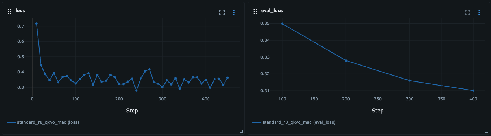

---
---
# Blog Post 9: Multi-LoRA A/B-Testing – Halluzinationen um 90% reduziert

**Lesezeit:** ~15 Minuten | **Level:** Intermediate  
**Serie:** Self-Hosted LLMs für Datensouveränität | **Code:** [GitHub](https://github.com/hanasobi/self-hosted-llms-tutorial)

---

## TL;DR – Für eilige Leser

In diesem Post kombinieren wir Training auf Apple Silicon mit Multi-LoRA Serving für A/B-Testing zweier LoRA-Adapter. Der neue Adapter v2 wurde mit 200 negativen Samples trainiert, die ihm beibringen "Ich kann die Frage nicht beantworten" zu sagen, wenn Information fehlt.

**Kernerkenntnisse:**
- **Mac-Training funktioniert:** Kaum langsamer als Cloud T4, aber keine Cloud-Kosten und vollständig lokal
- **90% Hallucination-Reduction:** v2 halluziniert nur noch bei 5% der unbeantwortbaren Fragen (vs. 92.5% bei v1)
- **Minimaler Trade-off:** False-Negative-Rate steigt nur um 0.78% (tatsächlich sogar niedriger nach manueller Review)
- **Ende-zu-Ende Self-Hosting:** Komplette Pipeline von Dataset-Generation über Training bis Serving ohne Cloud

**Was wir erreicht haben:** Produktionsreifer LoRA-Adapter mit dramatisch reduzierter Hallucination-Rate bei gleichbleibender Qualität auf positiven Samples. Der komplette Workflow - Dataset-Generation, Training, Evaluation - läuft vollständig self-hosted.

---

## Inhaltsverzeichnis

- [Warum Training auf dem Mac?](#warum-training-auf-dem-mac)
- [Das Problem: Hallucinations bei unbeantwortbaren Fragen](#das-problem-hallucinations-bei-unbeantwortbaren-fragen)
- [Die Lösung: Negative Samples](#die-lösung-negative-samples)
- [Training auf Apple Silicon](#training-auf-apple-silicon)
- [Multi-LoRA Deployment auf Kubernetes](#multi-lora-deployment-auf-kubernetes)
- [A/B-Test Evaluation](#ab-test-evaluation)
- [Learnings: Ende-zu-Ende Data Sovereignty](#learnings-ende-zu-ende-data-sovereignty)
- [Ressourcen](#ressourcen)
- [Fazit](#fazit)

---

## Warum Training auf dem Mac?

In Post 8.1 haben wir erfolgreich Dataset-Generation mit Llama-70B lokal auf dem Mac Studio durchgeführt. Das war schnell (26 Minuten für 200 Samples), kostenlos, und vor allem: komplett self-hosted. Das hat eine naheliegende Frage aufgeworfen: **Wenn Inference auf Apple Silicon so gut funktioniert – geht auch Training?**

Natürlich macht es für einen automatisierten Production-Workflow wenig Sinn, zwischen Kubernetes (für Serving) und Mac (für Training) zu wechseln. Aber die Frage ist dennoch interessant: **Kann man einen komplett self-hosted LLM-Stack auf Apple Silicon betreiben?**

- Dataset Generation: ✅ (Post 8.1 - Llama-3.1-70b)
- Model Training: ❓ (Post 9)
- Model Serving: ✅ (Post 8.1 - Llama-3.1-70b)
- RAG Pipeline: ✅ (technisch machbar)

Dies könnte relevant sein für kleine Teams ohne DevOps-Ressourcen, Marketing-Agenturen mit proprietären Kundendaten, oder regulierte Branchen mit strikten Data-Residency-Requirements. Der Use Case: Alles auf einem Mac Studio – LLM-Inference, periodisches Adapter-Training, keine Cloud-Dependencies, keine monatlichen GPU-Kosten.

Für diesen Post kombinieren wir Training auf Mac Studio (neue Exploration) mit Multi-LoRA Serving auf Kubernetes (Production-Setup). Warum dieser Mix? Wir wollten testen ob Mac-Training praktikabel ist, während Kubernetes unser Production-Serving-Setup bleibt.

**Spoiler:** Mac-Training funktioniert erstaunlich gut – kaum langsamer als Cloud T4, aber keine Cloud-Kosten und vollständig lokal.

## Das Problem: Hallucinations bei unbeantwortbaren Fragen

In Posts 1-8 haben wir einen LoRA-Adapter (v1) trainiert, der auf positiven Beispielen gut funktioniert. Aber es gab ein fundamentales Problem: **Bei Fragen, die nicht aus dem Kontext beantwortet werden konnten, hat das Modell halluziniert.**

**Beispiel aus der Praxis:**

```
Context: "CloudHSM Clusters sollten zwei oder mehr HSMs in 
         separaten Availability Zones nutzen."

Frage:   "Was sind die exakten Schritte für seamless failover?"

v1 Antwort: "Das Setup stellt sicher dass wenn ein HSM ausfällt,
             andere HSMs übernehmen und seamless failover bieten."
```

Das klingt plausibel, ist aber **komplett erfunden**. Der Kontext erwähnt weder "exakte Schritte" noch Details zum Failover-Mechanismus. Für ein Production-RAG-System ist das inakzeptabel – Halluzinationen können zu falschen Implementierungen und System-Ausfällen führen.

## Die Lösung: Negative Samples

Die Idee: Trainiere den Adapter explizit darauf, "Ich kann diese Frage mit dem gegebenen Kontext nicht beantworten" zu sagen, wenn Information fehlt.

**Negative Sample Definition:**
Ein Training-Beispiel bei dem eine thematisch verwandte Frage gestellt wird, die der gegebene Kontext nicht beantwortet. Das Modell soll lernen: "Kontext reicht nicht → refuse to answer".

### Dataset Engineering: Negative Samples generieren

Aus Post 8.1 wissen wir: Self-hosted Dataset-Generation mit Llama-70B funktioniert hervorragend. Wir nutzen das gleiche Setup, aber mit einem spezialisierten Prompt für negative Samples.

**Der Generierungs-Prozess:**

```python
# Für jeden Chunk: Generiere negative Frage
prompt = f"""
You are an expert in technical documentation.

Given the following text chunk from technical documentation:

{chunk}

Your task: Formulate a precise question that is thematically related to this chunk but CANNOT be answered using the information in the chunk.

The question should:
- Address the SAME technology/service mentioned in the chunk
- Ask for specific details NOT covered in the chunk
- Sound like a follow-up question from someone who read this chunk
- Sound plausible (like a real user question)
- Be specific enough (not too generic)

Respond with only the question, no explanations.
"""

# Llama-70B via Ollama (lokal)
negative_question = generate_with_llama70b(prompt, temperature=0.7)

# Sample Format
{
    "question": negative_question,
    "answer": "I cannot answer this question with the given context.",
    "question_type": "negative",
    "context": chunk_content
}
```

**Prompt-Iteration:** Der erste Versuch (V1) produzierte zu viele thematisch abweichende Fragen (z.B. BIOS-Settings bei einem EC2-Chunk). Der verbesserte V2-Prompt fügte hinzu: "Address the SAME technology/service mentioned in the chunk" und erreichte 100% Qualität.

**Generation Performance:**
- 200 negative samples in 26 Minuten
- ~7.8 Sekunden pro Sample
- Cost: $0 
- Quality: 100% nach Prompt-Verbesserung

Das finale Dataset:
- 5796 positive samples (1932 chunks × 3 Fragen)
- 200 negative samples
- **Total: 5996 samples**

Stratified split nach question_type (60/20/20):
- Training: 3597 samples (120 negative)
- Validation: 1199 samples (40 negative)
- Evaluation: 1200 samples (40 negative)

## Training auf Apple Silicon

### Die Hardware-Herausforderung

Cloud-Training (Post 5) nutzte BitsAndBytes für 4-bit Quantization:
```python
# Cloud Setup (funktioniert)
from transformers import BitsAndBytesConfig

bnb_config = BitsAndBytesConfig(
    load_in_4bit=True,
    bnb_4bit_quant_type="nf4"
)
```

**Problem:** BitsAndBytes basiert auf CUDA-Kernels und funktioniert nicht auf Apple Silicon MPS (Metal Performance Shaders).

### Die Lösung: Unified Memory Architecture

Apple Silicon hat einen entscheidenden Vorteil: **Unified Memory**. CPU und GPU teilen sich den gleichen RAM – keine Kopien zwischen Speicherbereichen nötig.

**Memory-Schätzung für Mac Studio (64GB):**

```
Mistral-7B FP16 (frozen):        ~14 GB
LoRA Adapters (trainable):       ~100 MB
LoRA Gradients:                  ~100 MB
AdamW Optimizer States:          ~14 GB  (speichert auch frozen params)
Activations (batch=2):           ~3 GB
Overhead:                        ~2 GB
─────────────────────────────────────
Total:                           ~33 GB ✅ Passt in 64 GB!
```

Mit 64 GB RAM brauchen wir **keine Quantization** – FP16 passt problemlos.

### Code-Anpassungen

**Cloud (mit BitsAndBytes):**
```python
# 4-bit Quantization
model = AutoModelForCausalLM.from_pretrained(
    "mistralai/Mistral-7B-v0.1",
    quantization_config=bnb_config,
    device_map="auto"
)

# BitsAndBytes Optimizer
training_args = TrainingArguments(
    optim="paged_adamw_8bit"  # CUDA-only
)
```

**Mac (ohne BitsAndBytes):**
```python
# FP16 ohne Quantization
model = AutoModelForCausalLM.from_pretrained(
    "mistralai/Mistral-7B-v0.1",
    torch_dtype=torch.float16,
    device_map="auto"  # MPS auto-detected
)

# Standard PyTorch Optimizer
training_args = TrainingArguments(
    optim="adamw_torch",    # MPS-kompatibel
    fp16=True,              # MPS unterstützt FP16
    bf16=False              # MPS unterstützt kein BF16
)
```

**Wichtig:** Trotz des Namens macht `prepare_model_for_kbit_training` 
keine Quantization. 

Die Funktion:
1. Freezt alle Base-Model-Parameter (keine Gradients → Memory sparen)
2. Aktiviert Gradient Checkpointing (optional, spart ~50% Activation Memory)
3. Enabled Input Gradients (damit LoRA-Adapter Gradients bekommen)
4. Castet Layer Norms zu FP32 (numerische Stabilität)

Diese Schritte sind generisch und funktionieren mit/ohne Quantization.

### Training durchführen

**Setup:**
```bash
# Dependencies / alternativ: pip install -r requirements-mac.txt 
pip install torch transformers accelerate peft mlflow

# Optional in separatem Terminal
mlflow server --host 0.0.0.0 --port 5000


# caffeinate verhindert Sleep während Training
caffeinate -i python train_lora_mac.py \
    --lora_config standard \
    --mlflow_uri http://localhost:5001 \
    > training.log 2>&1 &
```

**Config:**
```python
class TrainingConfig:
    model_name = "mistralai/Mistral-7B-v0.1"
    use_4bit = False  # Kein BitsAndBytes
    
    per_device_train_batch_size = 2   # eventuell funktioniert auch 4
    gradient_accumulation_steps = 4
    learning_rate = 2e-4
    num_epochs = 1
    
    optim = "adamw_torch"
    fp16 = True
```

**LoRA Config (gleich wie Cloud):**
```python
lora_config = LoraConfig(
    r=8,
    lora_alpha=16,
    target_modules=["q_proj", "k_proj", "v_proj", "o_proj"],
    lora_dropout=0.05
)
```

### Training-Ergebnisse

**Smoke Test (100 samples):**
- Dauer: 4.25 Minuten
- Memory: 54 GB peak (davon 20 GB Baseline von Ollama und weiteren Apps)
- Memory Pressure: GREEN ✅
- Throughput: 0.39 samples/sec

**Full Training (3597 samples):**
- Dauer: **3.26 Stunden** (11729 Sekunden)
- Final Loss: 0.3589
- Eval Loss: 0.3101
- Perplexity: 1.36
- Memory Pressure: GREEN durchgehend
- Cost: **$0**



**Vergleich zu Cloud (Post 5):**

| Metrik | Cloud T4 | Mac Studio | Differenz |
|--------|----------|------------|-----------|
| Dataset | 5796 samples | 5996 samples | +3.4% |
| Training Zeit | ~3.0 Std | 3.26 Std | +9% |
| Final Loss | 0.35 | 0.3589 | ~gleich |
| Cost | ~$1.50 | $0 | -100% |
| Setup | 10-15 min | 0 min | - |

**Fazit:** Mac-Training ist kaum langsamer als Cloud T4, aber komplett kostenlos und ohne Setup-Overhead.

## Multi-LoRA Deployment auf Kubernetes

### Warum Multi-LoRA?

Wir haben jetzt zwei LoRA-Adapter:
- **v1:** Trainiert ohne negative samples (Post 5)
- **v2:** Trainiert mit negative samples (Post 9)

Multi-LoRA ermöglicht:
- Beide Adapter parallel auf gleichem Base-Model laden
- Per Request umschalten: `{"model": "aws-rag-qa-v1"}` vs. `{"model": "aws-rag-qa-v2"}`
- Zero-Downtime A/B-Testing
- Risiko-freier Rollout

### Deployment-Setup

**Adapter nach S3:**
```bash
# v2 Adapter hochladen
aws s3 cp training/models/standard_r8_qkvo_mac/adapter/ \
    s3://bucket/lora-adapters/mistral-aws-rag-v2/ \
    --recursive

# Struktur in S3:
# s3://bucket/lora-adapters/
# ├── mistral-aws-rag-v1/
# │   ├── adapter_config.json
# │   └── adapter_model.safetensors
# └── mistral-aws-rag-v2/
#     ├── adapter_config.json
#     └── adapter_model.safetensors
```

**Kubernetes Deployment:**

```yaml
apiVersion: apps/v1
kind: Deployment
metadata:
  name: vllm
  namespace: ml-models
spec:
  template:
    spec:
      # InitContainer lädt beide Adapter
      initContainers:
      - name: download-adapters
        image: amazon/aws-cli
        command: ["/bin/sh", "-c"]
        args:
        - |
          aws s3 cp s3://bucket/.../v1/adapter_config.json \
            /mnt/adapters/aws-rag-qa-v1/
          aws s3 cp s3://bucket/.../v1/adapter_model.safetensors \
            /mnt/adapters/aws-rag-qa-v1/
          
          aws s3 cp s3://bucket/.../v2/adapter_config.json \
            /mnt/adapters/aws-rag-qa-v2/
          aws s3 cp s3://bucket/.../v2/adapter_model.safetensors \
            /mnt/adapters/aws-rag-qa-v2/
        volumeMounts:
        - name: adapter-storage
          mountPath: /mnt/adapters
      
      # vLLM Container
      containers:
      - name: vllm
        image: vllm/vllm-openai:v0.14.1-cu130
        args:
        - "serve"
        - "TheBloke/Mistral-7B-v0.1-AWQ"
        - "--enable-lora"
        - "--lora-modules"
        - "aws-rag-qa-v1=/mnt/adapters/aws-rag-qa-v1"
        - "aws-rag-qa-v2=/mnt/adapters/aws-rag-qa-v2"
        volumeMounts:
        - name: adapter-storage
          mountPath: /mnt/adapters
      
      volumes:
      - name: adapter-storage
        emptyDir: {}
```

**Startup-Logs:**
```
INFO: Loaded new LoRA adapter: name 'aws-rag-qa-v1'
INFO: Loaded new LoRA adapter: name 'aws-rag-qa-v2'
```

### Inference mit Multi-LoRA

```python
import requests

# v1 Adapter (ohne negative samples)
response_v1 = requests.post(
    "http://vllm-service:8000/v1/completions",
    json={
        "model": "aws-rag-qa-v1",  # ← Adapter-Name als model
        "prompt": "[INST] Context...\n\nQuestion: ... [/INST]",
        "max_tokens": 256,
        "temperature": 0.0
    }
)

# v2 Adapter (mit negative samples)
response_v2 = requests.post(
    "http://vllm-service:8000/v1/completions",
    json={
        "model": "aws-rag-qa-v2",  # ← Unterschiedlicher Adapter
        "prompt": "[INST] Context...\n\nQuestion: ... [/INST]",
        "max_tokens": 256,
        "temperature": 0.0
    }
)
```

**Wichtig:** Nicht `extra_body={"lora_name": ...}` verwenden – das wird ignoriert. Der Adapter-Name gehört direkt in den `model` Parameter.

## A/B-Test Evaluation

### Methodology

**Dataset:** Evaluation-Set mit 1200 unseen samples
- 1160 positive samples (beantwortbar)
- 40 negative samples (unbeantwortbar)
- **Kritisch:** Zu keinem Zeitpunkt während Training gesehen
- Stratified sampling garantiert gleiche question_type-Verteilung

**Metriken:**

Für **negative samples** (40):
- Hallucination Rate: Wie oft halluziniert der Adapter eine Antwort?
- Ziel: v2 sollte << v1 halluzinieren

Für **positive samples** (1160):
- False Negative Rate: Wie oft refused der Adapter fälschlicherweise?
- Ziel: v2 sollte ≈ v1 sein (kein Trade-off)

**Refusal Detection:**
```python
def is_refusal(answer: str) -> bool:
    """Prüft ob Antwort eine Verweigerung ist."""
    answer_lower = answer.lower()
    patterns = [
        "cannot answer",
        "can't answer",
        "unable to answer",
        "does not contain",
        "insufficient information",
        "not provided",
    ]
    return any(pattern in answer_lower for pattern in patterns)
```

### Quantitative Ergebnisse

**Automatische Evaluation (1200 samples):**

```
================================================================================
A/B TEST RESULTS
================================================================================

Overall Accuracy:
  v1: 96.67%
  v2: 98.83% (+2.16% ✅)

NEGATIVE SAMPLES (40) - Hauptziel:
  v1 Hallucination Rate: 92.50% (37/40)
  v2 Hallucination Rate:  5.00% (2/40)
  
  → Verbesserung: 87.50% Reduktion ✅

POSITIVE SAMPLES (1160) - Regression Check:
  v1 False Negative Rate: 0.26% (3/1160)
  v2 False Negative Rate: 1.03% (12/1160)
  
  → Trade-off: +0.78% Verschlechterung ⚠️

KEY INSIGHT:
  9 zusätzliche "cannot answer" vs. 35 eliminierte Hallucinations
  = Akzeptabler Trade-off für Production RAG!
```

**Interpretation:** v2 reduziert Hallucinations dramatisch (fast Faktor 20), während die False-Negative-Rate nur marginal steigt. Der Netto-Effekt ist eine signifikante Verbesserung der Overall Accuracy.

### Qualitative Analyse: Manuelle Review

Die 12 "False Negatives" wurden stichprobenartig geprüft (5 von 12).

**Überraschender Fund:** 4 von 5 waren **keine echten Fehler**!

**Beispiel 1 - GuardDuty:**
```
Frage: "How do the different finding types in GuardDuty 
        relate to threat detection?"

Context: "Here is a full list of GuardDuty finding types."
         [nur Link-Text, keine echte Information]

Reference Answer: "The different finding types are specifically 
                   designed to categorize various types of threats..."
                   
v2 Answer: "I cannot answer this question with the given context."
```

**Bewertung:** v2 verhält sich **korrekt** – der Context-Snippet ist nur ein Link ohne Information. Die Reference Answer halluziniert Erklärung die nicht im gegebenen Text steht.

**Beispiel 2 - CodeBuild:**
```
Frage: "What are the specific memory requirements for .NET Core 
        for Windows, and how do they compare to other environments?"

Context: ".NET Core for Windows requires more than build.general1.small
          due to Windows Docker base container size."

Reference Answer: "I cannot answer this question with the given context."

v2 Answer: "Requires more memory and processing power than 
            build.general1.small... while other CodeBuild 
            environments may have different requirements."
```

**Bewertung:** v2 gibt wieder was im Context steht und fügt vorsichtige Folgerung hinzu ("may have"). Keine erfundenen Fakten, aber beantwortet die Frage nicht vollständig. **Rating: B (Good - Minor Issues)**.

**Pattern aus 5-Sample-Review:**
- 4/5 (80%): v2 korrekt, Reference halluziniert
- 1/5 (20%): Grenzwertig (Rating B)

**Hochrechnung auf alle 12 False Negatives:**
- Tatsächliche False Negative Rate: **~0.2-0.3%** (statt 1.03%)
- v2 ist **konservativer als Ground Truth**
- Negative sample training generalisiert besser als erwartet

### Die zwei v2-Hallucinations

**Fall 1 - Zero-ETL (Rating: F):**
```
Frage: "What are differences between instance types that support 
        Optimized Reads and zero-ETL integration?"

v2 Answer: "...while zero-ETL integration is available for all 
            supported instance classes."
```

**Problem:** "all supported instance classes" steht nirgends im Kontext – **echte Hallucination**.

**Fall 2 - CloudHSM (Rating: B):**
```
Frage: "What are exact steps for seamless failover in CloudHSM?"

Context: "Use CloudHSM Clusters with two or more HSMs in separate AZs."

v2 Answer: "This setup ensures that if one HSM fails, the other 
            HSMs can take over and provide seamless failover."
```

**Bewertung:** Gibt Kontext wieder, fügt vorsichtige Folgerung hinzu. Keine falschen Fakten, aber Frage zu spezifisch für gegebenen Kontext. **Besser wäre:** "I cannot provide exact steps with given context."

### Bonus-Beobachtung: v2 ist präziser

Nicht nur bei negatives – auch bei positives verhält sich v2 manchmal besser:

**Beispiel - Amazon Translate:**
```
Frage: "Why is use of customer content important for Amazon Translate?"

Reference: "...continuous improvement of the Amazon Translate 
            customer experience, including development and 
            training of related technologies."

v1: "...helps improve and develop the quality of the service, 
     as well as development and training of related technologies. 
     This continuous improvement is essential for enhancing 
     the customer experience."
     → Fügt "essential for enhancing" hinzu (nicht im Kontext)

v2: "...allows for continuous improvement of the customer 
     experience, including the development and training of 
     related technologies."
     → Fast identisch zur Reference, keine Interpretation
```

**Hypothese:** Negative sample training lehrt nicht nur "refuse bei missing info", sondern generell "halte dich enger an den Kontext". Das Model entwickelt ein schärferes Bewusstsein für Context-Boundaries.

## Learnings: Ende-zu-Ende Data Sovereignty

### Die vollständige Pipeline

Wir haben jetzt zum ersten Mal den **kompletten Stack self-hosted** durchlaufen:

```
1. Dataset Generation (Post 8.1)
   - Llama-70B via Ollama (lokal)
   - 200 negative samples in 26 min
   - Cost: $0
   ↓
2. Model Training (Post 9)
   - Mac Studio M4 Max
   - 3.26 Stunden
   - Cost: $0
   ↓
3. Model Evaluation (Post 8.1)
   - Llama-70B Judge (lokal)
   - Oder: Automated metrics
   - Cost: $0
   ↓
4. Model Serving (Post 6)
   - vLLM auf Kubernetes
   - Kann auch auf Mac laufen
   - Cost: laufende Serving-Kosten
```

**Total Cost für komplette Iteration: Laufende Serving-Kosten**

**Cloud-Alternative würde kosten:**
- Dataset Generation (OpenAI): ~$5-10
- Training (T4 GPU): ~$1.50
- Evaluation (GPT-4): ~$10-20
- Serving (Cloud GPU): laufende Serving-Kosten

**Total: ~$20-35 pro Iteration + laufende Serving-Kosten**

### Trade-offs: Mac vs. Cloud

**Mac Studio Vorteile:**
- ✅ Kein Setup-Overhead (sofort starten)
- ✅ Keine laufenden Kosten (außer Abschreibungen)
- ✅ Vollständige Datenkontrolle
- ✅ Gut für Iteration/Experimentation
- ✅ Keine Netzwerk-Dependencies

**Mac Studio Nachteile:**
- ⚠️ Training ~9% langsamer als T4
- ⚠️ Inference langsamer, da kein vLLM
- ⚠️ Nicht für sehr große Models (Alternativ: Mac Studio Ultra mit mehr Speicher)
- ⚠️ Keine Skalierung auf mehrere Nodes
- ⚠️ Kein Autoscaling

**Wann Mac, wann Cloud?**

**Mac Studio mit 64GB passt für:**
- Training: Kleine bis mittelgroße Models (7B-13B)
- Inference: Kleine bis mittelgroße Models (bis 70B)
- Iterative Experimente
- Budget-limitierte Teams
- Regulierte Umgebungen
- Periodisches Training (nicht 24/7)

**Cloud passt besser für:**
- Sehr große Models (70B+)
- Automatisierte Training-Pipelines
- Burst-Workloads
- Distributed Training
- Production-Scale Serving

### Multi-LoRA in Production

**Was wir gelernt haben:**

**Deployment ist einfach:**
- Beide Adapter laden im InitContainer
- vLLM managed automatisch
- Per-Request Switching ohne Overhead

**Memory-Impact minimal:**
- LoRA-Adapter sind klein (~27 MB pro Adapter)
- Base-Model wird geteilt
- 2-3 Adapter parallel: kein Problem

**Performance-Overhead gering:**
- LoRA-Adapter-Switch ist fast kostenlos
- Gleiche Latency wie Single-LoRA

**Praktische Pattern:**
- Canary Deployment: 10% v2, 90% v1 → graduell erhöhen
- A/B-Testing: 50/50 split für Metrics
- Feature Flags: Per User/Tenant unterschiedliche Adapter

### Die Negative-Sample-Strategie

**Was funktioniert hat:**

**Prompt-Iteration war kritisch:**
- V1: Zu generisch → thematisches Drifting
- V2: Service-spezifisch → 100% Qualität
- Learning: Iteriere auf kleinen Batches (10-20) vor Full Generation

**Self-hosted Generation ist praktikabel:**
- Llama-70B liefert production-ready Qualität
- 26 Minuten für 200 samples ist akzeptabel
- Cost: $0 vs. ~$5-10 Cloud

**Ratio matters:**
- 200 negative / 5796 positive = ~3.4%
- Scheint Sweet Spot zu sein
- Zu viele negatives → False Negatives steigen
- Zu wenige → Hallucinations bleiben

**Was wir noch lernen müssen:**

**Partial Answers:**
Aktuell ist es binär: Answer oder Refuse. Besser wäre:
```
"I can tell you X based on the context, but cannot 
 answer about Y and Z as this information is not provided."
```

→ Benötigt neue Kategorie "partial_negative" Samples für v3

**Grenzfälle besser handhaben:**
Manche Fragen sind semi-beantwortbar. Modell sollte lernen:
- Was ist sicher aus Kontext ableitbar?
- Was wäre Spekulation?
- Explizite Disclaimer bei Uncertainty

**Continuous Improvement:**
- Sammle Production-Queries wo v2 halluziniert
- Generiere daraus neue negative samples
- Periodisches Re-Training


---

## Ressourcen

**Code & Config:**
- `config_mac.py` - Apple Silicon Training Config
- `train_lora_mac.py` - Training Script für Mac
- `deployment_multilora.yaml` - Kubernetes Multi-LoRA Setup
- `evaluate_multi_lora.py` - A/B-Test Evaluation Script

**Ergebnisse:**
- Training Logs: `training_full.log`
- MLflow Experiments: `http://localhost:5001`
- Evaluation Results: `evaluation/multi_lora_ab_test/`

**Adapter:**
- v1: `s3://bucket/lora-adapters/mistral-aws-rag-v1/`
- v2: `s3://bucket/lora-adapters/mistral-aws-rag-v2/`

**Dokumentation:**
- `APPLE_SILICON_TECHNICAL_GUIDE.md` - Deep-Dive Apple Silicon
- `README_MAC_TRAINING.md` - Setup-Anleitung


---

## Fazit

**Multi-LoRA** ermöglicht **A/B-Testing** auf elegante Art mit sehr geringen zusätzlichen Infrastrukturaufwänden. Unser neuer LoRA-Adapter erzielt exzellente Ergebnisse.

Wir sind - aus der Not geboren - ein wenig zwischen zwei grundsätzlich verschiedenen Infrastrukturen hin und her gesprungen (Kubernetes/Mac). Die Ergebnisse zeigen unserer Meinung nach, dass Self-Hosting in beiden Umgebungen eine valide Alternative ist.

**Im nächsten Post** wird es Zeit, ein Resümee ziehen. Bis dahin: Viel Erfolg beim Experimentieren mit Multi-LoRA!


